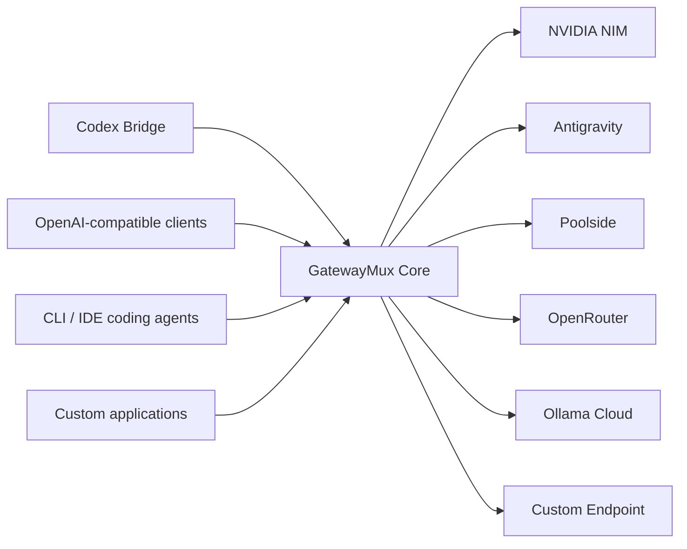

# GatewayMux

> Local-first, multi-provider LLM gateway for AI coding clients, autonomous coding workflows, and native Codex child-subagent routing.

**Project Status**: **Pre-Implementation Architectural Baseline**. GatewayMux is currently in active pre-implementation scaffolding. Architectural boundaries, engineering governance, toolchain validation, and repository structure are established, but product features (routing engine, provider adapters, HTTP server, dashboard UI, Codex Bridge interception) have not yet been implemented.

## Overview

GatewayMux is designed to expose a stable OpenAI-compatible data plane while adapting heterogeneous upstream providers through a canonical internal representation. It pools multiple accounts, models, and provider deployments while enforcing capability, quality, trust, cost policy, health, and quotas before any request leaves the local machine.



## Documentation & Governance

- **Product Authority**: [GatewayMux PRD v1.0.0 (Rev 5)](docs/GatewayMux_PRD_v1.0.0.md)
- **Agent Constitution**: [AGENTS.md](AGENTS.md)
- **Contribution Guide**: [CONTRIBUTING.md](CONTRIBUTING.md)
- **Security Policy**: [SECURITY.md](SECURITY.md)
- **Architecture Decisions**: [Architecture Decision Records (ADRs)](docs/architecture/adr/README.md)
- **Engineering Guides**:
  - [Repository Layout](docs/engineering/repository-layout.md)
  - [Coding Standards & Naming Conventions](docs/engineering/coding-standards.md)
  - [Git Workflow & PR Policy](docs/engineering/git-workflow.md)
  - [Change-Risk Classification (R0–R4)](docs/engineering/risk-classification.md)
  - [Repository Artifact Classes & Generated Files](docs/engineering/generated-files.md)
  - [GitHub Setup & Governance](docs/engineering/github-setup.md)

## Developer Automation

GatewayMux uses `cargo xtask` as its canonical task runner:

```bash
# Full workspace linting, formatting, architecture, and repo checks
cargo xtask check

# Run workspace unit and integration tests
cargo xtask test

# Check architectural dependency direction
cargo xtask architecture-check

# Enforce repository root hygiene and layout
cargo xtask repo-check

# Verify generated files drift
cargo xtask generate --check

# Validate Compatibility Corpus fixtures
cargo xtask compat

# Check provider conformance checklist
cargo xtask provider-check <provider-id>

# Verify change-risk class against path minima
cargo xtask risk-check --risk <R0..R4>

# Verify release readiness and version alignment
cargo xtask release-check
```

## License

GatewayMux is licensed under the [MIT License](LICENSE).  
Copyright (c) 2026 ArchdukeViel.
