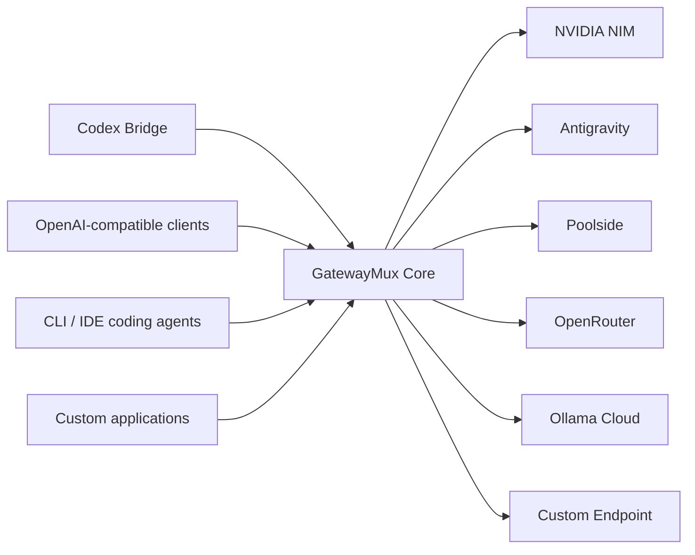

# GatewayMux

> Local-first, multi-provider LLM gateway for AI coding clients, autonomous coding workflows, and native Codex child-subagent routing.

GatewayMux exposes a stable OpenAI-compatible data plane while adapting heterogeneous upstream providers through a canonical internal representation. It pools multiple accounts, models, and provider deployments while enforcing capability, quality, trust, cost policy, health, and quotas before requests leave the local environment.

## Documentation

- [GatewayMux Product Requirements Document (PRD v1.0.0)](docs/GatewayMux_PRD_v1.0.0.md)

## Architecture Overview

## License

MIT
