# GatewayMux - Product Requirements Document

> **Product**: GatewayMux  
> **Version**: `1.0.0`  
> **Status**: Greenfield Architecture Baseline / Living Product Specification  
> **Document Revision**: `Rev 7`  
> **Date**: 2026-10-08  
> **Target Repository**: `ArchdukeViel/gatewaymux`  
> **License**: MIT  
> **Primary Release Platform**: Windows 10/11 x86_64  
> **Architecture**: OS-neutral GatewayMux Core + Windows-only GatewayMux Codex Bridge  
> **Normative Keywords**: **MUST**, **MUST NOT**, **SHOULD**, **SHOULD NOT**, and **MAY** are requirement keywords.

---

## Table of Contents

1. [Executive Summary](#1-executive-summary)
2. [Product Scope and Principles](#2-product-scope-and-principles)
3. [Goals and Non-Goals](#3-goals-and-non-goals)
4. [Users, Platforms, and Supported Surfaces](#4-users-platforms-and-supported-surfaces)
5. [System Context](#5-system-context)
6. [Runtime Architecture](#6-runtime-architecture)
7. [Core Domain Model](#7-core-domain-model)
8. [Canonical Operations and Semantic Model](#8-canonical-operations-and-semantic-model)
9. [Routing and Eligibility Engine](#9-routing-and-eligibility-engine)
10. [Provider Framework](#10-provider-framework)
11. [First-Class Provider Specifications](#11-first-class-provider-specifications)
12. [Capability Discovery and Provider Conformance Lab](#12-capability-discovery-and-provider-conformance-lab)
13. [Quality System and Model Profiles](#13-quality-system-and-model-profiles)
14. [Pricing, Free Models, Quotas, and Cost Policy](#14-pricing-free-models-quotas-and-cost-policy)
15. [Health, Reliability, Retry, and Streaming](#15-health-reliability-retry-and-streaming)
16. [Concurrent Request Coalescing](#16-concurrent-request-coalescing)
17. [Data Plane and Operation APIs](#17-data-plane-and-operation-apis)
18. [Control Plane and Dashboard](#18-control-plane-and-dashboard)
19. [Security, Secrets, Trust, and Egress](#19-security-secrets-trust-and-egress)
20. [GatewayMux Codex Bridge](#20-gatewaymux-codex-bridge)
21. [Configuration and Desired-State Management](#21-configuration-and-desired-state-management)
22. [Cloud State Sync and Distributed Coordination](#22-cloud-state-sync-and-distributed-coordination)
23. [Persistence and Data Model](#23-persistence-and-data-model)
24. [Observability, Analytics, and Route Explainability](#24-observability-analytics-and-route-explainability)
25. [Distribution, Installation, Updates, Rollback, and Uninstall](#25-distribution-installation-updates-rollback-and-uninstall)
26. [Testing and CI/CD](#26-testing-and-cicd)
27. [Release Acceptance Criteria](#27-release-acceptance-criteria)
28. [Repository & Engineering Governance](#28-repository--engineering-governance)
29. [Future Considerations](#29-future-considerations)
30. [Appendix A - Glossary](#appendix-a---glossary)
31. [Appendix B - Decision Register](#appendix-b---decision-register)
32. [Appendix C - Reference Configuration](#appendix-c---reference-configuration)
33. [Appendix D - Error Taxonomy](#appendix-d---error-taxonomy)
34. [Appendix E - Provider and Distribution Reference Sources](#appendix-e---provider-and-distribution-reference-sources)

---

# 1. Executive Summary

GatewayMux is a local-first, multi-provider AI gateway optimized primarily for LLM and AI-coding workloads — AI coding clients, autonomous coding workflows, and native Codex child-subagent routing — while providing a canonical routing and control architecture for additional AI operation families (embeddings, image generation, speech synthesis, transcription, video operations, web search, and web fetch). It exposes a stable OpenAI-compatible data plane while adapting heterogeneous upstream providers through a canonical internal representation. GatewayMux pools multiple accounts, models, and provider deployments while enforcing capability, quality, trust, free/paid cost policy, health, and quota requirements before any request leaves the machine.

GatewayMux v1.0.0 is a **greenfield product**. The repository begins with a clean architecture, clean naming, and no compatibility obligation to any earlier project or configuration format. The v1 product consists of two conceptual components:

- **GatewayMux Core** - the primary, OS-neutral multi-provider gateway.
- **GatewayMux Codex Bridge** - an optional Windows-specific integration that can route confirmed Codex child subagents through GatewayMux while keeping parent conversations and protected internal Codex operations on the official ChatGPT path.

The official v1.0 distribution is Windows-first, but the Core MUST not depend on Win32-specific behavior. Windows-specific integration belongs exclusively to the Codex Bridge, installer, tray, and Windows secret-store adapters.

GatewayMux v1.0 has exactly six supported provider categories. These providers may expose different operation families; first-class status does not imply that every provider supports every operation.

1. NVIDIA NIM hosted API.
2. Antigravity OAuth/subscription connector.
3. Poolside hosted inference API.
4. OpenRouter, including global, US-region, and EU-region deployments.
5. Ollama Cloud direct API.
6. Custom Endpoint, supporting configurable/probed upstream mappings for text generation, embeddings, image generation, audio, video, and web operations where the endpoint implements a compatible contract.

GatewayMux v1 exposes multiple client-facing operation families: OpenAI Chat Completions, OpenAI Responses, Anthropic Messages, embeddings, image generation, speech synthesis, transcription, video operations, web search, and web fetch. These are normalized into operation-specific canonical representations rather than one oversized universal request object.

Other services are not first-class v1 providers. A compatible service MAY be used through Custom Endpoint.

GatewayMux v1 also ships through two official Windows distribution channels: signed GitHub release artifacts/installer and the `gatewaymux` npm package. The npm package bundles the signed native Windows executable and a minimal launcher; npm is a distribution mechanism, not the GatewayMux runtime.

Cloud State Sync is a v1 subsystem. Shared routing/configuration state can synchronize across devices while device-local integration state remains local. Secrets stay local by default, with an optional separately encrypted end-to-end secret vault. Multi-device users sharing provider accounts can use distributed quota/rate coordination when the configured sync backend advertises the required coordination capabilities.

## 1.1 Key Value Proposition

GatewayMux provides one local endpoint and one policy engine for heterogeneous model infrastructure:

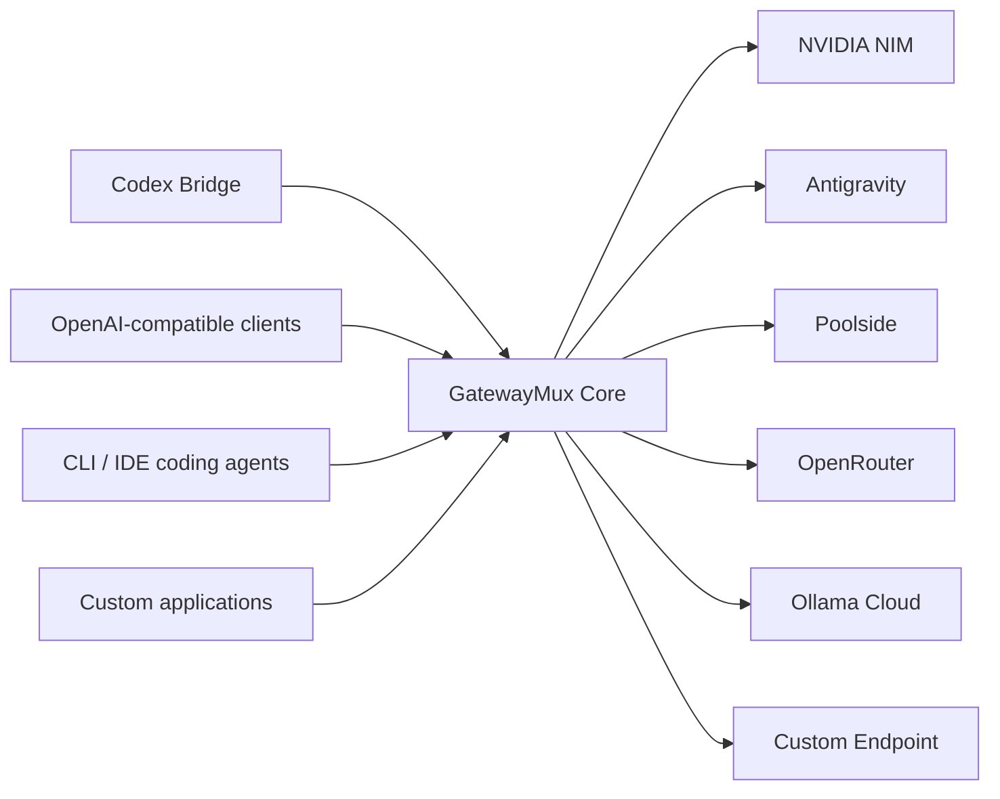

GatewayMux does not treat routing as “pick the cheapest endpoint.” It first proves that a path is eligible. Only then does it optimize among eligible choices.

The routing hierarchy is:

```text
Combo -> Logical Model -> Provider Deployment -> Account
```

A request is admitted only when the selected path satisfies:

- required request semantics;
- required capabilities;
- required quality tier;
- project/API-key trust and egress policy;
- provider pin constraints;
- deployment/account health;
- active quota/cooldown policy;
- cost policy such as `normal`, `prefer_free`, or `free_only`.

## 1.2 Product Naming

| Item | Canonical Name |
|---|---|
| Product | GatewayMux |
| Repository | `ArchdukeViel/gatewaymux` |
| Windows executable | `gatewaymux.exe` |
| CLI command | `gatewaymux` |
| Core | GatewayMux Core |
| Codex integration | GatewayMux Codex Bridge |
| Dashboard | GatewayMux Dashboard |
| Main configuration | `gatewaymux.toml` |
| Client API key prefix | `gmx-sk-` |
| Synthetic Codex model | `gatewaymux-subagent` |

## 1.3 Provider and Protocol Facts Are Runtime Inputs, Not Permanent Truth

Provider catalogs, prices, free-model availability, quota limits, regional endpoints, model capabilities, and model identifiers can change faster than GatewayMux releases. Therefore:

- provider documentation and built-in profiles are bootstrap knowledge;
- runtime provider catalogs are preferred when available;
- runtime conformance evidence is authoritative over built-in capability assumptions;
- user overrides are authoritative over runtime evidence when explicitly configured;
- pricing/free metadata MUST include source and freshness metadata;
- hard-coded request limits MUST NOT be treated as eternal contracts;
- transport behavior, schema dialects, streaming framing, and media operation contracts MUST be versioned/verified rather than assumed globally.

---

# 2. Product Scope and Principles

## 2.1 Product Boundary

GatewayMux Core is a standalone gateway. It MUST operate without Codex installed. The Codex Bridge consumes Core services but Core MUST NOT depend on Codex-specific types, file layouts, environment variables, private schemas, or process behavior.

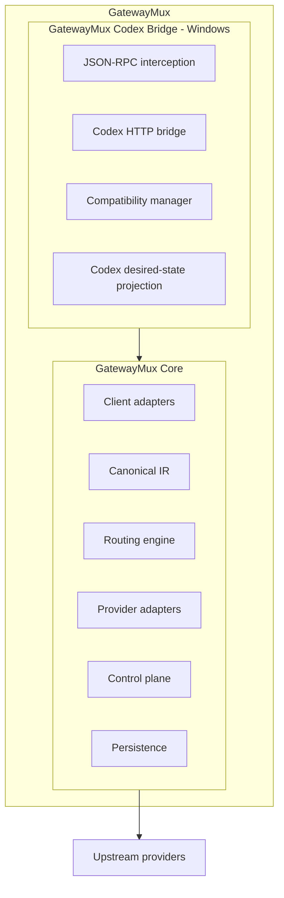

## 2.2 Correctness Over Continuity

When GatewayMux cannot establish that state and semantics remain correct, it MUST fail rather than fabricate successful state.

Examples:

- failed compaction does not become a locally fabricated summary;
- an incomplete provider stream does not become a synthesized success response;
- a missing required capability excludes that deployment;
- a lower quality tier does not substitute for a required higher tier;
- a request that begins streaming from one upstream is never spliced with another provider's continuation.

The governing invariant is:

> **Never substitute uncertain state for successful state.**

## 2.3 No Silent Semantic Degradation

Every compatibility transform MUST be classified as:

```text
LOSSLESS
VALIDATED_EQUIVALENT
LOSSY
```

`LOSSLESS` and `VALIDATED_EQUIVALENT` transforms MAY run automatically. `LOSSY` transforms require explicit policy opt-in and MUST be visible in routing/debug traces.

Tool substitutions are automatic only when individually registered, versioned, tested, and classified `VALIDATED_EQUIVALENT`. There is no generic “unsupported tool -> shell command” rule.

## 2.4 Quality Is a Hard Contract

Quality tiers use `S`, `A`, `B`, `C`. Quality can vary by role and deployment. A request requiring `S` MUST NOT route to `A` because `A` is cheaper, free, or lower latency.

## 2.5 Trust Is a Hard Boundary

Every deployment defaults to `general_cloud` in v1. The user MAY promote or demote it. An API key defines a maximum allowed trust scope, and known project adapters MAY tighten it further.

GatewayMux MUST NOT silently route into a disallowed trust class.

For aggregator providers, GatewayMux's trust boundary is the aggregator service itself unless GatewayMux explicitly models the downstream provider. For OpenRouter v1, OpenRouter is treated as the trust boundary.

## 2.6 No Data-Loss-Prevention Claim

GatewayMux v1 does not scan prompt bodies, tool arguments, repository files, or outputs for secrets before egress. It MUST NOT advertise itself as DLP software. Egress policy, trust configuration, and user/provider selection are the protection boundary.

## 2.7 Explainability Is a Product Requirement

GatewayMux MUST be able to answer:

- why a logical model was selected;
- why another deployment was rejected;
- which capability evidence was used;
- which quality tier applied;
- which trust rule applied;
- which cost/free policy applied;
- which quota bucket affected eligibility;
- whether a prompt/parameter/tool transform ran;
- whether a provider/model profile affected the request.

This requirement drives the Route Simulator and persisted routing trace.

---

# 3. Goals and Non-Goals

## 3.1 Goals

| ID | Goal |
|---|---|
| G-01 | Provide a stable OpenAI-compatible local data plane for multiple upstream providers. |
| G-02 | Support multiple accounts per provider when provider terms and user authorization permit it. |
| G-03 | Route by logical model rather than binding configuration directly to provider-specific identifiers. |
| G-04 | Preserve required semantics and fail rather than silently degrade them. |
| G-05 | Provide capability discovery and safe runtime verification. |
| G-06 | Enforce hard role-specific quality contracts. |
| G-07 | Support project/API-key trust and egress boundaries. |
| G-08 | Support `normal`, `prefer_free`, and `free_only` cost policy. |
| G-09 | Explicitly mark free, free-tier, promotional, paid, and unknown pricing at deployment level. |
| G-10 | Model shared provider/account/model quota with hierarchical quota buckets. |
| G-11 | Provide provider-specific and model-specific optimization without inventing capabilities. |
| G-12 | Provide a Provider Conformance Lab and Route Simulator in v1. |
| G-13 | Provide metadata-only analytics and compact route traces by default. |
| G-14 | Provide a secure loopback administrative control plane. |
| G-15 | Provide a Windows Codex Bridge with verified per-surface compatibility and safe passthrough. |
| G-16 | Provide transactional installation, update, rollback, and uninstall behavior. |
| G-17 | Make Gateway Core portable so future Linux/macOS packaging does not require an architecture rewrite. |
| G-18 | Provide official npm distribution without converting GatewayMux into a Node.js runtime. |
| G-19 | Provide provider-neutral cloud state synchronization with revision-safe conflicts, device overlays, optional E2E secret vault, and distributed quota/rate coordination. |
| G-20 | Support text, embeddings, image, audio, video, and web operation families through operation-specific canonical contracts. |
| G-21 | Compile tool schemas per target protocol/provider/model through explicit schema-dialect profiles rather than a global provider-specific sanitizer. |
| G-22 | Model transport compatibility separately from semantic capability, including compression, HTTP versions, streaming framing, multipart/binary bodies, async jobs, cancellation, and request-acceptance ambiguity. |
| G-23 | Maintain a sanitized Compatibility Corpus so production protocol lessons become deterministic regression fixtures instead of undocumented implementation folklore. |
| G-18 | Provide a secure, implementation-grade responsive Dashboard with Safe Drafts, explainability, guided onboarding, and mobile/tablet reflow without weakening control-plane security. |

## 3.2 Non-Goals

GatewayMux v1.0 does not aim to:

- provide an e-book or document generation subsystem;
- become a general-purpose workflow/orchestration engine;
- execute model tools itself on behalf of arbitrary API clients;
- infer whether downstream tool side effects happened;
- bypass provider restrictions, anti-abuse systems, account enforcement, or rate limits;
- conceal GatewayMux's identity to defeat provider enforcement;
- guarantee downstream-provider identity behind an aggregator unless that provider exposes and GatewayMux enforces such control;
- scan source code for secrets before provider egress;
- guarantee identical semantics where an upstream protocol fundamentally cannot represent a request;
- support every local inference server as a dedicated provider; compatible servers use Custom Endpoint;
- ship a native iOS/Android application in v1; responsive mobile administration is provided through the authenticated web dashboard;
- officially package Linux/macOS binaries in v1.0;
- assume one JSON/tool schema dialect for every provider/model;
- hide retry multiplication inside SDKs or adapters;
- treat cloud configuration sync as proof of distributed quota correctness when the backend lacks coordination primitives.

---

# 4. Users, Platforms, and Supported Surfaces

## 4.1 Primary Users

GatewayMux targets:

1. Individual developers with multiple cloud model accounts.
2. Developers running long-lived autonomous coding agents.
3. Codex users who want parent sessions on official ChatGPT while child subagents use external models.
4. Users who want explicit free-model routing without accidental paid fallback.
5. Advanced users who need local policy, observability, and provider failover without deploying a remote gateway.

## 4.2 Official v1 Platform

The official v1.0 release target is:

- Windows 10/11 x86_64;
- one signed Windows bundle containing Core, Codex Bridge, tray/controller, installer, and uninstaller;
- Core code structured to compile on Linux/macOS later.

## 4.3 Supported Client Surfaces

GatewayMux Core supports any client that can call compatible OpenAI endpoints and satisfy GatewayMux authentication.

GatewayMux Codex Bridge targets verified instances of:

- Codex Desktop App;
- standalone Codex CLI;
- VS Code Codex extension;
- other Codex-compatible IDE surfaces only after concrete compatibility verification.

Compatibility is tracked per concrete binary/surface, not globally.

## 4.4 Dashboard Client Surfaces

GatewayMux Dashboard is a responsive web control-plane client. v1 targets:

- current Chromium-based Edge/Chrome on desktop;
- current mobile Chrome and Safari when remote administration has been explicitly and securely enabled;
- responsive layouts from approximately 320 CSS px upward;
- desktop, tablet, and mobile browser form factors without requiring a native mobile app.

Responsive support does not change the default loopback-only control-plane bind. A phone/tablet on another device can reach the dashboard only when the administrator explicitly enables remote administration under §18/§19 security requirements.

---

# 5. System Context

## 5.1 External Actors

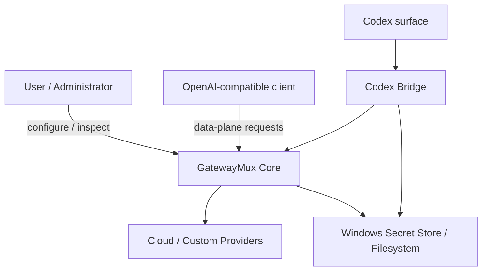

## 5.2 Network Planes

GatewayMux MUST keep data-plane and control-plane exposure separate.

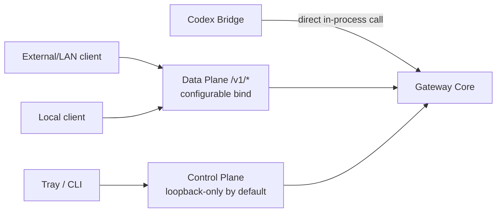

### Data Plane

- Default bind: loopback.
- MAY be exposed to LAN by explicit configuration.
- Requires GatewayMux API-key authentication.
- HTTPS is recommended for non-loopback use.
- Plain HTTP on LAN requires explicit `allow_insecure_lan = true`.

### Control Plane

- Separate listener.
- Loopback-only by default.
- Authenticated browser session.
- Remote administration requires a separate explicit setting and separate risk treatment.

### Codex Internal Calls

When Bridge and Core are in the same process, the Bridge MUST call Core directly. No fixed internal bearer key exists.

---

# 6. Runtime Architecture

## 6.1 Core Modules

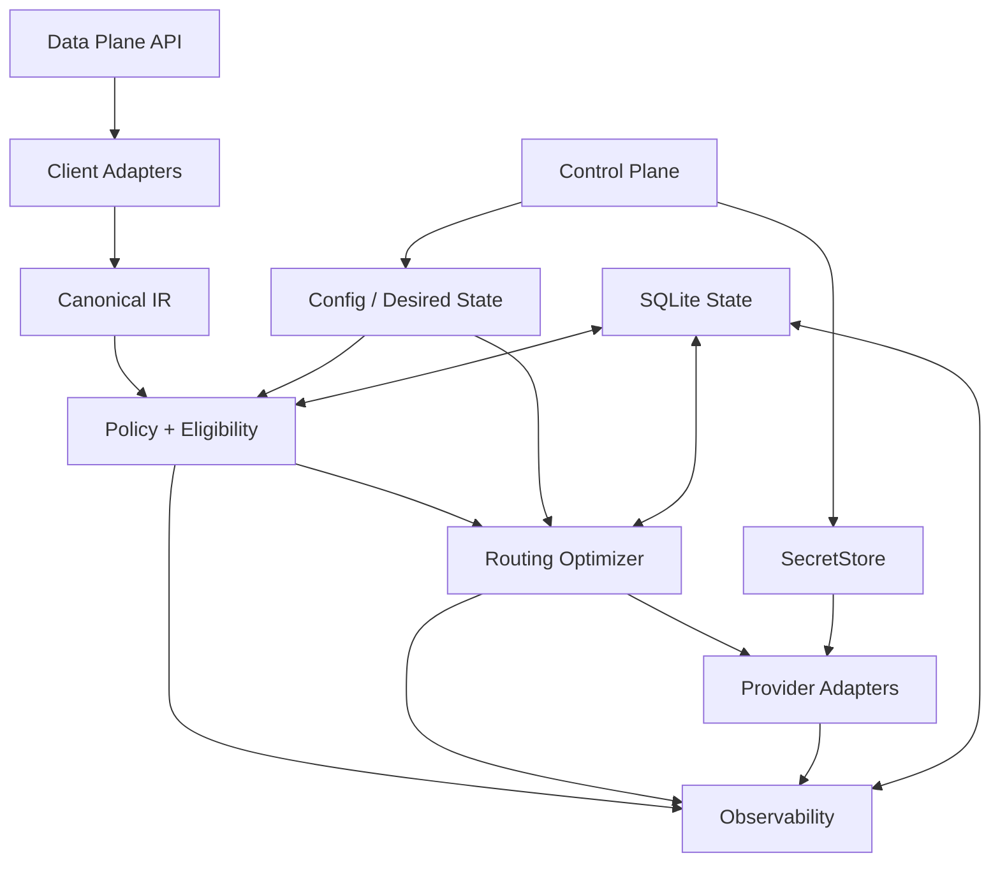

## 6.2 Provider Adapter Layers

Provider integration is intentionally layered so a Gemini-specific, Anthropic-specific, or media-specific compatibility rule cannot leak into unrelated models.

```text
Canonical operation
  -> protocol adapter
  -> provider profile
  -> deployment profile
  -> model profile
  -> tool-schema dialect compiler (when tools exist)
  -> transport profile
  -> concrete upstream attempt
```

A provider/model optimization MUST be scoped to the exact provider/deployment/model/operation for which it is valid. There is no global Gemini schema sanitizer. Gemini/Vertex rules are one schema dialect profile among several, and switching to Qwen, GLM, Kimi, or another model does not inherit Gemini-specific rewrites unless runtime evidence proves the target path requires the same transformation.


Each first-class provider SHOULD separate:

1. transport/authentication;
2. catalog/model discovery;
3. protocol codec;
4. quota/health parsing;
5. pricing/free metadata discovery;
6. provider-level quirks;
7. model-specific profile logic.

This prevents provider quirks from leaking into the routing engine.

## 6.3 Request Lifecycle

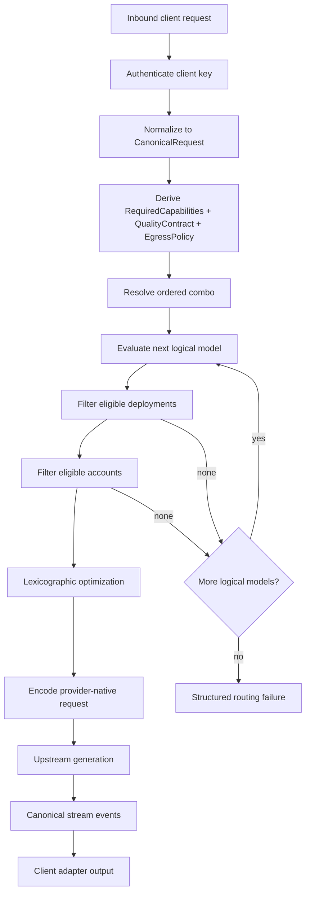

## 6.4 Thread/Request Identity

Every logical request MUST receive a GatewayMux request identity independent of provider request IDs. It SHOULD carry:

- `request_id`;
- client API key ID;
- optional client-provided request ID;
- optional thread/conversation ID;
- optional project/workspace identity;
- coalescing group ID when applicable;
- routing attempt number;
- selected logical model/deployment/account;
- upstream request/response ID when returned.

Sensitive request bodies are not part of the normal trace.

---


## 6.5 Runtime Ownership and Concurrency Boundaries

GatewayMux uses **layered recovery with one shared attempt ledger**, rather than either a single monolithic retry loop or unbounded nested retries.

- Client adapters own client-protocol parsing/encoding.
- Canonical operation types own semantic normalization.
- Policy/eligibility owns hard exclusions.
- Routing optimizer owns ordering among eligible logical models/deployments/accounts.
- Transport layer may retry connection establishment only when it can prove the generation request was not accepted.
- Provider adapters may perform provider-specific non-generation recovery such as OAuth refresh, but every replay of a generation/media operation MUST consume a shared retry budget and be recorded in the AttemptLedger.
- Account/deployment/combo layers may fail over within the remaining shared budget.
- Health manager owns scoped health transitions.
- Quota manager owns local and distributed quota observations/admission.
- Analytics is observational and MUST NOT be required for inference success.
- Codex Bridge owns Codex-specific classification/projection only.

A request's selected route is immutable once the first client-visible generation/media output is emitted, except for operation protocols whose public contract is asynchronous job creation; after a job is accepted, the job identity itself becomes immutable.


## 6.6 Operation and Transport Boundaries

GatewayMux separates semantic operation compatibility from transport compatibility.

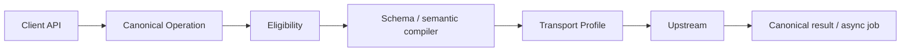

The same provider MAY use SSE for chat, multipart upload for transcription, binary output for speech, and asynchronous polling for video. These transport contracts MUST be modeled per `(deployment, operation)` rather than globally per provider.

## 6.7 Deployment Quarantine

GatewayMux distinguishes ordinary health degradation from **semantic quarantine**. A deployment can be transport-healthy but semantically unsafe for a capability.

Examples:

- a model that begins accepting tool definitions but emits malformed tool arguments;
- a Responses endpoint that streams events incompatible with its advertised schema;
- a provider that silently ignores `response_format` after previously supporting it;
- a model profile that runtime evidence contradicts.

The Conformance Lab or repeated real-traffic evidence MAY quarantine an affected `(deployment, operation, capability)` tuple. Quarantine excludes that capability/path until re-probed, user-overridden, or the provider/model/profile version changes.

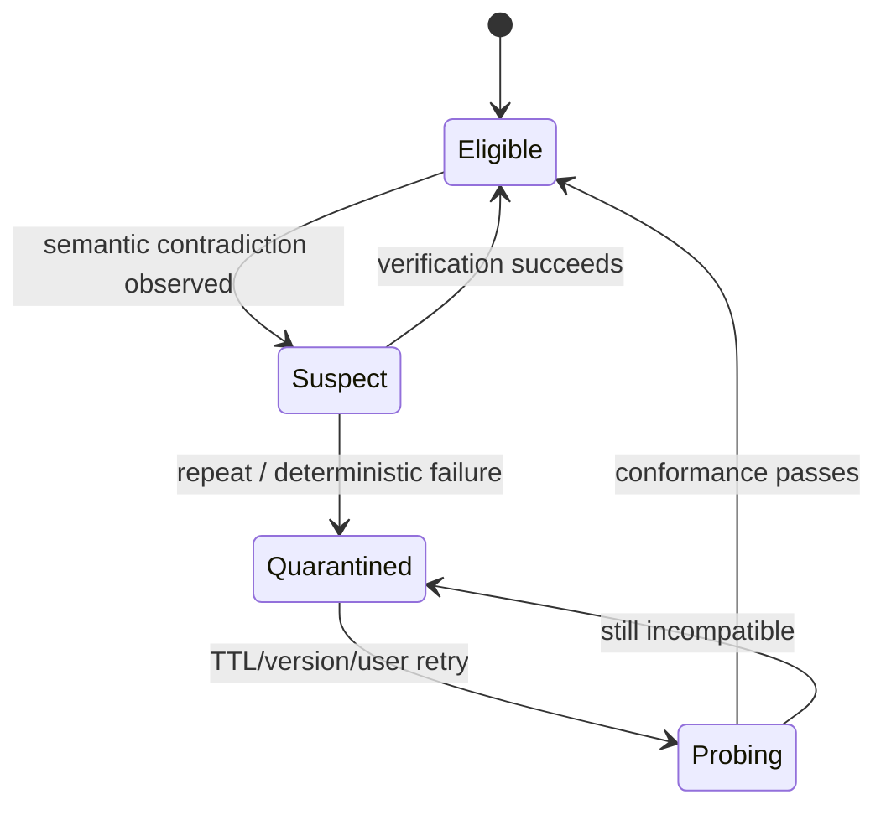

## 6.8 Graceful Runtime Reconfiguration

Hot reload MUST preserve in-flight request consistency:

1. parse and validate new desired state;
2. build an immutable runtime snapshot;
3. atomically publish the new snapshot for new requests;
4. allow existing requests to keep the snapshot with which they were admitted;
5. retire removed accounts/deployments only after references drain, except when immediate revocation is required for security.

Credential revocation and explicit account disable MAY interrupt future attempts immediately. Existing visible streams are not migrated to another provider.

# 7. Core Domain Model

## 7.1 Routing Hierarchy

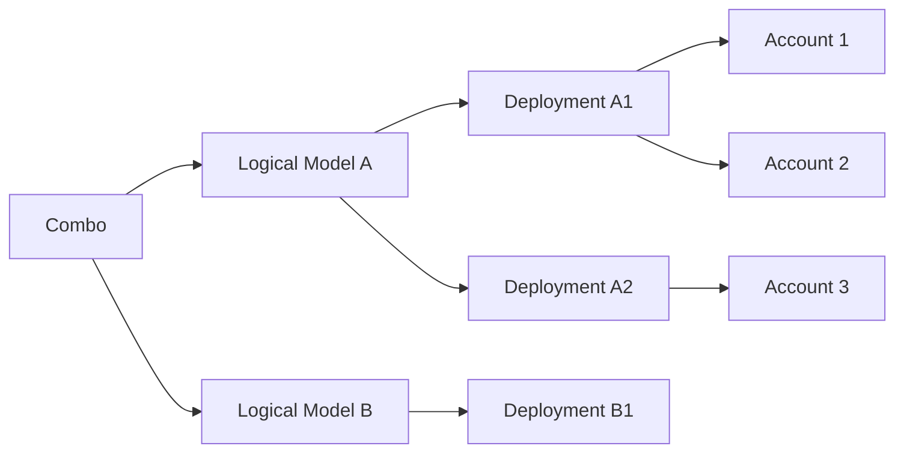

## 7.2 Logical Model

A `LogicalModel` represents the conceptual model identity used by users and combos, independent of provider deployment.

Example IDs:

```text
zai/glm-5
moonshot/kimi-k3
google/gemini-3.8-flash
openrouter/free
```

A logical model contains:

- canonical ID;
- display name;
- aliases, including floating aliases;
- base role-specific quality tiers;
- optional family/lineage metadata;
- optional stable/floating identity flag;
- references to deployments.

Floating aliases are permitted but MUST be marked `floating`. When the upstream reveals the resolved concrete model/version, GatewayMux SHOULD record it in the routing trace.

## 7.3 Provider Deployment

A `ProviderDeployment` binds a logical model to one provider-specific path.

Fields SHOULD include:

- deployment ID;
- provider ID;
- canonical logical model ID;
- upstream model ID;
- endpoint/region;
- trust class;
- protocol options;
- enabled state;
- pricing state;
- quota bucket references;
- model-profile reference;
- capability evidence references;
- optional quality override;
- provider pin identity.

## 7.4 Provider Account

A `ProviderAccount` represents one credential/authorization context.

It includes:

- account ID and label;
- provider ID;
- `credential_ref` into SecretStore;
- enabled state;
- account-level health;
- quota bucket references;
- optional policy metadata;
- optional OAuth refresh state;
- optional provider plan/subscription metadata.

## 7.5 Combo

A combo is an ordered list of logical-model entries. There is no combo-level `roundrobin`, `adaptive`, or `fallback` mode in v1. Ordered fallback is the only combo semantic.

Example:

```toml
[[combos]]
id = "reviewer"
models = [
  "zai/glm-5",
  "moonshot/kimi-k3",
  "openrouter/free"
]
```

GatewayMux exhausts eligible deployments/accounts of entry 1 before evaluating entry 2, subject to pre-visible-output failure rules.

## 7.6 Route Pin

Model references support an optional absolute **Route Pin**. A Route Pin is either a provider-level pin or a deployment-level pin:

```text
zai/glm-5
nvidia::zai/glm-5
openrouter-eu::zai/glm-5
```

A Route Pin is absolute for that combo entry. A provider pin may choose any eligible deployment/account under that provider; a deployment pin selects one deployment namespace. If no eligible pinned path exists, GatewayMux MAY continue to the next combo logical model, but MUST NOT silently ignore the pin.

Normal combos SHOULD NOT pin provider accounts because account health/quota is operational state. Route Simulator MAY temporarily pin an account for diagnostics.

## 7.7 Canonical Operation Kind

Every request resolves to exactly one operation kind before provider routing:

```text
TEXT_CHAT
TEXT_RESPONSES
ANTHROPIC_MESSAGES
EMBEDDING
IMAGE_GENERATION
AUDIO_SPEECH
AUDIO_TRANSCRIPTION
VIDEO_GENERATION
VIDEO_STATUS
VIDEO_EDIT
VIDEO_EXTEND
WEB_SEARCH
WEB_FETCH
```

Provider support is operation-specific; a deployment may be healthy for text and unsupported for video without being globally unhealthy.

## 7.8 Capability State

Capability evidence is tri-state:

```text
SUPPORTED
UNSUPPORTED
UNKNOWN
```

Evidence is scoped at the narrowest useful level, normally `(deployment, model, operation, capability)`.

## 7.9 Quality Tier

Configured quality tiers:

```text
S > A > B > C
```

Quality is configured per `(logical model, role)` with optional deployment override.

## 7.10 Trust Class

Minimum v1 trust vocabulary:

```text
local
trusted_cloud
general_cloud
blocked_for_sensitive
```

All six provider categories default to `general_cloud` until changed by the user.

## 7.11 Pricing Status

Pricing status belongs to the deployment, not the logical model:

```text
FREE
FREE_TIER
PROMOTIONAL
PAID
UNKNOWN
```

`FREE` is not equivalent to “preferred” and is not a quality signal.

## 7.12 Quota Bucket

A `QuotaBucket` represents a shared rate/quota constraint that can be referenced by one or more deployments/accounts.

Scope examples:

```text
ACCOUNT
PROVIDER_ACCOUNT
MODEL
DEPLOYMENT
REGION
CUSTOM
```

A bucket may contain:

- request limit/remaining;
- token limit/remaining;
- reset time;
- window duration;
- source and confidence;
- hard/soft policy;
- whether paid overage is possible;
- current free-tier exhaustion state.

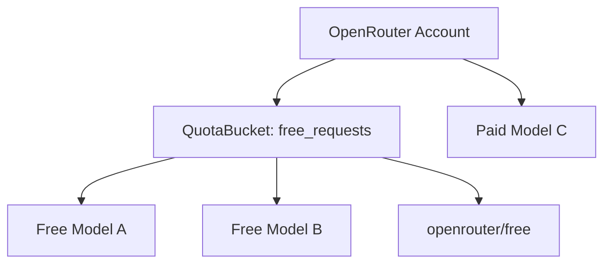

---

# 8. Canonical Operations and Semantic Model

## 8.1 Operation Union

GatewayMux MUST NOT force text generation, embeddings, media, and web operations into one giant request structure. The canonical layer is a tagged operation union:

```text
CanonicalOperation
|- TextGeneration
|  |- Chat
|  |- Responses
|  `- Messages
|- Embedding
|- ImageGeneration
|- AudioSpeech
|- AudioTranscription
|- VideoGeneration
|- VideoStatus
|- VideoEdit
|- VideoExtend
|- WebSearch
`- WebFetch
```

Shared envelope fields include request identity, caller/API-key policy, project/trust context, required capabilities, quality contract where applicable, cost policy, routing hints, timeout/cancellation context, and trace correlation.

Each operation subtype owns only semantically relevant fields. For example, embedding dimensions do not appear on chat requests, and video duration/aspect fields do not pollute text generation.

## 8.2 Text Canonical Model

Text operations use reusable canonical objects:

```text
CanonicalMessage
CanonicalContent
CanonicalImage
CanonicalReasoning
CanonicalToolDefinition
CanonicalToolCall
CanonicalToolResult
CanonicalGenerationOptions
CanonicalUsage
RequiredCapabilities
QualityContract
RequestIdentity
```

Client adapters normalize OpenAI Chat, OpenAI Responses, and Anthropic Messages into this representation where semantics are compatible. Provider adapters translate from it to the selected upstream protocol.

## 8.3 Non-Text Operation Models

Representative required objects:

```text
CanonicalEmbeddingRequest / Result
CanonicalImageGenerationRequest / Result
CanonicalSpeechRequest / Result
CanonicalTranscriptionRequest / Result
CanonicalVideoRequest / Job / Result
CanonicalWebSearchRequest / Result
CanonicalWebFetchRequest / Result
```

Binary/media payloads MUST use bounded streaming or file-backed temporary storage where appropriate rather than unbounded in-memory buffering. Temporary files MUST be lifecycle-owned and deleted after completion/retention policy.

## 8.4 Typed Extensions

Provider-native semantics that cannot be represented generically MAY use typed namespaced extensions:

```text
extensions.openai.encrypted_reasoning
extensions.anthropic.cache_control
extensions.gemini.thinking_config
extensions.video.seed
```

Extensions MUST NOT be used as an excuse for arbitrary provider JSON passthrough across unrelated adapters.

## 8.5 Required and Preferred Capabilities

Capabilities are split into hard and soft requirements:

```text
RequiredCapabilities  -> missing/unsupported excludes route
PreferredCapabilities -> affects ranking only
```

Examples of required capabilities include tools, vision, strict JSON schema, audio input, or a minimum context window. Preferred capabilities may include very large context, native reasoning controls, or a preferred response protocol.

## 8.6 Transformation Registry

Every semantic transform is registered as:

```text
LOSSLESS
VALIDATED_EQUIVALENT
LOSSY
```

Automatic transforms may use only the first two unless explicit policy opts into lossiness. Each transformation records rule ID, adapter/profile version, preconditions, and tests.

## 8.7 Tool Schema Compiler

Tool schemas are compiled for the exact target dialect rather than passed through a global provider sanitizer.

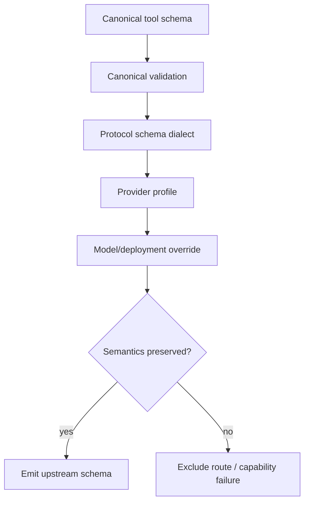

Built-in dialect profiles include at least OpenAI Chat/Responses, Anthropic Messages, Gemini/Vertex-style schemas, and Custom Endpoint profiles. Gemini-specific handling such as unsupported keywords or nullable-union behavior MUST be scoped to Gemini/Vertex-compatible deployments and MUST NOT affect unrelated models.

The compiler MUST maintain a schema-feature evidence matrix per deployment/model/operation, including `$ref`/`$defs`, `additionalProperties`, `oneOf`, `anyOf`, enums, recursive structures, strict objects, arrays, and parallel-tool semantics.

## 8.8 Transport Profile

A `TransportProfile` is scoped to `(deployment, operation)` and may define:

- HTTP/1.1 and/or HTTP/2 support;
- request/response compression (`identity`, `gzip`, `zstd`);
- JSON, SSE, multipart, binary, or async-job response mode;
- content types and upload limits;
- redirect policy;
- connection reuse rules;
- timeout and cancellation semantics;
- job polling cadence/backoff;
- verified idempotency mechanism;
- maximum safe request/response sizes;
- TLS/proxy requirements.

Transport evidence has source, verification time, adapter version, and freshness metadata. Transport failure may quarantine only the affected `(deployment, operation, mode)` rather than the whole provider.

## 8.9 Request Acceptance Boundary

For any operation replay, GatewayMux distinguishes:

```text
NOT_SENT
PROVABLY_NOT_ACCEPTED
ACCEPTANCE_UNKNOWN
ACCEPTED
OUTPUT_VISIBLE
```

If acceptance is unknown, GatewayMux MUST retry only when the provider offers a verified idempotency mechanism or GatewayMux can otherwise prove replay cannot duplicate work/charges. Otherwise it fails the logical request/job safely.

# 9. Routing and Eligibility Engine

## 9.1 Ordered Logical-Model Routing

GatewayMux does not compare all logical models globally. Combo order is user intent.

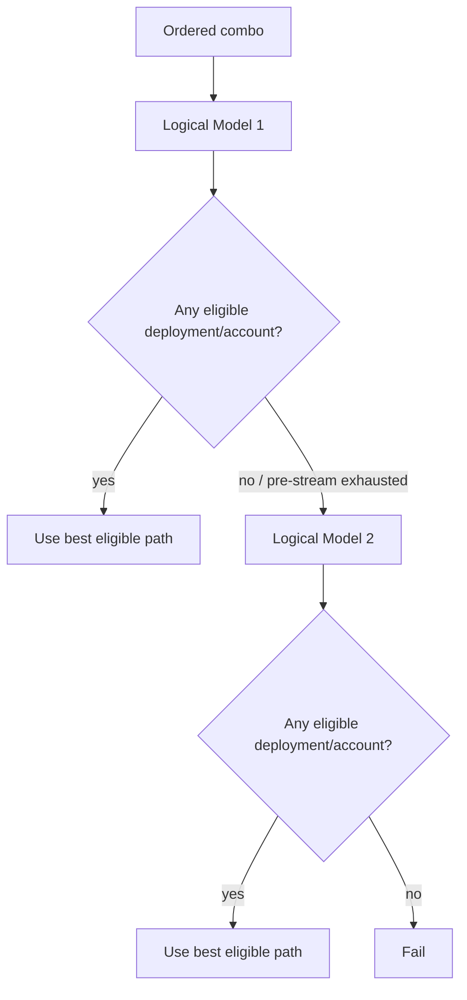

## 9.2 Eligibility Pipeline

Eligibility is a hard-gate pipeline, not a blended weighted score.

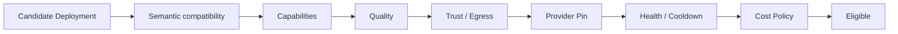

A failure at any stage excludes the candidate.

## 9.3 Deployment Optimization

After eligibility, deployments are ordered lexicographically rather than through one scalar score. Default comparison dimensions:

1. reliability band;
2. quota pressure;
3. latency;
4. cost preference/status;
5. affinity when appropriate.

The exact ordering MAY be configurable, but correctness gates are never weights.

## 9.4 Account Optimization

Within an eligible deployment, accounts are selected using:

- auth/health eligibility;
- active cooldown;
- quota bucket state;
- account affinity;
- observed reliability;
- latency where meaningful;
- cost only when accounts genuinely differ in price.

Unknown quota is neutral, not “100% remaining.”

## 9.5 Cost Policy

GatewayMux v1 supports:

### `normal`

All eligible pricing statuses may route. Cost participates only after correctness, quality, trust, and health requirements.

### `prefer_free`

`FREE` and `FREE_TIER` routes are preferred among otherwise eligible choices, but paid routes remain eligible.

### `free_only`

`PAID`, `PROMOTIONAL` when not explicitly zero-cost, and `UNKNOWN` routes are excluded unless a user override explicitly marks them free. When one logical model has no eligible free path, GatewayMux continues through the ordered combo looking for another free path.

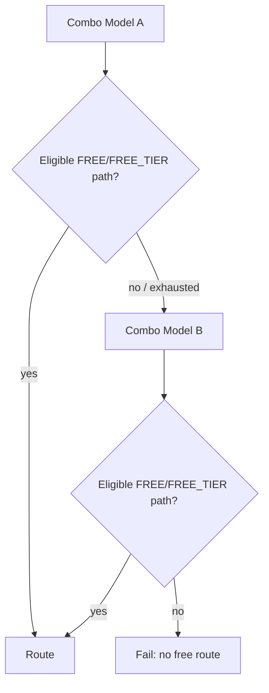

## 9.6 Route Simulator

`gatewaymux route explain` is a v1 requirement.

Example:

```text
gatewaymux route explain reviewer --tools --context 180k --cost-policy free_only
```

It MUST explain candidate decisions without sending project content upstream.

Example output shape:

```text
Combo: reviewer
Cost policy: free_only
Trust max: general_cloud

1. zai/glm-5
   nvidia/zai-glm-5
     capability.tools       SUPPORTED
     quality.reviewer       S
     trust                  general_cloud
     pricing                FREE_TIER
     quota                  exhausted
     result                 REJECTED_QUOTA

   openrouter/zai-glm-5
     pricing                PAID
     result                 REJECTED_COST_POLICY

2. openrouter/free
   openrouter-global/openrouter-free
     pricing                FREE
     quota                  29/50 observed
     result                 SELECTED
```

---


## 9.7 Admission Control Before Routing

Before model routing, GatewayMux performs admission checks that are independent of provider choice:

- client API key valid and enabled;
- client key not expired;
- RPM/RPD limits not exceeded;
- request body within configured maximum size;
- requested combo/model permitted by key policy;
- requested maximum trust class not above key ceiling;
- request concurrency within per-key/global limits;
- service not in drain/shutdown mode.

Admission rejection does not consume upstream quota.

## 9.8 Request Size and Token Estimation

GatewayMux SHOULD use provider-native token counting when available and trustworthy. When unavailable, it MAY use model-family-aware local tokenizers or conservative estimation. A byte/character heuristic is only a last-resort estimate and MUST be labeled approximate.

Context eligibility SHOULD include:

- messages/instructions;
- tool schemas;
- image/token-equivalent estimates where relevant;
- expected/provider-required system wrappers;
- reserved output budget;
- provider-specific hidden overhead when known.

GatewayMux MUST not automatically compact arbitrary client requests merely to make a route fit unless the client/protocol explicitly authorizes semantically safe compaction. Codex child compaction is handled by the Bridge's dedicated contract.

## 9.9 Thread Affinity

Affinity is an optimization, never an eligibility override.

Preferred hierarchy:

1. same logical model;
2. same provider deployment when it improves provider-side caching or state locality;
3. same account when provider cache scope/limits make this useful.

Provider adapters declare whether prompt-cache/session affinity is scoped to account, API key, deployment, model, or provider. Unknown cache scope MUST NOT create a hard affinity.

## 9.10 Routing Determinism and Tie Breaking

For equivalent candidates, tie-breaking SHOULD be deterministic within one runtime snapshot. Stable ordering makes route simulation reproducible and prevents unnecessary provider churn.

Possible final tie breakers:

- current affinity;
- least-recently-used account;
- stable deployment/account ID ordering.

Random load balancing is not a v1 default because it reduces explainability.

# 10. Provider Framework

## 10.1 First-Class Provider Contract

Every first-class provider in v1 MUST provide, where the upstream makes it possible:

- account onboarding;
- secure credential storage;
- model/catalog discovery;
- model enable/disable controls;
- safe conformance tests;
- capability evidence;
- provider/model profiles;
- health classification;
- quota/rate-limit observations;
- pricing/free metadata;
- routing traces;
- dashboard management;
- automated offline adapter tests;
- optional live integration tests gated by secrets.

A provider that only performs basic text generation is not considered “first-class complete.”

## 10.2 ProviderAdapter Contract

A first-class adapter exposes operation-aware behavior rather than one monolithic `chat()` function. The source-level Provider Development Kit SHOULD define contracts equivalent to:

```text
provider_metadata()
authenticate()/refresh_auth()
discover_models()
operation_manifest()
translate_request(operation)
translate_response(operation)
translate_stream(operation)
classify_error()
discover_quota()
discover_pricing()
capability_probe()
transport_probe()
health_probe()
conformance_cases()
```

Third-party dynamic Rust DLL/plugin loading is a non-goal for v1 because ABI and supply-chain boundaries are not stable enough. New providers should use the source-level adapter contract or Custom Endpoint.


Conceptual interface:

```rust
trait ProviderAdapter {
    fn provider_id(&self) -> ProviderId;
    async fn discover_models(&self, account: &ProviderAccount) -> DiscoveryResult;
    async fn verify_capability(&self, probe: CapabilityProbe) -> ProbeResult;
    async fn execute(&self, request: CanonicalRequest, route: RouteContext) -> ProviderStream;
    fn classify_error(&self, error: ProviderError) -> ClassifiedError;
    fn parse_quota(&self, response: &ProviderResponseMeta) -> Vec<QuotaObservation>;
    fn parse_usage(&self, response: &ProviderResponseMeta) -> CanonicalUsage;
    fn pricing_observations(&self) -> Vec<PricingObservation>;
}
```

The real Rust design MAY differ, but responsibilities MUST remain separated.

## 10.3 Provider Operation Manifest

Every provider/deployment exposes a machine-readable operation manifest used by routing and the dashboard:

```text
Text Chat            SUPPORTED
Responses            SUPPORTED
Anthropic Messages   TRANSLATED
Embeddings            SUPPORTED
Images                UNSUPPORTED
Speech                UNKNOWN
Transcription         UNKNOWN
Video                 UNSUPPORTED
Web Search            SUPPORTED
Web Fetch             SUPPORTED
```

The manifest is evidence-backed; it is not merely marketing metadata. Unsupported operations do not make the whole provider unhealthy.

## 10.4 ModelProfile

Provider/model-specific optimization lives in `ModelProfile`, separate from identity and capability evidence.

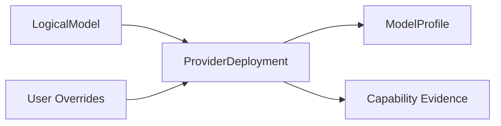

A model profile MAY contain:

- parameter mappings;
- reasoning-level mappings;
- known output limits;
- prompt adaptations;
- provider-specific headers;
- schema normalization rules;
- validated tool mappings;
- known incompatibilities.

Authority precedence:

```text
User override > runtime verified evidence > built-in model profile
```

Built-in profiles are versioned with the GatewayMux binary in v1. There is no separate GatewayMux-owned remote metadata service in v1.

## 10.5 Prompt Optimization

Provider/model-specific prompt rewrites are permitted only when registered as `LOSSLESS` or `VALIDATED_EQUIVALENT`.

Routing trace MUST record:

- rule ID;
- adapter/profile version;
- transformation class;
- whether the rule fired.

Normal traces MUST NOT store the prompt content.

---


## 10.6 Provider Onboarding Lifecycle

First-class providers follow the same conceptual lifecycle:

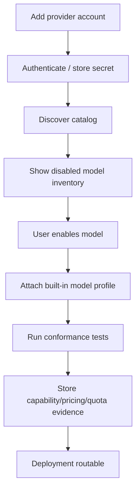

If discovery fails but provider inference still works, the provider MAY support manually entered model IDs. First-class adapters SHOULD make this an exception, while Custom Endpoint explicitly supports it as a normal path.

## 10.7 Provider Catalog Reconciliation

Provider catalog refresh does not immediately mutate routable configuration.

- Newly discovered models appear as disabled candidates.
- Missing models are marked `catalog_missing` before automatic removal.
- Existing deployments remain configured but may become unhealthy/unavailable if the provider rejects them.
- Model rename/alias detection SHOULD require evidence rather than automatic guessing.
- Deprecated/retired models SHOULD surface warnings and suggested replacements without silently rewriting combos.

## 10.8 Provider Adapter Versioning

Every provider adapter exposes a semantic version or build identifier used in capability evidence and route traces. A material adapter translation change invalidates relevant cached conformance evidence.

## 10.9 Provider-Specific Rate-Limit Semantics

Providers may expose multiple independent limits such as RPM, TPM, daily requests, daily tokens, account credits, or model-specific caps. Adapters translate each independent constraint into a separate `QuotaBucket`. GatewayMux MUST avoid collapsing unlike limits into a single percentage when doing so would lose reset or eligibility semantics.

## 10.10 Provider Metadata Confidence

Runtime/provider metadata SHOULD have a confidence/source tag:

```text
USER_OVERRIDE
RUNTIME_VERIFIED
PROVIDER_CATALOG
PROVIDER_HEADERS
BUILT_IN_REFERENCE
INFERRED
UNKNOWN
```

Inferred metadata MUST NOT satisfy a hard capability requirement unless policy explicitly permits inference.


## 10.11 Schema Dialect and Transport Profiles

Provider implementations MUST keep semantic/tool-schema compatibility profiles separate from transport profiles. A model change may alter schema behavior without changing transport, and an endpoint change may alter SSE/compression behavior without changing model semantics.

Runtime evidence MAY override stale built-in assumptions, subject to user override precedence and quarantine rules.

# 11. First-Class Provider Specifications

## 11.1 NVIDIA NIM

### Scope

v1 supports NVIDIA's hosted API only. Self-hosted NIM deployments are configured through Custom Endpoint.

Reference hosted base:

```text
https://integrate.api.nvidia.com
```

The hosted catalog currently exposes OpenAI-compatible chat inference at `/v1/chat/completions`. GatewayMux MUST treat supported protocol and parameter details as model/deployment-specific rather than assuming every hosted model accepts identical fields.

### Authentication

- API key stored in SecretStore.
- Config stores only `credential_ref`.
- Multiple accounts MAY be configured.

### Discovery

GatewayMux SHOULD use NVIDIA's current model catalog/API where practical and merge it with built-in profiles. Discovered models are **not routable by default**. The user explicitly enables models, which creates or activates provider deployments.

### Provider Optimization

NVIDIA adapter SHOULD understand provider-level behavior such as:

- hosted endpoint conventions;
- error shapes;
- rate-limit/quota headers where present;
- streaming conventions;
- model catalog identifiers.

### Per-Model Optimization

Each enabled NVIDIA model MAY have a specific `ModelProfile` covering:

- context and output limits;
- reasoning parameter names/ranges;
- tool-call behavior;
- image support;
- structured output;
- sampling constraints;
- system/developer role constraints;
- model-specific prompt adaptations.

Runtime evidence overrides built-in assumptions.

### Health

Health MUST distinguish account authentication, provider transport, model operation, and specific capability failures.

---


### NVIDIA Operational Requirements

The NVIDIA provider page in Dashboard SHOULD show:

- account connectivity and auth state;
- discovered/enabled hosted models;
- per-model conformance status;
- reasoning/tool/vision/structured-output evidence;
- free/pricing status and freshness;
- rate/quota observations when exposed;
- model-profile version;
- recent reliability and latency.

NVIDIA live conformance tests MUST keep token output minimal. Model-specific tests SHOULD avoid assuming that one NVIDIA model's accepted parameters apply to another model.

### NVIDIA Request Encoding Rules

The adapter builds the provider request from Canonical IR and the selected `ModelProfile`. Unsupported optional parameters are omitted only when their omission is semantically safe. A required generation option that cannot be represented makes the deployment ineligible.

For reasoning controls, GatewayMux maps canonical requested effort to upstream model-specific accepted values only through a versioned validated mapping. It MUST NOT invent a reasoning level that the upstream model does not expose.

### NVIDIA Discovery Freshness

Catalog refresh SHOULD run on explicit refresh, provider/account changes, and a configurable periodic interval. Model disappearance, capability drift, or repeated validation failure triggers re-verification rather than silently preserving stale support forever.

## 11.2 Antigravity OAuth/Subscription Connector

### Scope and Status

Antigravity is a first-class v1 provider implemented as an **OAuth/subscription connector** rather than the separate public managed-agent API path.

Status in the dashboard:

```text
First-class provider
Experimental transport classification
Subscription/OAuth risk notice
```

The connector is intended for accounts the user is entitled to use. GatewayMux displays a persistent risk notice explaining that subscription/OAuth access may not be officially licensed for third-party router use and that the provider may restrict accounts. The user chose warning-only onboarding; a separate explicit acceptance checkbox is not required.

### Safety Boundary

GatewayMux MAY implement:

- browser OAuth connection;
- token refresh;
- account identity storage;
- plan/quota observation where exposed;
- model discovery;
- request/response protocol adaptation;
- multi-account pooling;
- provider/model profiles.

GatewayMux MUST NOT specify or implement features whose purpose is to evade provider enforcement, disguise router usage, rotate fingerprints to defeat detection, or bypass quota/anti-abuse restrictions.

### Account Support

Any account successfully authenticated by the connector MAY be added. Plan/subscription information SHOULD be discovered and stored as metadata when available.

Multiple accounts MAY be pooled, but each account has independent auth, quota, cooldown, and health state.

### Model Identity

When an Antigravity-exposed model can be confidently mapped to the same underlying logical model exposed elsewhere, it SHOULD share that logical-model identity. Deployment-specific capability and quality overrides remain possible.

### Quota

Subscription quota SHOULD be represented using `QuotaBucket` objects rather than model-local counters. If the provider exposes multiple windows, each window becomes its own bucket.

### Compatibility Risk

Because this connector depends on provider behavior not guaranteed as a stable public router API, its transport is tested heavily through the Provider Conformance Lab and can be disabled independently without affecting other providers.

---


### Antigravity OAuth Lifecycle

The connector SHOULD model OAuth states explicitly:

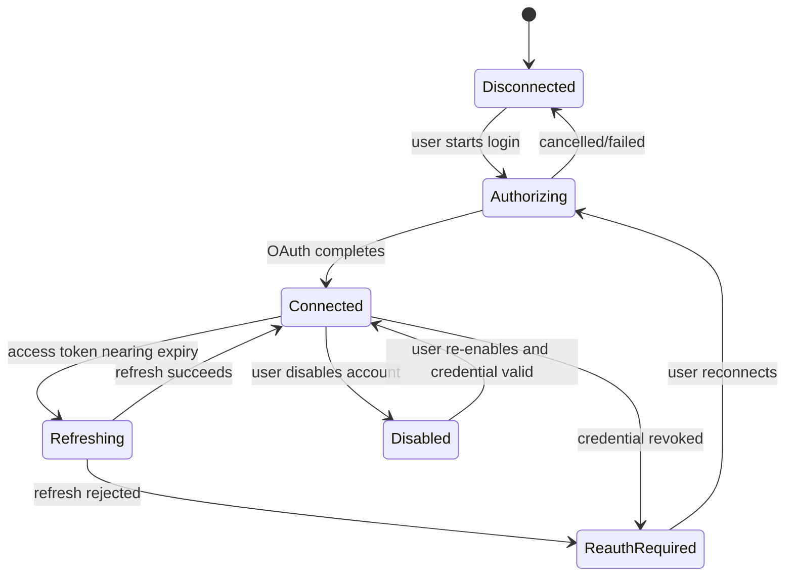

Access tokens SHOULD remain ephemeral in memory where possible; refresh credentials are the long-lived secret stored through SecretStore.

### Antigravity Model Discovery and Mapping

The adapter MAY maintain an internal model mapping table needed to convert provider-facing IDs into canonical logical-model IDs. Mapping requires strong evidence such as provider catalog identity/version metadata, not similarity of display names alone.

When mapping confidence is insufficient, GatewayMux creates a distinct logical model rather than incorrectly merging quality/capability evidence with another deployment.

### Antigravity Account Pooling

Accounts are independently eligible. GatewayMux does not attempt to spread traffic in a pattern intended to defeat provider limits. Account selection uses the same health/quota/affinity architecture as other providers and respects observed cooldown/reset information.

### Antigravity Risk UX

The provider page MUST prominently display:

- that authentication is subscription/OAuth based;
- that the connector is experimental with respect to router compatibility;
- that provider policy or account restrictions may change;
- the currently discovered plan/quota metadata when available.

The risk notice is informational and persistent; the chosen product decision does not require a separate acknowledgement checkbox before login.

## 11.3 Poolside

### Scope

Poolside is a first-class hosted inference provider. Current public examples use:

```text
https://inference.poolside.ai/v1
```

and an OpenAI-compatible chat API.

### Authentication

- API key via SecretStore.
- Multiple accounts MAY be configured if permitted by the provider/user.

### Discovery

GatewayMux SHOULD query available catalog endpoints when supported and otherwise use built-in model profiles plus explicit user model enablement.

### Optimization

Poolside gets the same provider/model optimization architecture as NVIDIA:

- provider-level transport/error handling;
- model-specific context/output/capability profiles;
- runtime verification;
- pricing/free observation;
- prompt/parameter adaptations only when semantically validated.

If a Poolside model is temporarily offered at zero cost, that state is recorded as `FREE`, `FREE_TIER`, or `PROMOTIONAL` with a source and freshness timestamp rather than hard-coded indefinitely.

---


### Poolside Operational Requirements

Poolside Dashboard integration SHOULD show catalog source/time, enabled models, provider/model profiles, capability evidence, pricing/free status, and recent health/latency.

A model advertised as temporarily free MUST use `PROMOTIONAL` or `FREE_TIER` when the free condition is time/quota constrained. The adapter MUST not convert “free for a limited time” into permanent `FREE` without current evidence.

### Poolside Capability Drift

Because a provider may update served model revisions behind a stable model identifier, repeated semantic contradictions SHOULD invalidate the relevant capability evidence and trigger re-conformance even if the model ID did not change.

## 11.4 OpenRouter

### Deployments

GatewayMux exposes region as distinct deployment identity when configured:

```text
openrouter-global
openrouter-us
openrouter-eu
```

Reference base URLs:

```text
https://openrouter.ai/api/v1
https://us.openrouter.ai/api/v1
https://eu.openrouter.ai/api/v1
```

Availability and plan eligibility of region-specific routing can vary by OpenRouter plan and MUST be treated as runtime/account capability.

### Trust Boundary

In v1, OpenRouter itself is the GatewayMux trust boundary. GatewayMux does not guarantee the identity/trust class of OpenRouter's own selected downstream inference provider unless that identity is surfaced and the user explicitly models it.

The PRD therefore does **not** claim that every physical provider behind OpenRouter has the GatewayMux deployment's trust class.

### Internal OpenRouter Routing

GatewayMux MAY pass provider preferences supported by OpenRouter for optimization, but v1 does not require GatewayMux to enforce downstream provider allowlists. OpenRouter's internal routing/fallback policy remains OpenRouter responsibility.

### Free Models

OpenRouter can expose individual free model variants as well as the `openrouter/free` dynamic router. Both are normal selectable logical-model entries in GatewayMux v1.

`openrouter/free` is treated as an ordinary logical model from the user's perspective, but its observed resolved model SHOULD be recorded when the response exposes it. Built-in quality defaults SHOULD remain conservative until configured or supported by runtime evidence because the upstream can select different free models over time.

### Free Quota

OpenRouter free-model request quotas are represented by account-level `QuotaBucket` state shared by all free deployments that consume the same allowance. Current provider documentation is reference data, not a hard-coded contract.

GatewayMux SHOULD discover/observe current limits where possible and otherwise expose a user-editable/reference observation.

### Pricing

OpenRouter pricing metadata can change frequently. GatewayMux SHOULD sync provider/catalog pricing where a reliable API/source exists. Each observation includes source and timestamp. User overrides take precedence.

---


### OpenRouter Model Variants

OpenRouter model IDs/variants may encode pricing or routing differences. GatewayMux SHOULD preserve upstream model identity exactly in the deployment while mapping it to an appropriate logical model.

Individual `:free` variants are separate deployments from paid variants even when they share a base model because quota, availability, latency, and context behavior may differ.

### OpenRouter `openrouter/free`

The dynamic free router is exposed as an ordinary logical model per the v1 product decision. To preserve explainability:

- response-resolved model identity SHOULD be captured when OpenRouter returns it;
- pricing status is `FREE` while current provider evidence supports it;
- shared free-account quota buckets apply;
- configured quality can be used like any other logical model, but GatewayMux built-in defaults remain conservative because the underlying model may vary;
- capability evidence for the router is the capability of the router contract, not a claim that every underlying free model has identical features.

### OpenRouter Regional Deployments

Global, US, and EU endpoints are independent deployments for policy and health purposes. Region availability may depend on plan. A configured regional deployment that the account cannot use is marked ineligible; GatewayMux does not silently substitute the global endpoint for a region-pinned deployment.

### OpenRouter Free-Model Reference Limits

Provider limits are dynamic. As of the reference date in this PRD, OpenRouter documentation reports a limited daily allowance for Free-plan API use and separate free-model limits. GatewayMux MUST represent actual observed/configured limits through `QuotaBucket` state rather than embedding those values as invariant constants.

## 11.5 Ollama Cloud

### Scope

v1 first-class support is **direct Ollama Cloud API access**. A local Ollama server is configured through Custom Endpoint.

Reference OpenAI-compatible cloud base:

```text
https://ollama.com/v1
```

### Protocols

Current Ollama documentation supports OpenAI-compatible Chat Completions and stateless Responses, plus an Anthropic-compatible messages endpoint. GatewayMux's first-class Ollama adapter SHOULD prefer the strongest verified protocol per request.

Provider behavior MUST account for protocol limitations. For example, stateful Responses features are not assumed merely because `/v1/responses` exists.

### Discovery

GatewayMux SHOULD discover cloud models through supported Ollama catalog endpoints and create deployments only for user-enabled models.

### Model Profiles

Model-specific reasoning/thinking controls are represented in `ModelProfile` and verified at runtime where possible.

---


### Ollama Cloud Protocol Selection

The adapter can choose between Chat Completions, stateless Responses, and other verified compatible protocol paths based on the request's semantics. A Responses endpoint that lacks stateful continuation does not satisfy a request requiring `previous_response_id`-style semantics.

### Ollama Cloud Catalog and Model Metadata

GatewayMux SHOULD obtain cloud model identifiers from provider-supported catalog endpoints. It MAY use Ollama-specific model metadata to refine reasoning/thinking controls when available, while keeping Canonical IR provider-neutral.

### Ollama Cloud vs Local Ollama

The named first-class adapter intentionally represents direct cloud service behavior. Local Ollama is still fully usable through Custom Endpoint, which prevents local-server-specific assumptions from contaminating the cloud adapter.

## 11.6 Custom Endpoint

### Purpose

Custom Endpoint provides first-class generic compatibility for services not modeled as named providers.

v1 protocols:

```text
OpenAI Chat Completions
OpenAI Responses
Anthropic Messages
```

### Configuration

A custom endpoint includes:

- friendly name;
- provider prefix;
- base URL;
- protocol mode: `auto`, `chat`, `responses`, `anthropic`;
- authentication mode;
- static headers;
- optional manual model IDs;
- trust class;
- TLS/insecure-HTTP policy;
- enabled state.

### Authentication

Supported v1 authentication:

1. no authentication;
2. bearer token;
3. configurable static headers.

Secret values MUST be represented by SecretStore references rather than plaintext config.

Example:

```toml
[providers.private.auth]
type = "headers"

[providers.private.auth.headers]
Authorization = "Bearer {{secret:private-api-key}}"
X-Organization = "team-42"
```

### Transport Security

- Plain HTTP is allowed by default only for loopback/local endpoints.
- Non-loopback endpoints require HTTPS by default.
- Remote plaintext HTTP requires explicit `allow_insecure_endpoint = true`.
- Certificate validation is enabled by default.
- Disabling certificate validation requires a separate explicit high-risk option and MUST NOT be implied by `allow_insecure_endpoint`.

### Operation Mapping

Each Custom Endpoint MAY configure/probe operations independently:

```text
chat/completions
responses
messages
embeddings
images/generations
audio/speech
audio/transcriptions
videos/generations + status/edit/extend
search
web/fetch
```

One endpoint may support only a subset. Each operation has its own protocol/transport profile, capability evidence, and health state. A failure in image generation MUST NOT disable a healthy chat operation.

### Protocol Auto-Detection

`protocol = "auto"` safely probes all three families and records every verified protocol.

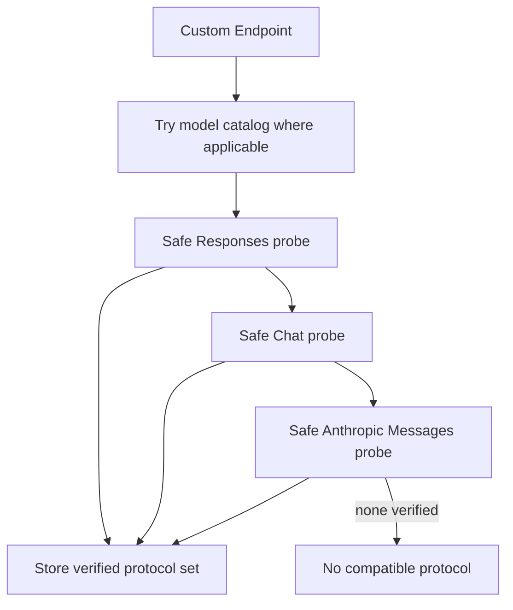

When more than one protocol is verified, the request adapter chooses the strongest semantics-compatible protocol for the specific request. The user can pin one protocol if auto-detection is undesirable.

### Model Discovery

Workflow:

1. use `/models` or protocol-native catalog when available;
2. show discovered models but keep them disabled;
3. allow manual model IDs when no catalog exists;
4. conformance-probe selected models;
5. enable deployments only after explicit user enablement.

### SSRF Protection

Control-plane endpoint validation MUST defend against server-side request forgery. Remote admin callers MUST NOT be able to make GatewayMux probe arbitrary internal network targets unless the endpoint was explicitly configured/approved through local administration policy.

---


### Custom Endpoint Validation Results

Validation distinguishes:

- DNS/network unreachable;
- TLS validation failure;
- authentication rejected;
- catalog absent;
- protocol endpoint absent;
- model invalid;
- basic inference valid;
- stream valid;
- semantic feature unsupported.

A missing `/models` endpoint is not by itself a failure if manual model IDs plus inference conformance succeed.

### Custom Endpoint Static Header Safety

Static headers can carry both secret and non-secret values. GatewayMux SHOULD support explicit secret references rather than trying to guess whether a header value is sensitive. UI MUST mask secret-backed values after entry.

### Custom Endpoint Name/Prefix Rules

Provider prefixes are unique, normalized identifiers used for advanced pinned model names. Prefixes MUST reject whitespace/path/control characters and SHOULD be immutable after routes depend on them unless a coordinated migration is performed.

### Custom Endpoint Capability Independence

Two models behind the same custom endpoint can have different capabilities. Capability evidence is never endpoint-global unless the capability truly belongs to transport/authentication rather than model semantics.

# 12. Capability Discovery and Provider Conformance Lab

## 12.1 Discovery Sources

Capability state merges:

1. user override;
2. runtime verified evidence;
3. provider catalog/API metadata;
4. built-in model profile;
5. `UNKNOWN` fallback.

This precedence is intentional. A user can force a capability state when necessary, but the UI MUST show that it is overridden.

## 12.2 Verification Cache

Each observation SHOULD store:

- deployment ID;
- model ID;
- operation;
- capability;
- result;
- source;
- adapter/profile version;
- provider/catalog version when available;
- observed time;
- expiration/refresh time;
- optional failure signature.

## 12.3 Safe Probes

Auto probes MUST be safe and inexpensive. Examples:

- text generation with minimal tokens;
- structured JSON with tiny schema;
- one no-side-effect tool definition;
- one tiny image input for vision;
- cancellation/stream framing test;
- parameter acceptance test.

GatewayMux MUST NOT automatically execute destructive external tools as a capability probe.

## 12.4 Provider Conformance Lab

The Provider Conformance Lab is a v1 feature available through CLI and Dashboard.

Example:

```text
gatewaymux doctor provider nvidia
gatewaymux doctor provider openrouter-global
gatewaymux doctor provider custom-private
```

Test groups:

- authentication;
- catalog discovery;
- basic generation;
- streaming framing;
- cancellation;
- usage reporting;
- tools;
- parallel tools;
- structured output;
- vision;
- reasoning controls;
- error classification;
- rate-limit/quota parsing;
- protocol-specific state semantics.

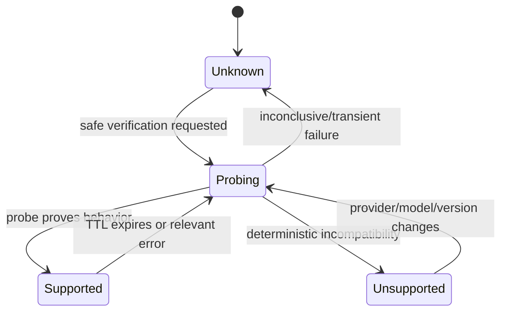

## 12.5 Passive Evidence

Real traffic is the primary long-term source of reliability evidence. Passive observations can update health/reliability metrics, but MUST NOT silently rewrite user quality tiers.

---


## 12.6 Tool-Schema and Transport Conformance

Conformance cases MUST include schema dialect and transport behavior, not only successful text generation. Representative cases:

- nested object/array tool schemas;
- `additionalProperties`, `$ref`, `$defs`, `oneOf`, `anyOf`, enums, nullable fields;
- streaming chunk boundaries and malformed SSE;
- gzip/zstd request/response encodings;
- multipart uploads;
- binary speech responses;
- async video job creation/polling;
- cancellation and connection loss;
- provider idempotency support.

## 12.7 Compatibility Corpus

GatewayMux MUST maintain a sanitized, versioned **Compatibility Corpus** containing real protocol lessons as deterministic regression fixtures.

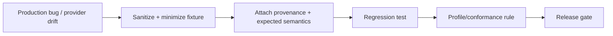

Corpus categories include:

- Codex invocation/JSON-RPC traces;
- compressed request fixtures (including zstd where applicable);
- tool-schema dialect fixtures;
- namespace tool round-trips;
- malformed/partial SSE streams;
- provider error bodies and rate-limit headers;
- multimodal request/response fixtures;
- async job lifecycle fixtures;
- cloud-sync conflict/lease fixtures.

Every fixture MUST be stripped of secrets, user prompts/repository content not required to reproduce the issue, account identifiers, and private URLs. Fixtures include origin category, affected version/profile, expected classification, and regression owner. A production compatibility bug is not considered fully closed until an appropriate sanitized fixture exists or a documented reason explains why one cannot safely be retained.

# 13. Quality System and Model Profiles

## 13.1 Purpose

Quality is a user-controlled routing contract, not an automatically inferred benchmark score. It exists to prevent a cheaper/free/faster route from silently substituting a model/deployment the user considers materially weaker for a role.

Quality and reliability are independent dimensions: an S-tier model can be temporarily unreliable, and a C-tier model can be highly reliable.

## 13.2 Role-Specific Quality

Quality is configured per `(logical model, role)` using `S`, `A`, `B`, `C`.

Example:

| Logical Model | Worker | Explorer | Reviewer |
|---|---:|---:|---:|
| Model A | S | A | S |
| Model B | S | A | A |
| `openrouter/free` | C | C | C |

The table is illustrative; real defaults are versioned product data, not guaranteed by this PRD.

Suggested semantics:

- **S** - preferred for the most demanding role workload; may satisfy an S/A/B/C requirement.
- **A** - strong but not accepted for an S-only contract.
- **B** - normal/general quality.
- **C** - utility/experimental/unknown-dynamic quality where the user accepts it.

These are ordinal user policy labels, not universal claims that scores are comparable across every task domain.

## 13.3 Quality Contract Resolution

Effective minimum quality is the strictest applicable requirement from:

1. project/API-key policy;
2. client/request role contract;
3. combo override (which may tighten but not weaken the above);
4. default role policy.

A route with unknown configured quality does not satisfy a hard minimum unless the policy explicitly permits unknown/dynamic quality.

`openrouter/free` and other dynamic routers may be represented as ordinary logical models per product decision, but SHOULD carry `dynamic_identity=true` and a conservative configured quality chosen by the user/product profile.

## 13.4 Deployment Overrides

A deployment can override base logical-model quality when provider behavior materially changes effective quality.

Effective tier:

```text
deployment override if present
otherwise logical-model role tier
```

Overrides require explicit user approval. Runtime evidence can recommend an override but never silently mutate configured quality.

## 13.5 Quality Evidence

Evidence is observational and may include:

- task completion outcome;
- user rating;
- test-suite result;
- reviewer acceptance;
- retry/failure rate;
- tool-call correctness indicators;
- structured-output validity;
- benchmark/evaluation suite identifier and version.

Evidence records model/deployment/profile versions so results are not blindly applied after a model or provider changes.

## 13.6 Recommendation Workflow

GatewayMux may show:

```text
Recommend: Model B / worker A -> S
Reason: 92 successful benchmark tasks, low intervention rate
Evidence window: 30 days
```

The recommendation states sample size, evidence period, confidence limitations, and affected roles/deployments. The user accepts/rejects it through Safe Drafts. Rejected recommendations SHOULD be suppressible until new material evidence appears.

## 13.7 Quality vs Capability

Quality never substitutes for capability. A deployment may be S-tier for reviewer work but still be ineligible for a request requiring unsupported vision or strict schema semantics. Capability gates run independently before quality-based eligibility is accepted.

## 13.8 ModelProfile Precedence

ModelProfile optimization data follows:

```text
user override
  > runtime verified evidence
  > built-in profile
```

Quality configuration is distinct from capability evidence: runtime probing may prove a capability, but it cannot autonomously promote a quality tier.

---

# 14. Pricing, Free Models, Quotas, and Cost Policy

## 14.1 Pricing and Free Status Are Distinct

A numeric zero price alone is insufficient because zero can mean permanently free, free within quota, promotional, or unknown/missing data.

Each deployment has:

```text
pricing_status
input_price
output_price
currency
unit
source
observed_at
refresh_after
optional_valid_until
```

## 14.2 PricingStatus

### `FREE`
No monetary token charge according to current evidence.

### `FREE_TIER`
Zero-cost within a quota/allowance. Exhaustion makes the free route unavailable under `free_only`.

### `PROMOTIONAL`
Temporarily discounted/free or explicitly time-limited. Promotions require freshness/expiry metadata.

### `PAID`
Known paid usage.

### `UNKNOWN`
GatewayMux lacks reliable current pricing. Unknown MUST NOT be treated as zero.

## 14.3 Pricing Storage

Money MUST NOT be stored as floating-point binary currency. Use integer micros/nanos or decimal fixed precision.

Unknown pricing is `NULL`/unknown, not `0`.

## 14.4 Quota Buckets

Quota is hierarchical and shareable.

```mermaid
%% diagram-id: hierarchical-quota
flowchart TB
    P[Provider]
    A[Account]
    Q1[Daily free requests]
    Q2[Requests/minute]
    Q3[Model token quota]
    D1[Deployment A]
    D2[Deployment B]

    P --> A
    A --> Q1
    A --> Q2
    A --> Q3
    Q1 --> D1
    Q1 --> D2
    Q2 --> D1
    Q2 --> D2
    Q3 --> D1
```

A request is eligible only if every hard quota bucket it consumes is eligible.

## 14.5 Free-Tier Exhaustion

Under `free_only`, an exhausted free bucket excludes affected deployments. GatewayMux then continues the ordered combo looking for another eligible `FREE`/`FREE_TIER` path.

No paid overage is used under `free_only`.

Under `prefer_free`, paid routes remain allowed after free routes become ineligible.

## 14.6 Free Metadata Freshness

`FREE`, `FREE_TIER`, and `PROMOTIONAL` observations MUST have source and freshness metadata. This prevents an old “free” label from silently causing unexpected charges after provider terms change.

## 14.7 UI Requirements

Dashboard model/deployment rows SHOULD display badges:

```text
FREE
FREE TIER
PROMO
PAID
PRICE UNKNOWN
```

Dashboard filtering SHOULD support:

- free only;
- free + free-tier;
- paid;
- unknown pricing;
- quota exhausted;
- quota reset soon.

---


## 14.8 Cost Estimation During Streaming

Estimated cost is updated using usage events when provided. If the provider supplies only final usage, interim cost is unknown until completion. GatewayMux MUST distinguish provider-reported usage from locally estimated usage.

## 14.9 Free Quota Reservation

GatewayMux MAY reserve a small amount of known request-based quota at admission to reduce simultaneous oversubscription across concurrent requests. Reservations are best-effort local coordination only; provider state remains authoritative.

For token-based quotas where final usage is unknown, GatewayMux SHOULD avoid pretending that a precise reservation is possible. Conservative estimates MAY be used if configured.

## 14.10 Pricing Change Protection

When a deployment previously classified `FREE`/`FREE_TIER` is refreshed as `PAID` or `UNKNOWN`:

- `free_only` immediately excludes it for new requests;
- dashboard raises a pricing-status change warning;
- existing in-flight requests are not forcibly terminated solely due to metadata refresh;
- the routing trace records the pricing observation used at admission time.

This prevents silent paid fallback caused by stale free metadata.

# 15. Health, Reliability, Retry, and Streaming

## 15.1 Hierarchical Health

Health state is attached at the narrowest scope justified by evidence:

- provider/transport;
- account/auth;
- deployment/model;
- operation/capability.

One model returning a capability error does not disable all models on the same account.

## 15.2 Health States

Minimum states:

```text
Healthy
Cooldown
Unhealthy
AuthError
Probing
Disabled
```

`Cooldown` is a hard routing exclusion until eligible again.

```mermaid
%% diagram-id: health-state
stateDiagram-v2
    [*] --> Healthy
    Healthy --> Cooldown: rate/quota transient
    Healthy --> Unhealthy: transport/5xx threshold
    Healthy --> AuthError: authentication failure
    Cooldown --> Probing: reset/backoff expires
    Unhealthy --> Probing: probe time
    Probing --> Healthy: verification succeeds
    Probing --> Cooldown: rate/quota persists
    Probing --> Unhealthy: transport failure persists
    AuthError --> Probing: credential changed / user retry
    Healthy --> Disabled: user disable
    Cooldown --> Disabled: user disable
    Unhealthy --> Disabled: user disable
    Disabled --> Probing: user enable
```

## 15.3 Error Scope Classification

Adapters classify errors into the narrowest known category, such as:

- auth/account;
- quota bucket;
- provider transport;
- model unavailable;
- operation unsupported;
- request semantic rejection;
- transient server failure;
- client invalid request.

## 15.4 Layered Retry and Recovery

GatewayMux v1 uses layered recovery similar to mature provider routers, but all layers share one **RetryBudget** and **AttemptLedger**. No provider SDK or adapter may hide model/media generation replays from this ledger.

Allowed layers:

| Layer | Typical recovery |
|---|---|
| Transport | reconnect before request could have been accepted |
| Provider adapter | OAuth/token refresh or equivalent non-generation repair |
| Account | move to another eligible account |
| Deployment | move to another eligible deployment/endpoint |
| Combo | move to the next logical model |

Every concrete upstream generation/media attempt receives an attempt ID, route identity, acceptance state, timing, result/error class, cost/quota observations, and parent logical request ID.

## 15.5 Retry Budget

The shared budget MUST bound total generation/media attempts regardless of how many layers participate. The configured budget may vary by operation because an inexpensive text retry differs from a costly image/video job. Defaults MUST be conservative.

Authentication refresh that occurs before a request is sent does not consume a generation attempt but is still traced as recovery activity.

## 15.6 Ambiguous Acceptance and Idempotency

If a connection fails after bytes may have reached the upstream but before GatewayMux receives an acknowledgement, acceptance is `UNKNOWN`.

GatewayMux MAY replay only when:

1. the provider exposes a verified idempotency mechanism and GatewayMux reuses the same idempotency identity; or
2. transport evidence proves the operation was not accepted.

Otherwise GatewayMux fails safely to avoid duplicate generation, duplicate media jobs, or duplicate charges.

## 15.7 Pre-Output Failover

Before first client-visible output (or before an asynchronous job is accepted), layered failover may move across eligible accounts/deployments/logical models when semantic, quality, trust, cost, and retry-budget requirements remain satisfied.

## 15.8 Post-Output / Post-Acceptance Failure

After client-visible generation output begins:

```text
same upstream generation or fail
```

After an asynchronous media job is accepted, GatewayMux tracks that same job identity. It MUST NOT create a replacement job merely because polling or result retrieval temporarily fails unless the public API explicitly requested a new job.


## 15.10 Cancellation and Backpressure

- Client cancellation MUST propagate upstream where supported.
- Internal queues MUST be bounded.
- Slow subscribers MUST NOT cause unbounded memory growth.
- Load shedding SHOULD reject new work explicitly instead of silently accumulating latency.

---


## 15.11 Reliability Evidence

GatewayMux tracks reliability independently from semantic capability. Suggested rolling evidence includes:

- connect success rate;
- pre-stream failure rate;
- post-stream interruption rate;
- malformed response rate;
- latency percentiles;
- throttling frequency.

Reliability influences optimization only among already eligible candidates.

## 15.12 Circuit Breaking

Repeated transport/service failures MAY open a circuit at provider/account/deployment scope. Circuit state is separate from semantic quarantine. The circuit closes through time-based probing or user action.

## 15.13 Graceful Shutdown and Drain

On normal shutdown/update:

1. stop accepting new work;
2. allow configured drain period for active streams;
3. cancel remaining upstream requests after deadline;
4. flush bounded analytics/audit buffers;
5. close SQLite cleanly;
6. release listener/daemon ownership locks.

Update rollback must not leave two versions simultaneously owning the same listeners or Codex projections.


## 15.14 AttemptLedger Explainability

Live Requests and request detail views MUST expose a compact attempt tree behind the circular `?` explain control, including recovery reason, layer, route, acceptance state, and whether the attempt consumed billable/request quota. Raw secrets/provider error HTML are never shown.

# 16. Concurrent Request Coalescing

## 16.1 Scope

GatewayMux supports exact **in-flight** request coalescing only. There is no completed-response cache in v1.

Coalescing is an optimization, never an authorization shortcut. Every client request is authenticated, policy-admitted, rate-limited, and assigned a logical request record before it may join a coalescing group.

## 16.2 Eligible Operations

Default coalescing eligibility:

- text generation: allowed when the canonical request and all effective policy/routing constraints are identical;
- embeddings: allowed when deterministic request semantics match;
- image/video generation: disabled by default because two identical user requests may intentionally represent two separately billable stochastic jobs;
- speech/transcription/search/fetch: disabled by default in v1 unless a future operation-specific profile explicitly proves safe semantics.

Administrators MAY disable coalescing globally or per API key/operation.

## 16.3 Singleflight Identity

Identity is computed from a canonicalized fingerprint that includes at minimum:

- operation kind and canonical semantic payload;
- logical model/combo reference;
- required/preferred capabilities;
- quality contract;
- trust/egress constraints;
- cost policy;
- Route Pin;
- generation options affecting output;
- effective transformation/profile versions where material;
- authorization boundary/coalescing domain.

Requests with different effective provider eligibility or data-egress authorization MUST NOT coalesce even when prompt/model text is identical.

If a fingerprint is persisted, GatewayMux uses a keyed HMAC and never persists the raw prompt/tool/media body solely for coalescing.

## 16.4 Leader and Followers

The first admitted request becomes group leader and owns the upstream attempt. Later exact requests become followers.

Follower admission MUST NOT change the leader's route, retry budget, trust policy, cost policy, or cancellation semantics. If a follower would require stricter policy than the existing leader, it cannot join and starts its own logical request.

## 16.5 Streaming Replay

Late followers receive the accumulated canonical stream prefix and then atomically join the live stream.

```mermaid
%% diagram-id: singleflight
sequenceDiagram
    participant C1 as Client 1
    participant G as GatewayMux
    participant U as Upstream
    participant C2 as Client 2

    C1->>G: Exact admitted request
    G->>U: One upstream generation
    U-->>G: stream event A
    G-->>C1: A
    U-->>G: stream event B
    G-->>C1: B
    C2->>G: Same admitted request while in-flight
    G-->>C2: replay A, B
    U-->>G: stream event C
    G-->>C1: C
    G-->>C2: C
```

The transition from replay to live subscription MUST be atomic so no canonical event is omitted or duplicated.

## 16.6 Buffering and Backpressure

The group retains only bounded replay state. If replay state exceeds configured memory limits, GatewayMux may stop accepting new followers for that group rather than spill sensitive bodies/events to disk by default.

Slow followers use bounded queues. A slow follower may be disconnected independently without cancelling the leader or other followers.

## 16.7 Cancellation

- Cancelling a follower detaches only that follower.
- Cancelling the leader client does not cancel the upstream while other followers remain.
- The upstream is cancelled when no subscribers remain and cancellation is supported/safe.
- Once the upstream ends, all remaining followers receive the same canonical terminal state.

## 16.8 Accounting

Each incoming request:

- authenticates independently;
- consumes its own client-side admission/rate-limit accounting;
- receives its own logical request record.

The upstream generation/cost/usage is recorded once and linked through `coalescing_group_id`. Dashboard analytics MUST distinguish `logical_requests` from `upstream_generations` so coalescing does not make usage appear duplicated or free.

## 16.9 Failure Semantics

Followers observe the same upstream generation result/failure as the leader group. Layered retry happens through the single leader's AttemptLedger before visible output. Followers do not independently trigger hidden retry branches.

## 16.10 Privacy Boundary

Coalescing MUST default to an authorization-scoped domain. Cross-API-key or cross-project coalescing is disabled unless the administrator explicitly configures a shared coalescing domain and the effective trust/egress policies are identical.

---

# 17. Data Plane and Operation APIs

## 17.1 General Contract

All data-plane endpoints use GatewayMux API-key policy, request identity, routing, trust, quota, cost, health, and observability. Each operation maps to one canonical operation kind and routes only to deployments that advertise verified support.

GatewayMux SHOULD preserve widely used OpenAI/Anthropic compatibility where a stable external contract exists. For video and web operations without a sufficiently stable cross-provider standard, GatewayMux defines its own versioned `/v1/...` contract and translates provider-native APIs behind it.

## 17.2 Text Generation Endpoints

Required v1 endpoints:

```text
POST /v1/chat/completions
POST /v1/responses
POST /v1/messages
POST /v1/messages/count_tokens   (when compatible token estimation is available)
GET  /v1/models
```

`/v1/messages` follows Anthropic Messages compatibility closely enough for supported clients while still passing through GatewayMux's Canonical Text model and routing policy.

## 17.3 Embeddings

```text
POST /v1/embeddings
```

Embedding routes are operation-specific and MUST NOT use text-generation quality tiers unless an embedding-specific policy is configured. Dimensions, encoding format, input limits, and batch semantics are capability evidence.

## 17.4 Image Generation

```text
POST /v1/images/generations
```

GatewayMux normalizes prompt, size/aspect, count, format, seed/reference where supported, safety/provider options via typed extensions, and result metadata. Binary/base64/URL result modes are bounded and explicitly declared.

## 17.5 Audio

```text
POST /v1/audio/speech
POST /v1/audio/transcriptions
```

Speech may return streaming/binary audio according to the public contract. Transcription accepts bounded multipart/file input. Voice/model/language/format options are evidence-backed by the selected deployment.

## 17.6 Video

GatewayMux v1 defines a stable asynchronous job contract:

```text
POST /v1/videos/generations
GET  /v1/videos/{id}
POST /v1/videos/edits
POST /v1/videos/extensions
```

A successful creation returns a GatewayMux job ID linked to the upstream job. Polling/retrieval never creates a second upstream generation. Provider-native lifecycle states are normalized to GatewayMux job states.

## 17.7 Web Search and Fetch

```text
POST /v1/search
POST /v1/web/fetch
```

Search and fetch are separate operations. Fetch MUST enforce SSRF/private-network policy independent of Custom Endpoint SSRF controls. The default policy blocks loopback, link-local, private-network, metadata-service, and local file targets unless explicitly permitted by administrator policy.

## 17.8 Model and Operation Listing

`GET /v1/models` SHOULD expose operation metadata and may filter by operation. The dashboard and API MUST distinguish a logical model from provider deployments and show which operations are currently enabled/verified.

## 17.9 Errors

Errors use stable GatewayMux codes plus safe details:

```text
error.code
error.message
error.request_id
error.operation
error.retryable
error.retry_after
```

Raw upstream bodies are sanitized/truncated before exposure.

## 17.10 API-Key Policy

API keys may restrict:

- allowed combos/logical models;
- allowed operations;
- maximum trust;
- cost policy/max paid usage where configured;
- RPM/RPD and longer windows;
- expiry/IP policy;
- project/egress policy references.

## 17.11 Streaming and Binary Contracts

Text streaming uses normalized SSE where the client API expects SSE. Binary/media endpoints use bounded streaming/file transfer where appropriate. The gateway MUST propagate client cancellation to upstream transports when supported.

## 17.12 Request Idempotency

GatewayMux accepts/creates request identity and SHOULD honor client idempotency keys on operations where replay can create duplicate billable work. Provider adapters map GatewayMux idempotency identity to verified upstream mechanisms when supported.

## 17.13 Limits

Operation-specific request limits cover JSON body size, tool/schema size, number of messages/items, upload size, media duration, batch size, and output buffering. Limits are configurable but MUST retain hard safety ceilings to prevent local resource exhaustion.

## 17.14 Custom Endpoint Operation Mapping

Custom Endpoint may map/probe each operation independently. A custom endpoint is routable for an operation only after configuration/conformance establishes a compatible protocol and transport profile.

# 18. Control Plane and Dashboard

GatewayMux Dashboard is the primary local administration surface for v1.0.0. It is not a decorative monitoring page; it is a first-class control-plane client responsible for configuration, provider onboarding, model enablement, combo management, route explanation, conformance testing, API-key administration, operational diagnostics, Codex Bridge visibility, and usage analytics.

The dashboard MUST preserve the same correctness and security principles as the Core. In particular, it MUST NOT silently apply partial configuration, hide routing constraints, expose secrets in ordinary UI state, or turn responsive/mobile support into implicit remote-administration exposure.

## 18.1 UX Principles

The dashboard follows five product principles.

1. **Simple first view, detail on demand.** Normal pages show current state, the next useful action, and concise status. Deep evidence is one click/tap away.
2. **Progressive disclosure.** Provider quirks, route evidence, raw protocol details, and configuration internals live behind expandable details, drawers, or Advanced sections.
3. **Explain every consequential decision.** Statuses such as FREE, quality tier, cooldown, capability unknown, trust class, route rejection, or provider selection expose a small circular `?` control that explains the evidence without navigating away.
4. **Draft before mutation.** Authoritative configuration edits accumulate in a Safe Draft and are validated, impact-analyzed, reviewed, and atomically applied as one transaction.
5. **Responsive does not weaken security.** Mobile/tablet layouts are supported, but remote administration remains disabled by default and requires the same explicit network/security configuration as desktop remote administration.

The visual direction is a restrained utility interface: dark-first, warm neutral/charcoal surfaces, one primary accent color, compact information density by default, modest border radius, subtle shadows, limited animation, and strong status semantics. Light theme is also supported.

## 18.2 Control-Plane Listener Separation

The control plane is physically separated from the configurable data-plane listener. Accidentally binding `/v1/*` to `0.0.0.0` MUST NOT expose the admin API or Dashboard.

Default behavior:

```text
Data plane:     127.0.0.1:<data-port>     configurable / may opt into LAN
Control plane:  127.0.0.1:<admin-port>    loopback-only by default
```

Remote administration is a separate explicit feature. Enabling LAN data-plane access MUST NOT automatically enable remote dashboard access.

## 18.3 Bootstrap Authentication and Session Lifecycle

Tray/CLI opens a one-time random bootstrap URL.

```mermaid
%% diagram-id: admin-bootstrap
sequenceDiagram
    participant T as Tray/CLI
    participant C as Control Plane
    participant B as Browser

    T->>C: create one-time bootstrap token
    T->>B: open loopback URL with token
    B->>C: consume token once
    C-->>B: Set HttpOnly SameSite=Strict session cookie
    C-->>B: redirect to clean dashboard URL
```

Control-plane browser sessions MUST additionally enforce appropriate Origin, Host, Fetch-Metadata, and CSRF protections for state-changing operations.

Session requirements:

- bootstrap tokens are single-use and short-lived;
- sessions expire after an inactivity timeout and a maximum lifetime;
- logout invalidates the server-side session;
- security-sensitive events such as SecretStore reset MAY invalidate all sessions;
- a state-changing request MUST fail if the session is expired rather than silently re-authenticating;
- remote-admin sessions MUST use the configured strong authentication mechanism and transport policy;
- the UI MUST clearly indicate when it is connected through remote-admin mode.

## 18.4 Frontend Architecture

The v1 reference implementation SHOULD use a compiled React + TypeScript SPA built with Vite (or an equivalent static bundler) and embedded into `gatewaymux.exe` as immutable release assets.

Properties:

- no Node.js runtime is required after installation;
- the dashboard and Core ship in the same signed release artifact;
- static asset hashes are content-addressed or revisioned for safe caching;
- the dashboard communicates only with the authenticated GatewayMux control plane;
- application state is divided into server state, local UI state, and Safe Draft state;
- authoritative configuration is never stored only in browser state;
- secret values MUST NOT be persisted in browser local/session storage;
- theme, density, table column preferences, and non-sensitive saved filters MAY be browser-local preferences.

A query/cache layer MAY be used for server state, but it MUST respect revision/event invalidation and MUST NOT make stale values look authoritative after a confirmed server change.

## 18.5 Dashboard Information Architecture

The primary navigation is grouped rather than presented as one flat list.

```mermaid
%% diagram-id: dashboard-ia
flowchart TB
    O[Overview]
    R[Routing]
    P[Providers]
    A[Access]
    OB[Observability]
    I[Integrations]
    S[System]

    R --> LR[Live Requests]
    R --> M[Models]
    R --> C[Combos]
    R --> RS[Route Simulator]

    P --> PP[Providers]
    P --> CL[Conformance Lab]

    A --> K[API Keys]

    OB --> U[Usage & Cost]
    OB --> AL[Audit Log]

    I --> CB[Codex Bridge]

    S --> D[Doctor]
    S --> CFG[Configuration]
```

Canonical navigation order:

```text
GatewayMux

Overview

ROUTING
  Live Requests
  Models
  Combos
  Route Simulator

PROVIDERS
  Providers
  Conformance Lab

ACCESS
  API Keys

OBSERVABILITY
  Usage & Cost
  Audit Log

INTEGRATIONS
  Codex Bridge

SYSTEM
  Doctor
  Configuration
  Sync & Devices
```

The sidebar/footer SHOULD also show version and high-level health without becoming a second dashboard.

## 18.6 Application Shell

### 18.6.1 Desktop Shell

At desktop widths the dashboard uses:

- persistent left navigation;
- a compact Global Context Bar below or adjacent to the page header;
- page title, optional breadcrumbs, primary action, and page-level filters;
- main content area using cards/tables/drawers as appropriate;
- a global Safe Draft apply bar only when unsaved authoritative changes exist.

### 18.6.2 Global Context Bar

The Global Context Bar is a persistent, concise system heartbeat. It is not a second metrics dashboard.

Default categories:

```text
System | Requests | Free/Quota | Codex Bridge
```

Example healthy state:

```text
● Healthy  |  3 active  |  Free quota OK  |  Codex ● Verified
```

Example degraded state:

```text
⚠ Degraded  |  11 active  |  Free quota low  |  Codex ⚠ 1 quarantined
```

Click/tap behavior:

- **System** opens Core/control-plane/SecretStore/database health summary.
- **Requests** opens active/queued/load-shed counts with a link to Live Requests.
- **Free/Quota** opens the most relevant quota buckets and reset information.
- **Codex Bridge** opens per-surface verification/quarantine summary.

When configuration is applying, the context bar MAY temporarily show the transaction state, for example `Applying configuration revision 105…`.

### 18.6.3 Alert Center

The dashboard includes a persistent actionable Alert Center distinct from the context bar.

Typical alerts:

- free quota low or exhausted;
- provider/account authentication failure;
- capability evidence stale or contradicted;
- provider pricing changed from free to paid/unknown;
- combo became unavailable;
- Codex surface quarantined after update;
- configuration drift detected;
- analytics/database health warning;
- update available or update rollback occurred.

Each alert includes:

- severity;
- concise title;
- affected entity;
- observation time;
- primary action;
- optional dismiss/snooze control when safe.

Dismissal MUST hide the notification, not change the underlying operational state. A still-relevant issue MAY continue to appear in the Global Context Bar.

Snooze SHOULD be condition-aware where possible, e.g. “until quota reset” rather than only a clock duration.

### 18.6.4 Command Palette

`Ctrl+K` opens a global command palette. On macOS in future portable builds, the equivalent MAY be `Cmd+K`.

The palette supports four result classes:

1. Navigation.
2. Entities.
3. Actions.
4. Diagnostics.

Examples:

```text
> glm
Models: GLM-5
Deployments: NVIDIA / GLM-5, OpenRouter EU / GLM-5
Combos: heavy-worker (contains GLM-5)

> create combo
Action: Create combo

> route ai-review
Action: Open Route Simulator pre-filled with ai-review

> quarantined
Diagnostic: VS Code Codex surface - QUARANTINED
```

The v1 palette is fuzzy search over registered commands/entities; it is NOT a free-form shell or natural-language command parser.

Configuration-changing palette actions MUST update the current Safe Draft and MUST NOT bypass review/apply semantics. Security-sensitive actions such as key reveal, account deletion, SecretStore reset, or destructive repair MUST still require their normal confirmations/auth checks.

### 18.6.5 Explain Control

A reusable circular question-mark control is the canonical explanation affordance.

Visual/interaction contract:

- rendered as a small circle containing `?`;
- approximately 16-18 CSS px visual size on desktop, with an accessible hit target;
- muted by default, emphasized on hover/focus;
- keyboard accessible;
- `aria-label` states the topic, e.g. `Explain pricing status`;
- never depends on hover alone.

Examples:

```text
FREE (?)
S quality (?)
Cooldown (?)
general_cloud (?)
Capability unknown (?)
```

Small explanations open a popover. Complex explanations open a side drawer on larger screens and a bottom/full-screen sheet on narrow screens.

The explanation SHOULD include source/provenance when relevant, for example pricing source, evidence type, observation time, profile version, or rejection reason. It MUST NOT reveal secret values or prompt content.

### 18.6.6 Theme and Density

Theme options:

- Dark (default).
- Light.
- Future OS-following mode MAY be added, but v1 only requires explicit Dark/Light selection.

Density options:

- Compact (default).
- Comfortable.

Density affects whitespace, row height, and information packing, but MUST NOT reduce touch targets below accessibility minimums on touch layouts.

Theme/density are per-browser UI preferences and are not authoritative GatewayMux routing configuration.

## 18.7 Safe Drafts and Configuration Transactions

Any dashboard action that changes authoritative desired state MUST use Safe Drafts unless the action is explicitly operational/ephemeral (for example “Run conformance test now”).

Examples of authoritative edits:

- enabling/disabling a model;
- editing a combo;
- changing provider/account settings;
- changing trust/cost policy;
- changing API-key policy;
- changing Codex Bridge desired-state settings;
- changing server/configuration settings.

### 18.7.1 Draft Lifecycle

```mermaid
%% diagram-id: safe-draft-state
stateDiagram-v2
    [*] --> CLEAN
    CLEAN --> DIRTY: first edit
    DIRTY --> VALIDATING: validate
    VALIDATING --> VALID: success
    VALIDATING --> INVALID: errors
    VALID --> DIRTY: further edit
    INVALID --> DIRTY: correction
    DIRTY --> STALE: base revision changed externally
    VALID --> STALE: base revision changed externally
    VALID --> APPLYING: Review and Apply
    APPLYING --> CLEAN: atomic apply succeeds
    APPLYING --> APPLY_FAILED: apply/runtime activation fails
    APPLY_FAILED --> DIRTY: return to draft
    STALE --> DIRTY: rebase succeeds
    STALE --> CLEAN: discard draft
```

The dashboard header/apply bar shows one of:

```text
Saved
N unsaved changes
Draft invalid
Draft based on older revision
Applying…
Apply failed
```

### 18.7.2 Draft Scope

A draft spans pages within the same authenticated administration session. A user may disable a deployment, reorder a combo, and change an API-key policy before applying all changes together.

This prevents transient invalid runtime states caused by saving dependent edits one modal at a time.

### 18.7.3 Optimistic Revision Control

Every draft is based on a configuration revision/hash. If another dashboard tab, CLI operation, or external accepted change advances the authoritative revision, the existing draft becomes `STALE`.

The dashboard MUST NOT use last-write-wins.

Stale-draft actions:

- View Differences.
- Rebase Draft.
- Discard Draft.

A rebase MUST surface conflicts rather than silently selecting one value.

### 18.7.4 Review and Apply

`Review & Apply` shows a semantic diff grouped by domain before raw TOML.

Example:

```text
Combos
  ai-review
    Model #1: zai/glm-5 -> qwen/qwen3.8-27b

Routing
  Cost policy: normal -> prefer_free

NVIDIA
  Enabled model: + moonshot/kimi-k3

API Keys
  codex-desktop RPD: 500 -> 1000
```

Impact Preview then explains known consequences using current evidence, for example expected route changes, quality/cost/trust changes, and affected API keys or Codex roles. Impact results are advisory and MUST be labeled as based on current observations, not guaranteed future behavior.

### 18.7.5 Apply Transaction

```mermaid
%% diagram-id: dashboard-apply
flowchart TD
    D[Dashboard Draft] --> SV[Schema validation]
    SV --> SEM[Semantic validation]
    SEM --> IA[Impact analysis]
    IA --> RV[Review confirmed]
    RV --> TMP[Write temporary config]
    TMP --> FS[Flush / atomic replace]
    FS --> LOAD[Load candidate runtime snapshot]
    LOAD --> CHECK{Runtime validation}
    CHECK -->|Pass| PUB[Publish new revision]
    CHECK -->|Fail| RB[Restore previous desired state]
    PUB --> AUD[Audit event]
    RB --> ERR[Show apply failure]
```

Structurally invalid configuration MUST be blocked. A structurally valid combo that is currently unroutable MAY still be saved and surfaced as `UNAVAILABLE`/`DEGRADED`; current provider availability MUST NOT be confused with config syntax validity.

### 18.7.6 Draft Recovery

Non-sensitive draft state MAY be stored locally in browser storage to recover from accidental refresh/tab close. On reload the dashboard MAY offer `Restore Draft` or `Discard`.

Secret values MUST NOT be persisted in browser storage. A restored draft containing a newly configured secret field MUST require re-entry of that secret if it was never committed to SecretStore.

## 18.8 Responsive and Mobile Behavior

Responsive support is part of v1. It does not imply a native mobile application.

### 18.8.1 Security Boundary for Mobile Access

Because the control plane is loopback-only by default, a phone/tablet on another device cannot reach the dashboard unless the administrator explicitly enables remote administration.

Responsive UI support MUST NOT:

- bind the admin listener to LAN automatically;
- bypass authentication because the client appears to be mobile;
- lower TLS/authentication requirements;
- expose a QR code or direct remote URL that silently changes network policy.

When remote admin is enabled, the dashboard MUST show a persistent remote-admin indicator and security status.

### 18.8.2 Supported Viewport Classes

Reference CSS breakpoints:

| Class | Width | Behavior |
|---|---:|---|
| Narrow mobile | 320-479 CSS px | single-column, full-screen sheets, compact app bar |
| Mobile | 480-767 CSS px | single-column, optional two-up small metrics |
| Tablet | 768-1023 CSS px | collapsible navigation, 1-2 column content |
| Desktop | 1024-1439 CSS px | persistent sidebar, multi-column pages |
| Wide desktop | 1440+ CSS px | persistent sidebar, wider tables/drawers |

The UI SHOULD reflow at 320 CSS px without horizontal page scrolling except for content that is inherently two-dimensional such as raw code/diffs or explicitly scrollable data grids.

### 18.8.3 Responsive Shell

```mermaid
%% diagram-id: responsive-shell
flowchart LR
    W{Viewport width}
    W -->|>=1024| DS[Persistent sidebar + context bar]
    W -->|768-1023| TS[Collapsed sidebar / overlay nav]
    W -->|<768| MS[Top app bar + off-canvas navigation]

    DS --> C[Page content]
    TS --> C
    MS --> MC[Single-column page content]
```

On mobile:

- the sidebar becomes an off-canvas navigation drawer opened from the top app bar;
- primary page action remains visible in the header or sticky action area;
- the Global Context Bar collapses into horizontally scrollable/condensed status chips or one summarized status button;
- the Alert Center is opened from the app bar;
- `Ctrl+K` remains supported on attached keyboards, while a visible search/command button opens the same palette for touch users.

### 18.8.4 Tables and Data Grids

At narrow widths, wide tables MUST NOT simply shrink text to unreadable sizes.

The page chooses one of:

- prioritized columns with horizontal scroll for expert data grids;
- stacked cards for entity lists;
- expandable row details;
- column chooser for secondary fields.

Critical state (health, price/free status, enabled state, primary action) MUST remain visible without horizontal scrolling.

### 18.8.5 Modals, Drawers, Popovers, and Explain UI

Desktop behavior:

- small forms use centered modal;
- complex details use right-side drawer;
- short `?` explanations use popover.

Mobile behavior:

- small/medium forms become bottom sheets or full-screen sheets;
- large forms/editors use a full-screen route-like page with sticky actions;
- explanation popovers that would overflow become bottom sheets;
- destructive confirmations remain explicit dialogs/sheets and MUST NOT be reduced to toast-only confirmation.

### 18.8.6 Combo Editing on Touch

Combo ordering always supports explicit up/down controls in addition to drag-and-drop. Touch drag MAY be supported through a long-press handle, but drag is never the only reorder mechanism.

Mobile combo editor uses:

- full-width model rows;
- visible order number;
- drag handle with accessible fallback buttons;
- status summary under the logical-model name;
- sticky `Review & Apply`/draft action bar;
- Add Model as a full-screen searchable picker.

### 18.8.7 Charts

Charts MUST have text/table summaries and MUST remain useful without hover.

Responsive behavior:

- multi-chart rows stack vertically on narrow screens;
- legends move below charts when needed;
- tooltips are tap-accessible;
- time-series allow horizontal range selection without requiring pixel-perfect gestures;
- charts never become the sole representation of a critical metric.

### 18.8.8 Touch and Accessibility Minimums

Touch layouts SHOULD provide approximately 44x44 CSS px interactive targets where practical. Compact density MAY reduce row whitespace but not make primary touch controls difficult to activate.

## 18.9 First-Run Guided Onboarding

First-run onboarding is outcome-oriented: the user should leave with a working gateway route, not merely a connected provider.

```mermaid
%% diagram-id: dashboard-onboarding
flowchart LR
    W[Welcome] --> P[Connect provider]
    P --> D[Discover models]
    D --> R[Recommended starter models]
    R --> C[Minimum conformance]
    C --> CO[Create first combo]
    CO --> K[Create API key]
    K --> I[Client setup instructions]
    I --> DONE[Ready]
```

### 18.9.1 Provider Selection

Show the six v1 provider categories:

- NVIDIA NIM;
- Antigravity;
- Poolside;
- OpenRouter;
- Ollama Cloud;
- Custom Endpoint.

Provider-specific onboarding uses the provider's first-class auth/setup flow. Antigravity displays its persistent OAuth/subscription risk notice.

### 18.9.2 Model Discovery and Recommended Starters

After successful connection GatewayMux discovers the provider catalog. Discovered models remain disabled until explicitly enabled.

The dashboard MAY recommend a small starter set based on current built-in/runtime evidence such as role quality, free/free-tier status, capability coverage, and current provider availability. Recommendations MUST show a short reason and an Explain `?` control. The user confirms the selection; recommended models MUST NOT auto-enable.

### 18.9.3 Minimum Conformance Before Enablement

Enabling a newly discovered model triggers minimum safe verification appropriate to the provider/model, for example authentication, tiny generation, basic streaming, and required protocol framing. A model that fails minimum conformance does not become a ready production deployment.

### 18.9.4 First Combo and API Key

The wizard offers a simple combo editor using the selected logical models, then creates or asks to create a GatewayMux API key. The final screen presents:

- data-plane base URL;
- API key copy/reveal control;
- default combo/model name;
- generic OpenAI-compatible client setup instructions;
- Codex Bridge setup/status separately if enabled.

## 18.10 Overview Page

Purpose: answer **Is GatewayMux healthy, and do I need to act?**

Required modules:

1. Service status.
2. Active/queued request summary.
3. Provider health summary.
4. Free/quota summary.
5. Actionable alerts.
6. Recent usage/cost summary.
7. Codex Bridge summary when enabled.

The Overview MUST prioritize actionable state over decorative charts.

Example information hierarchy:

```text
GatewayMux  ● Healthy
Requests today  1,284 | Active 7 | Success 99.3% | Estimated cost $3.42

Free / Quota
OpenRouter   36 / 50 free requests remaining
Antigravity  61% observed quota remaining
NVIDIA       FREE/FREE_TIER deployments healthy

Alerts
⚠ OpenRouter free quota low
⚠ VS Code Codex surface quarantined
```

Displayed hard quota numbers are runtime/config observations, not permanent built-in promises.

## 18.11 Live Requests Page

Canonical name: **Live Requests** rather than “Live Feed.”

The default list shows metadata only:

- start time;
- request ID;
- client/API-key label;
- combo/requested model;
- resolved logical model;
- selected provider/deployment;
- state (`Queued`, `Routing`, `Streaming`, `Complete`, `Failed`, `Cancelled`);
- time to first token when known;
- total duration;
- free/paid/unknown pricing marker.

Filters:

- active only;
- client/API key;
- provider;
- combo;
- status;
- free/paid;
- error only;
- time window.

Selecting a request opens detail showing:

- request metadata;
- routing path;
- candidate rejection reasons;
- selected account/deployment;
- applicable capability/quality/trust/cost checks;
- transformation IDs/classes and adapter/profile versions;
- queue/routing/upstream/TTFT/total timing;
- usage/cost confidence;
- coalescing group/subscriber count when applicable;
- side-effect boundary flag when applicable.

Prompt/response bodies and tool arguments are absent unless an explicitly enabled temporary debug-capture mode is active.

Live updates SHOULD use a resumable server-push event stream with monotonically increasing event IDs/sequence numbers. The v1 reference implementation SHOULD use Server-Sent Events for server-to-browser updates unless WebSocket is required by measured behavior. HTTP remains the channel for state-changing operations.

## 18.12 Providers Page

The Providers landing page shows one concise card per configured provider category/instance with:

- provider name;
- health;
- account count;
- discovered/enabled model counts;
- free/free-tier count where known;
- conformance freshness summary;
- concise quota warning when relevant.

Opening a provider uses tabs/sections:

1. Overview.
2. Accounts.
3. Models.
4. Quotas.
5. Evidence.
6. Settings.

### Accounts

Each account shows:

- label;
- auth type/status;
- plan/subscription metadata if available;
- health/cooldown;
- relevant quota buckets;
- last successful use;
- enable/disable;
- test connection;
- secret update/reconnect action.

Secrets are displayed only through explicit reveal flows where the product intentionally supports recovery; provider credentials SHOULD normally show only non-sensitive identification.

### Provider-Specific Notes

Provider pages may expose provider-specific fields, but common concepts use consistent components. Example: Antigravity shows a persistent Experimental / Subscription OAuth risk notice; OpenRouter may show region identity; Custom Endpoint shows protocol/auth/base URL and SSRF/security warnings.

### Operation Manifest

Provider detail views MUST include the current Provider Operation Manifest with `SUPPORTED`, `TRANSLATED`, `UNKNOWN`, and `UNSUPPORTED` status plus a circular `?` explanation control exposing evidence source/freshness.

## 18.13 Models Page

The Models page has two primary dimensions:

```text
Logical Models | Deployments
```

and separates model lifecycle:

```text
Enabled | Available
```

### 18.13.1 Available Models

Available means discovered or manually registered but not routable. Rows/cards show:

- display name and canonical/logical ID where resolved;
- provider source;
- pricing/free status and freshness;
- known high-level capabilities;
- discovery time/source;
- Enable action.

### 18.13.2 Enable Flow

Enabling a model opens a compact review showing provider, pricing status, known capabilities, and the minimum conformance tests that will run. `Enable & Verify` moves the deployment through verification; failure leaves it unavailable/quarantined rather than silently routing traffic.

### 18.13.3 Enabled Logical Model View

A logical model shows:

- canonical identity;
- role-specific quality tiers;
- floating/stable identity marker;
- enabled deployments;
- provider pin syntax/reference;
- capability summary;
- pricing/free availability across deployments;
- health/reliability summary;
- current combos referencing it.

### 18.13.4 Deployment View

Deployment rows support filters for:

- provider;
- pricing status;
- health;
- trust;
- capability;
- quality override;
- enabled/disabled;
- stale evidence.

Pricing badges use the normative statuses `FREE`, `FREE_TIER`, `PROMOTIONAL`, `PAID`, `UNKNOWN`.

## 18.14 Combos Page and Combo Editor

The combo UI intentionally remains simple even though GatewayMux routing is sophisticated.

A combo card/list row shows:

- name;
- ordered logical models;
- effective/inherited quality policy summary;
- cost policy;
- health status (`READY`, `DEGRADED`, `UNAVAILABLE`, `INVALID`, `UNUSED` as applicable);
- number of currently viable paths;
- recent request/success summary where useful;
- Edit, Simulate, Duplicate, and overflow actions.

### 18.14.1 Combo Status

- `READY`: at least one currently eligible path under default/current policy assumptions.
- `DEGRADED`: valid but an earlier/preferred entry is unavailable or evidence is degraded while a fallback remains.
- `UNAVAILABLE`: structurally valid but no currently eligible route for the evaluated/default contract.
- `INVALID`: structural/configuration validation failure; cannot be applied.
- `UNUSED`: valid but not referenced by configured keys/roles and has no recent use; informational only.

### 18.14.2 Combo Editor

Default fields:

- combo name;
- ordered logical-model list;
- `Add Model`;
- collapsed `Advanced` section;
- `Simulate Route`;
- Cancel/Save-to-Draft.

Model ordering supports drag handle plus explicit up/down controls.

Each model row shows only concise context by default, such as `FREE available`, deployment count, health summary, or provider pin badge.

### 18.14.3 Advanced Combo Fields

Advanced contains:

- optional role/quality override that may tighten request-derived requirements;
- cost policy (`normal`, `prefer_free`, `free_only`);
- explicit provider pin details where used;
- optional trust restriction tighter than caller policy;
- floating-alias strictness where implemented.

A combo override MUST NOT silently weaken a stricter request/API-key/project quality or trust requirement.

### 18.14.4 Add Model Picker

`Add Model` opens a separate searchable model picker rather than embedding the full provider catalog into the combo form.

Features:

- search by display/canonical ID;
- filters for enabled only, free/free-tier, tools, vision, structured output, provider;
- logical-model-first selection;
- concise deployment count/status;
- optional advanced `Pin provider…` action.

The default action adds the logical model. Provider selection is not mandatory.

### 18.14.5 Impact Preview

Before authoritative apply, the Review & Apply flow shows combo-specific impact when evidence permits:

- changed order;
- likely current selected route before/after;
- quality change;
- free/paid change;
- trust change;
- affected API keys;
- affected Codex roles.

Impact Preview never claims future routing certainty; it is based on current evidence and policy.

## 18.15 Route Simulator Page

The Route Simulator performs dry-run eligibility/routing without sending project prompt content upstream.

Inputs:

- combo or requested model;
- role;
- required quality;
- required capabilities (tools, vision, structured output, reasoning, etc.);
- context size;
- maximum trust;
- cost policy;
- provider pin when relevant;
- optional client/API-key policy context.

Output is an ordered route explanation showing:

- each combo entry evaluated;
- eligible deployments/accounts;
- rejected candidates and reason codes;
- quota bucket affecting eligibility;
- pricing/free status;
- quality/capability/trust evidence source;
- final selected route if any.

### 18.15.1 Scenario Presets

The simulator SHOULD ship with non-authoritative convenience presets such as:

- Coding + tools.
- Reviewer / strict quality.
- Long context.
- Vision.
- Structured output.
- Free only.

Presets are input templates only and do not change GatewayMux policy.

## 18.16 Conformance Lab Page

The Conformance Lab exposes provider/deployment verification evidence.

Views:

- provider summary;
- deployment/model test matrix;
- individual run detail;
- stale/contradicted evidence queue.

Test rows include:

- authentication;
- catalog discovery;
- generation;
- streaming;
- cancellation;
- tools;
- parallel tools;
- structured output;
- vision;
- reasoning controls;
- usage reporting;
- error/rate-limit semantics where safely testable.

A failed test shows expected vs observed behavior, resulting capability-state change, evidence timestamps, and affected combos where determinable.

Run controls:

- Run All safe tests.
- Run Selected.
- Re-test stale/contradicted capability.

Destructive/external-side-effect tools MUST NOT be executed automatically as probes.

## 18.17 API Keys Page

API-key rows show:

- label;
- masked prefix/suffix;
- enabled/revoked state;
- expiration;
- default model/combo where configured;
- allowed combos/models;
- maximum trust;
- RPM/RPD/long-window limits;
- IP/network restrictions;
- cost-policy default/ceiling;
- last used timestamp.

Actions:

- Create.
- Reveal existing recoverable key.
- Copy after reveal.
- Edit policy into Safe Draft.
- Disable/enable.
- Revoke.

Reveal requires an authenticated admin session and an explicit user action. The revealed secret MUST NOT be written to ordinary logs, audit payloads, browser persistent storage, or URL/query parameters.

## 18.18 Usage & Cost Page

Primary tabs/views:

```text
Usage | Cost | Free & Quota | Reliability
```

Metrics may include:

- requests over time;
- tokens over time;
- provider/logical-model/combo share;
- provider-reported vs estimated usage confidence;
- actual/estimated cost;
- free requests served;
- free quota remaining/reset;
- p50/p95/p99 TTFT and total latency;
- errors/retries/cooldowns;
- quota exhaustion events.

### 18.18.1 Estimated Savings

GatewayMux MAY show an estimated savings metric for requests served by a free/free-tier route when a defensible paid comparison exists. It MUST be labeled `Estimated`, include the comparison basis through `?`, and MUST NOT invent a paid equivalent when pricing/model equivalence is unknown.

### 18.18.2 Shared Quota Presentation

Shared QuotaBuckets MUST be displayed once with scope and consumers. The UI MUST NOT show each consuming model as if it owns the full independent quota.

## 18.19 Audit Log Page

The Audit Log is a dedicated v1 page.

Each entry includes:

- time;
- admin session/actor identifier;
- action type;
- target entity;
- success/failure;
- config revision before/after where relevant;
- safe summary/diff metadata.

Never include:

- provider secret values;
- GatewayMux client secret values;
- full prompt/response bodies;
- raw OAuth tokens;
- sensitive Custom Endpoint headers.

Filters:

- action category;
- actor/session;
- target type;
- success/failure;
- date range;
- config revision.

## 18.20 Codex Bridge Page

The Codex Bridge page shows each detected surface separately because compatibility is per concrete binary/surface.

For each surface:

- surface name/location;
- detected version;
- executable fingerprint abbreviated for UI;
- compatibility state (`VERIFIED`, `CANDIDATE`, `TESTING`, `QUARANTINED`, etc.);
- last compatibility run/time;
- failure reason if quarantined;
- desired-state drift status;
- actions such as Run Tests, View Results, View Diff, Restore/Accept conflict where permitted.

Unknown/unverified builds MUST remain clearly differentiated from healthy verified surfaces.

## 18.21 Doctor Page

Doctor presents operational diagnostics grouped by:

- Core;
- Providers;
- Security/networking;
- Persistence;
- Updates/signature provenance;
- Codex Bridge.

Each check has:

- pass/warn/fail;
- concise explanation;
- `?` for evidence/details;
- safe suggested remediation;
- optional Repair action only where the repair is deterministic and contained.

Repairs that change authoritative config use Safe Draft/Review & Apply. One-shot operational repair MAY execute directly only when its scope and side effects are explicit.

## 18.22 Configuration Page

Normal configuration uses structured forms rather than presenting raw TOML as the primary interface.

Sections:

- General.
- Networking.
- Routing.
- Trust.
- Analytics.
- Codex Bridge.
- Updates.
- History & Checkpoints.
- Advanced.

`Advanced -> Raw TOML` provides a syntax-highlighted editor/view with:

- Validate;
- semantic error markers;
- diff against current revision;
- Review & Apply;
- safe formatting.

Raw edits still participate in the same Safe Draft/revision model.

### 18.22.1 Configuration History and Named Checkpoints

The Configuration page MUST include a **History & Checkpoints** view built on the same immutable configuration-revision model used by Safe Drafts.

A **configuration revision** is created automatically for every successfully applied desired-state change. A **named configuration checkpoint** is a user-created label that points to one existing accepted revision so the user can mark a meaningful known-good state without duplicating the configuration or any secrets.

Checkpoint metadata SHOULD contain:

- checkpoint ID;
- human-readable name;
- optional description/note;
- referenced configuration revision/content hash;
- creation timestamp;
- creating admin session/actor identifier where available;
- optional non-sensitive tags.

A checkpoint MUST NOT copy provider credentials, OAuth tokens, client API-key secrets, or other SecretStore values. The referenced configuration revision contains only normal desired-state fields and secret references; secret material remains governed by SecretStore lifecycle independently.

The History & Checkpoints view SHOULD present:

```text
History & Checkpoints

Current
Revision 184                                      ACTIVE
Applied 11:18

[Checkpoint] Before NVIDIA model refresh
Revision 181                                      CHECKPOINT
Created 10:42
"Known-good routing before catalog/profile refresh"

  [Compare]  [Restore]  [Rename]  [Delete Label]

Revision 180
Applied 10:15
Combo ai-review reordered
```

Required interactions:

- **Create Checkpoint** from the current accepted revision or a selected retained revision;
- **Compare** checkpoint/revision against current desired state using semantic diff;
- **Restore** by generating a Safe Draft whose target state equals the selected checkpoint revision;
- **Rename** or edit the checkpoint note without modifying the referenced revision;
- **Delete Label** to remove only the named checkpoint metadata, not the immutable revision/audit history it references.

Checkpoint names do not need to be globally permanent identifiers, but SHOULD be unique enough in the local UI to avoid ambiguity. The UI MAY warn on duplicate names and SHOULD always show the referenced revision/time next to the name.

### 18.22.2 Checkpoint Restore Contract

Checkpoint restore is deliberately **not** an immediate rollback button. Restoring a checkpoint follows the same safety path as any other authoritative configuration change:

```text
Select checkpoint
      ↓
Generate restore Safe Draft
      ↓
Semantic diff against current revision
      ↓
Validate current schema/provider references
      ↓
Impact Preview
      ↓
Review & Apply
      ↓
New configuration revision
```

The original historical revision remains immutable. Applying a restore creates a **new** revision whose desired state is based on the selected checkpoint; revision numbers are never moved backward or reused.

If the selected checkpoint references configuration that is no longer structurally valid under the current schema, GatewayMux MUST NOT silently reinterpret it. The restore draft MUST run through normal schema migration/validation rules and surface incompatible or removed fields to the user.

If current provider catalogs, capabilities, quotas, or pricing have changed since the checkpoint was created, the restore preview MUST distinguish:

- **configuration facts being restored**; from
- **current runtime/provider facts that cannot be restored**.

For example, restoring a combo that once used a FREE deployment does not restore the provider's historical pricing status. The checkpoint restores desired state; current provider evidence remains authoritative.

Checkpoint creation, rename, deletion, restore-draft creation, and restore apply SHOULD emit metadata-only administrative audit events.


## 18.23 Sync & Devices Page

The Sync & Devices page shows:

- configured sync backend and capability level (S1/S2/S3);
- last successful push/pull revision;
- connected/known devices and device-overlay identity;
- remote conflicts requiring review;
- secret-vault status (local-only vs E2E vault enabled);
- distributed quota/rate coordination health;
- active leases/reservations in diagnostic detail;
- manual `Sync now`, `Pause sync`, and `Export State Bundle` actions.

The page MUST NOT display raw secret values. When a backend lacks S3 coordination, the UI MUST state that configuration sync is active but shared-account quota/rate coordination is not guaranteed.

Mobile layout uses cards/sheets rather than wide device tables.

## 18.24 Administrative Control API

The dashboard consumes an authenticated control API. Exact URL naming may evolve, but v1 MUST expose stable resource semantics for at least:

| Resource | Required operations |
|---|---|
| Status | overall health, version, active requests, current config revision |
| Alerts | list, dismiss/snooze metadata, resolve-by-condition updates |
| Providers | list/detail, onboarding status, account management, discovery |
| Models | available/enabled logical models and deployments, enable/disable flow |
| Combos | list/detail/create/edit/duplicate/delete through draft semantics |
| Route Simulator | dry-run explain result |
| Conformance | start safe run, read run status/results/evidence |
| API Keys | metadata create/edit/disable/revoke/reveal |
| Usage | aggregates/time-series/query filters |
| Requests | recent/live request metadata and route details |
| Audit | paginated/filterable audit records |
| Codex Bridge | surfaces, test results, drift/conflict operations |
| Doctor | run/status/results and safe repair actions |
| Drafts/Config | create/read/patch/validate/rebase/review/apply/discard |
| Config History/Checkpoints | list revisions, create/list/compare/rename/delete checkpoints, create restore draft |

State-changing browser requests MUST use CSRF-protected authenticated methods and optimistic revision checks where the operation touches versioned desired state.

## 18.25 Server-Push Event Contract

The dashboard requires server-push updates for live requests, health, quota, alerts, conformance runs, Codex compatibility runs, config revision changes, and apply progress.

Event envelopes SHOULD contain:

```json
{
  "event_id": 10442,
  "type": "request.updated",
  "time": "...",
  "entity_id": "req_...",
  "revision": 105,
  "payload": {"state":"streaming"}
}
```

Requirements:

- monotonically increasing event/sequence ID within the relevant stream;
- reconnect support using last-seen event ID when practical;
- bounded server-side replay/ring buffer for short disconnects;
- client falls back to refetching canonical resource state when replay is unavailable;
- event payloads are metadata-only unless the user explicitly enabled temporary debug-body capture;
- secret values never appear in events.

## 18.26 Loading, Empty, Error, and Disconnected States

Every page MUST define all four states rather than relying on blank content.

### Loading

Use skeletons/progress appropriate to expected duration. Long conformance/doctor operations display incremental test progress.

### Empty

Examples:

- no provider connected -> `Connect provider` CTA;
- no enabled models -> `Discover/Enable models` CTA;
- no combos -> `Create combo` CTA;
- no requests -> explanation of what will appear here;
- no alerts -> healthy empty state, not a warning-like blank panel.

### Error

Show stable error code/request ID where available and a safe retry/recovery action. Do not render raw untrusted provider error HTML.

### Control-Plane Disconnect

The dashboard enters read-only disconnected mode with a clear banner/overlay. It MUST NOT pretend draft apply succeeded. Safe Draft local state may remain available for recovery, but authoritative actions are disabled until session/connectivity is restored.

## 18.27 Accessibility and Keyboard Interaction

Dashboard v1 SHOULD target WCAG 2.2 AA-compatible behavior for its own UI.

Requirements include:

- semantic headings/landmarks;
- visible keyboard focus;
- keyboard access to all primary actions;
- no color-only status communication;
- status icon + text/accessible label;
- sufficient contrast in dark and light themes;
- accessible form labels/errors;
- `aria-live` or equivalent for important async completion/failure where appropriate;
- charts have text/table alternatives;
- combo ordering can be performed without drag;
- Explain `?` is focusable and named;
- command palette is keyboard navigable;
- modals/sheets trap/restore focus correctly.

## 18.28 Browser Support

Because official v1 packaging is Windows-first, the primary desktop browser target is current Chromium-based Edge/Chrome. Responsive remote administration SHOULD also work on current mobile Chrome and Safari when remote admin is explicitly enabled.

Browser support is based on standards and test coverage rather than user-agent-specific logic. Unsupported browsers SHOULD receive a clear compatibility warning rather than a broken blank page.

## 18.29 Performance Budgets

The dashboard MUST NOT materially degrade inference performance.

Reference budgets to validate during implementation:

- initial embedded shell should become interactive quickly on localhost under normal hardware;
- live request rendering uses virtualization/pagination for large lists;
- charts aggregate server-side rather than transferring the entire analytics database;
- server-push event bursts are batched/debounced for rendering when appropriate;
- inactive pages SHOULD NOT maintain redundant high-frequency subscriptions;
- provider catalog lists of hundreds/thousands of models use search/virtualization;
- dashboard operations run on control-plane tasks that cannot starve data-plane streaming.

Exact SLO numbers are set by benchmark before release rather than guessed in this document.

## 18.30 Dashboard Security and Privacy

In addition to general §19 requirements:

- dashboard HTML/JS uses a restrictive CSP appropriate to bundled local assets;
- no third-party analytics, fonts, scripts, CDNs, or remote UI dependencies are required at runtime;
- state-changing routes verify session + CSRF/origin policy;
- secret reveal never places values in URL/history;
- clipboard copy is explicit;
- raw provider errors are sanitized/truncated before display;
- dashboard previews never render provider-supplied HTML as trusted markup;
- remote-admin mode is visibly indicated;
- browser-stored preferences/drafts contain no secrets;
- debug-body capture status is globally visible while enabled.

## 18.31 Provider/Model Drift Inbox

As a v1 SHOULD, the Alert Center may expose a focused **Drift Inbox** for changes that alter routing assumptions:

- model disappeared from provider catalog;
- model identifier/revision changed;
- capability evidence contradicted;
- pricing moved FREE/FREE_TIER -> PAID/UNKNOWN;
- quota semantics changed;
- provider protocol behavior changed after re-conformance.

Each drift item SHOULD show:

- before/after fact;
- evidence/source/time;
- affected deployments;
- affected combos/API keys/Codex roles where determinable;
- recommended next action;
- link to Route Simulator or Conformance Lab.

GatewayMux MUST NOT silently rewrite combo identities solely because a provider catalog changed.

## 18.32 Dashboard Acceptance Criteria

Before v1.0.0 release, Dashboard must satisfy at minimum:

- authentication/bootstrap/session works;
- control/data listener separation remains intact;
- all canonical pages are implemented;
- dark and light themes work;
- Compact and Comfortable density work;
- grouped navigation works at desktop/tablet/mobile widths;
- responsive reflow works from 320 CSS px upward for supported pages;
- mobile does not implicitly enable remote admin;
- Safe Drafts support multi-page edits, validation, stale revision detection, review, apply, rollback/error state, and discard;
- Combo editor is logical-model-first, supports drag + up/down, Advanced section, simulator, impact preview;
- Add Model picker separates Enabled/Available and supports recommended starter models without auto-enable;
- Explain `?` works with mouse, keyboard, and touch;
- Global Context Bar and Alert Center update from live server state;
- Command Palette supports navigation/entities/actions/diagnostics without bypassing safety controls;
- Live Requests updates without prompt bodies by default;
- Provider pages cover all six first-class providers;
- Conformance Lab and Route Simulator are fully operable;
- API-key reveal does not leak secrets to logs/browser persistence;
- Audit Log captures state-changing admin actions;
- Codex Bridge page shows per-surface compatibility and drift;
- loading/empty/error/disconnected states are tested;
- accessibility and responsive automated/manual tests pass release thresholds;
- dashboard load/event activity does not cause unacceptable data-plane latency regression.

## 18.33 Administrative Audit Log Requirements

State-changing admin actions SHOULD generate metadata-only audit events containing:

- actor/session ID;
- action type;
- target ID/type;
- timestamp;
- success/failure;
- config revision before/after where appropriate;
- safe semantic summary.

Secret values and full prompt bodies are never included.

## 18.34 Remote Administration

Remote admin remains disabled by default. If enabled:

- it uses a separate explicit bind setting;
- strong authentication is required;
- TLS is strongly recommended and MAY be required by policy;
- data-plane LAN exposure does not enable it implicitly;
- the dashboard displays a persistent remote-admin indicator;
- session/device management and logout remain available at responsive/mobile widths;
- mobile/tablet use is treated as another authenticated control-plane client, not a lower-trust bypass.

---

# 19. Security, Secrets, Trust, and Egress

## 19.1 SecretStore

GatewayMux defines an abstract SecretStore.

Windows v1 SHOULD use OS-backed secret storage where practical. Encrypted-file fallback is allowed when native storage is unavailable.

Stored secret types include:

- provider API keys;
- OAuth refresh/access secrets;
- recoverable GatewayMux client keys;
- custom endpoint static-header secret values;
- update/signing trust metadata only if secret (normally public identifiers are not secret).

Config and SQLite store references/metadata, not secret values.

## 19.2 Secret Lifecycle

```mermaid
%% diagram-id: secret-lifecycle
flowchart LR
    UI[Admin UI / CLI]
    SS[SecretStore]
    REF[credential_ref in config/db]
    MEM[Short-lived in-memory credential]
    UP[Provider request]

    UI --> SS
    SS --> REF
    REF --> SS
    SS --> MEM --> UP
```

Secrets MUST be redacted from normal logs, error messages, routing traces, and crash diagnostics.

## 19.3 Trust Defaults

All first-class cloud providers and Custom Endpoint start at `general_cloud` by default. The user can explicitly assign another trust class to each deployment.

This avoids GatewayMux deciding that a provider is suitable for sensitive code on the user's behalf.

## 19.4 Project Egress Policy

For generic clients, API-key policy provides the safe upper bound.

Known adapters such as Codex Bridge MAY derive a normalized project/workspace identity and tighten policy per project.

Repository/project policy can only tighten the API-key/global maximum without authenticated admin approval.

Path normalization MUST account for symlinks/junctions where project identity is filesystem-derived.

## 19.5 Aggregator Trust

For OpenRouter v1, OpenRouter itself is the trust boundary. If a project permits the OpenRouter deployment, downstream provider selection internal to OpenRouter is governed by OpenRouter policy, not GatewayMux's provider trust registry.

This limitation MUST be visible in the UI/help text.

## 19.6 Analytics Privacy

Default analytics stores metadata only. It does not persist:

- prompt bodies;
- code/file bodies;
- tool arguments/results;
- raw model responses.

Temporary debug body capture is separate, explicit, short-retention, and redacted where feasible. Provider egress is not modified by a secret scanner.

## 19.7 Custom Endpoint SSRF

Administrative endpoint creation/probing must reject unsafe remote-admin attempts and require explicit local approval for private network targets. Loopback endpoints are valid because local/self-hosted compatibility is a legitimate use case.

## 19.8 Supply Chain

Windows release artifacts SHOULD include:

- Authenticode signature;
- trusted timestamp;
- GitHub artifact attestation/provenance;
- checksum;
- SBOM/provenance where available.

Updater verification MUST validate publisher identity and/or artifact provenance, not only a checksum fetched from the same release channel.

---


## 19.9 Threat Model Highlights

GatewayMux must consider at least:

- malicious/compromised LAN clients hitting the data plane;
- browser-origin attacks against loopback control plane;
- SSRF through custom endpoint validation;
- provider error bodies containing secrets/request echoes;
- compromised provider endpoints;
- local malware reading config/logs;
- accidental exposure through `0.0.0.0` binds;
- stale OAuth/provider credentials;
- malicious model/tool output attempting to influence Bridge/client behavior;
- supply-chain compromise of update artifacts.

Mitigations are layered; no single loopback assumption is treated as authentication.

## 19.10 Provider Error Sanitization

Provider errors are untrusted input. GatewayMux MUST:

- bound maximum logged/exposed size;
- strip/replace recognized auth headers/tokens;
- avoid reflecting raw request bodies;
- preserve provider status/error code when useful;
- store full raw body only inside explicit short-lived debug capture if enabled.

## 19.11 Memory Handling

Long-lived secrets SHOULD be minimized in memory. Implementations SHOULD avoid cloning secret strings unnecessarily and SHOULD zeroize where practical without compromising correctness. Crash dumps containing secrets are a deployment concern and SHOULD be documented for users enabling full dumps.


## 19.12 Cloud Sync Security

Cloud Sync treats configuration and secrets as separate protection domains.

- Secrets remain device-local by default.
- Enabling cloud configuration sync MUST NOT implicitly enable secret sync.
- Optional Secret Vault encrypts values client-side before upload using keys not available to the sync server.
- Sync metadata MUST minimize account/provider identifiers and MUST NOT include prompt/request bodies.
- Device revocation MUST prevent future vault decryption/sync authorization without deleting local provider credentials from other devices.
- The reference sync server is treated as untrusted for secret plaintext.

# 20. GatewayMux Codex Bridge

## 20.1 Purpose

The Codex Bridge allows confirmed Codex child subagents to use GatewayMux Core while the parent/main conversation stays on official ChatGPT.

The Bridge is optional. Core does not need it.

## 20.2 Minimum-Intervention Integration

Integration preference:

1. supported config/environment/launcher mechanisms;
2. runtime interception through stable verified surfaces;
3. executable shim only when necessary;
4. private cache/database mutation only as a verified last-resort compatibility adapter.

## 20.3 Parent/Child Classification

Classification result is explicit:

```text
CONFIRMED_SUBAGENT
CONFIRMED_OFFICIAL
AMBIGUOUS
```

Ambiguous traffic remains on the official ChatGPT path.

```mermaid
%% diagram-id: codex-classification
flowchart TD
    R[Codex request]
    X[Collect verified signals]
    C{Classification}
    S[Confirmed child -> GatewayMux Core]
    O[Official/parent -> ChatGPT]
    A[Ambiguous -> ChatGPT + diagnostic]

    R --> X --> C
    C -->|subagent| S
    C -->|official| O
    C -->|ambiguous| A
```

## 20.4 Invocation Classification Matrix

Each verified Codex compatibility profile classifies invocation modes such as app-server, exec-server, cloud, remote-control, agents, queue, doctor/help, and lightweight CLI operations as:

```text
INTERCEPT
PASSTHROUGH
BYPASS_INJECTION
UNKNOWN
```

`BYPASS_INJECTION` means GatewayMux MUST NOT inject loopback base URLs, proxy CA state, or other inference interception settings. `UNKNOWN` fails toward the safest official behavior.

## 20.5 Bridge Transport Profile

The Bridge compatibility profile records verified Codex request encodings/protocols, including `identity`, gzip, and zstd where observed. Decompression MUST enforce compressed/uncompressed size ceilings before JSON inspection. Transport support is versioned with the Codex compatibility profile.

## 20.6 JSON-RPC Lifecycle Matrix

Compatibility tests and profiles explicitly list supported methods/lifecycles such as thread start/resume/fork, turn start/steer/settings update, compaction, cancellation, and model metadata queries. New methods are not assumed compatible merely because old methods still work.

## 20.7 Detection Signals

Signals MAY include version-verified:

- explicit subagent headers;
- parent thread/turn metadata;
- thread source/subagent kind;
- known synthetic model identity;
- verified JSON-RPC method/context;
- configured child role metadata.

Arbitrary prompt text, message roles, history/schema containers, or incidental strings MUST NOT be used as sufficient child identity.

## 20.8 Explicit Official Exclusions

Known internal safety classifiers/reviewers and user-initiated parent forks stay official. The exact list is compatibility-versioned rather than assumed universal.

## 20.9 Unknown Child Role

If GatewayMux has unambiguous proof that a request is a child subagent but the role is unknown, it maps to configured `default` child role.

## 20.10 Role Policies

Default contained autonomy:

### Worker

- workspace read/write;
- shell/network/browser as allowed by Codex/project policy;
- destructive OS-level operations denied unless explicitly allowed.

### Explorer

- read-only workspace by default.

### Reviewer

- read-only workspace by default.

### Default

- uses configured safe default role containment.

The Bridge does not globally auto-approve every tool/MCP action.

## 20.11 Compatibility Identity

A Codex binary compatibility identity includes:

```text
reported version
+ executable SHA-256
+ protocol/schema fingerprints
+ surface identity
```

## 20.12 Per-Surface State

```mermaid
%% diagram-id: codex-compat-state
stateDiagram-v2
    [*] --> Discovered
    Discovered --> Candidate: fingerprinted
    Candidate --> Testing: compatibility suite
    Testing --> Verified: all required tests pass
    Testing --> Quarantined: any required test fails
    Verified --> Candidate: binary/protocol changes
    Quarantined --> Testing: explicit/release-supported retry
```

Possible simultaneous state:

```text
Desktop       VERIFIED
CLI           VERIFIED
VS Code       QUARANTINED
Other surface VERIFIED
```

## 20.13 Unknown Version Behavior

Unknown/unverified Codex builds use official passthrough for new work. Existing safe streams MAY drain. GatewayMux automatically re-enables interception only if the compatibility suite passes fully.

## 20.14 Compatibility Suite

Automatic non-repository destructive suite includes at minimum:

- JSON-RPC start/resume/turn lifecycle;
- confirmed subagent classification;
- parent preservation;
- model catalog behavior;
- one synthetic streamed child request;
- tool-call round-trip;
- compaction protocol;
- cancellation;
- official passthrough;
- required metadata projection behavior.

## 20.15 Request Translation

Bridge/Codex-specific transforms follow the same `LOSSLESS` / `VALIDATED_EQUIVALENT` / `LOSSY` registry as Core.

Unsupported required semantics make the selected provider path incompatible.

## 20.16 Tool Mapping

Automatic tool mapping exists only for named, tested `VALIDATED_EQUIVALENT` rules with exact preconditions.

## 20.17 Compaction

Remote compaction may use an eligible compatible model. If compaction cannot preserve required state, the child fails. No deterministic local summary fallback is generated.

## 20.18 Incomplete Output

If provider output is malformed/incomplete and cannot be losslessly normalized, the child request fails. Bridge MUST NOT synthesize a fake final answer.

## 20.19 Synthetic Model Metadata

The synthetic Codex model advertises only capabilities guaranteed by its configured routing path. Context and feature flags are conservative intersections/minimums, not maxima found anywhere in a combo.

## 20.20 Private State Projection

Live model-response injection is preferred. On-disk model-cache changes occur only when a verified Codex version empirically requires them.

Private SQLite triggers/database mutations are last-resort compatibility adapters, not normal installation behavior.

## 20.21 TLS Scope

If a local TLS interception listener is required:

- certificate is loopback scoped;
- private key has strict ACLs;
- process/user-scoped CA injection is preferred over global system trust;
- cert/key lifecycle is owned by the installation manifest;
- system-wide root trust is avoided unless a specific verified surface requires it.

## 20.22 Windows Desktop Healing

Default behavior detects and diagnoses stranded hidden-desktop processes. Automatic process termination requires an explicit setting plus high-confidence process/surface fingerprinting.

## 20.23 Compatibility Rules Distribution

Codex compatibility definitions/tests ship with signed GatewayMux releases in v1. There is no separately downloaded community compatibility manifest.

---


## 20.24 Bridge Process Topology

The Windows bundle MAY run Core and Bridge in one process. If separate helper processes are ever introduced, their IPC must use per-boot/random capabilities or OS-native local authorization rather than fixed hard-coded credentials.

## 20.25 Codex Surface Discovery

Discovery records candidate executable path, package/surface origin, version, hash, and helper binaries. Discovery alone never grants compatibility.

Candidate selection MUST NOT use “newest modified executable” as a compatibility decision.

## 20.26 Projection Planning

Before changing any Codex-owned file, Bridge planner produces a diff showing:

- target path/store;
- current fingerprint;
- desired mutation;
- compatibility adapter requiring it;
- rollback/backup plan.

Private mutations are applied only for a VERIFIED compatibility profile that declares them necessary.

## 20.27 Codex Update Race Safety

When Codex updates while GatewayMux is running:

- file watcher/discovery marks new binary candidate;
- current verified executable is not overwritten merely because a newer file appeared;
- new launches remain passthrough until candidate passes;
- ownership manifest never claims stock Codex binaries it does not own.

## 20.28 Official ChatGPT Usage Display

GatewayMux may preserve/forward official ChatGPT usage metadata for traffic that truly stays on ChatGPT. External provider usage is shown only in GatewayMux analytics. The Bridge MUST NOT fabricate external-provider usage as ChatGPT account usage.

## 20.29 Bridge Doctor Detail

Doctor output SHOULD state, per surface:

- discovered path;
- reported version;
- SHA-256 prefix/full hash on verbose output;
- compatibility state;
- compatibility profile version;
- last suite result/time;
- projected files and drift state;
- passthrough/interception mode;
- active listener/TLS health where relevant.


## 20.30 Role Tool Contract

Each subagent role declares required/allowed tool classes. Worker may require executable workspace tooling; explorer/reviewer remain read-only by default. GatewayMux MUST NOT solve missing worker tools by globally enabling shell/browser tools for every role.

## 20.31 Namespace Tool Round-Trip

Codex namespace/tool container flattening and reconstruction MAY run only as a versioned `VALIDATED_EQUIVALENT` transform with golden fixtures proving names, arguments, streaming events, and tool results round-trip without ambiguity.

## 20.32 Final-Answer Metadata Normalization

GatewayMux MAY add protocol metadata such as a required final-answer phase marker when a verified Codex profile proves it is structural metadata. It MUST NOT synthesize missing assistant content/reasoning into a fake successful final answer.

## 20.33 Binary and Helper-Bundle Coherence

Candidate Codex binaries are validated by PE/platform sanity, executable launch/version check, hash/fingerprint, surface origin, and compatibility profile. Companion helpers (command runner, sandbox helpers, code-mode host, search helper where applicable) MUST come from a coherent verified bundle rather than mixing unrelated versions.

When copying projected helpers/binaries is unavoidable, original modification timestamps SHOULD be preserved where doing so prevents copies from being mistaken for newer authoritative binaries.

## 20.34 Process Ancestry and Live Image Safety

Before any optional healing termination, GatewayMux verifies live executable path with OS-native process APIs and excludes its own/current installer/CLI ancestry. Process name alone is never sufficient.

## 20.35 Codex Configuration Validator

GatewayMux validates Codex TOML/projection values against the verified compatibility profile. Conflicting/invalid tables or enum values generate a proposed repair in GatewayMux Safe Draft/installer plan; user-owned configuration MUST NOT be silently rewritten outside the transactional projection model.

## 20.36 MCP and Browser Environment Diagnostics

Doctor MAY discover Chrome/Edge executable locations and verify configured MCP server status/authentication without changing permissions. These diagnostics help worker roles satisfy explicitly allowed browser/MCP tool contracts but do not auto-approve tools globally.

# 21. Configuration and Desired-State Management

## 21.1 Canonical Authority

`gatewaymux.toml` is user authority for GatewayMux desired state.

```mermaid
%% diagram-id: desired-state
flowchart LR
    CFG[gatewaymux.toml]
    PLAN[Planner]
    DIFF[Diff]
    APPLY[Transactional Apply]
    VERIFY[Verify]
    RUN[Runtime / Codex projections]
    DRIFT[Drift conflict]

    CFG --> PLAN --> DIFF --> APPLY --> VERIFY --> RUN
    RUN -->|manual divergence| DRIFT
```

## 21.2 Drift

Managed projection drift is not silently overwritten. GatewayMux reports:

- target;
- expected fingerprint;
- observed fingerprint;
- ownership;
- possible actions: restore desired state or accept/import where safe.

## 21.3 Schema Versioning

Config has explicit schema version and migrations:

- backup before migration;
- validate migrated config;
- never silently reinterpret unknown future fields;
- refuse unsupported future schema versions.

## 21.4 Hot Reload

Core routing/provider/policy changes SHOULD hot reload when safe.

Listener bind/port, TLS listener topology, some SecretStore adapters, and Codex binary integration changes may require restart.

## 21.5 Configuration Validation

Validation catches:

- duplicate IDs;
- unknown references;
- impossible trust hierarchy;
- invalid combo model references;
- invalid provider pins;
- secret references not present;
- unsupported protocol configuration;
- insecure endpoint policy violations;
- cyclic aliases;
- malformed cost/quota policies.

---


## 21.6 Configuration Revisioning

Every accepted configuration snapshot receives a monotonically increasing local revision or content hash. Requests record the revision used for admission so later diagnostics can reproduce policy context.

### 21.6.1 Named Configuration Checkpoints

GatewayMux MUST support lightweight named configuration checkpoints on top of accepted configuration revisions.

A checkpoint is metadata pointing to an immutable accepted revision; it is not a second configuration store and is not a secret backup. Conceptually:

```text
gatewaymux.toml desired state
          ↓
accepted configuration revisions
          ↓
optional named checkpoints
```

Normative behavior:

- checkpoint creation never changes runtime state;
- checkpoints MAY reference the current revision or another retained accepted revision;
- deleting a checkpoint removes only the label/metadata and MUST NOT delete the underlying revision if that revision is still required by retention/audit policy;
- restoring a checkpoint MUST create a Safe Draft and go through validation, semantic diff, Impact Preview, Review & Apply, and transactional publication;
- successful restore creates a new monotonically increasing revision rather than rewinding the revision counter;
- SecretStore contents are not versioned or duplicated by checkpoints;
- if a checkpoint depends on a secret reference that no longer exists, restore validation MUST identify the missing secret reference and require repair/re-entry before apply;
- checkpoint retention MAY be longer than ordinary unlabelled revision retention so explicitly marked known-good states are not pruned unexpectedly.

Suggested metadata shape:

```text
ConfigCheckpoint {
  id
  name
  description?
  config_revision
  created_at
  created_by?
  tags[]?
}
```


## 21.7 Transactional Configuration Writes

Dashboard/CLI edits follow:

1. read current revision;
2. apply patch to an in-memory model;
3. validate full config;
4. write temporary file;
5. fsync/atomic replace as supported;
6. publish new runtime snapshot;
7. record audit event.

Concurrent admin writes use optimistic revision checking to avoid lost updates.

## 21.8 Environment Variable Policy

Environment variables are permitted primarily for bootstrap/deployment concerns such as config path, log level, and automation. Provider secrets SHOULD use SecretStore rather than normal environment variables when configured through GatewayMux UI/CLI.

The product SHOULD keep the environment-variable surface small so config authority remains understandable.


## 21.9 Shared State vs Device Overlay

Configuration schema explicitly separates syncable shared desired state from device-local overlay state.

**Shared state** includes combos, logical models, enabled deployments, quality/cost/trust policy, route pins, non-secret provider configuration, API-key policy definitions, revision history, and named checkpoints.

**Device overlay** includes local bind/ports, filesystem paths, Codex surfaces/fingerprints, local TLS materials, browser paths, startup/tray integration, and local SecretStore references.

A cloud-synced shared profile MUST NOT overwrite a device overlay from another machine.

# 22. Cloud State Sync and Distributed Coordination

## 22.1 Goals

Cloud State Sync synchronizes GatewayMux desired state across devices without assuming devices have identical operating-system integration. It also provides optional coordination for users who run multiple machines against the same provider accounts simultaneously.

GatewayMux MUST remain fully usable with sync disabled.

## 22.2 Sync Capability Levels

Backends advertise capabilities rather than a vague `cloud_sync=true` flag:

| Level | Required capability |
|---|---|
| S1 - Blob Sync | encrypted snapshot/blob upload/download |
| S2 - Transactional Sync | revisions, compare-and-swap, conflict-safe append/merge |
| S3 - Coordination | leases and/or atomic counters sufficient for distributed quota/rate coordination |

Dashboard MUST clearly show which guarantees are active. Configuration sync on an S1/S2 backend MUST NOT be presented as globally coordinated quota protection.

## 22.3 Reference Sync Server

GatewayMux v1 ships an optional small **GatewayMux Sync Server** implementing S3 capabilities. The sync protocol remains provider-neutral so future storage/services can implement the same interface.

The reference server is a **Rust binary/service** (`gatewaymux-sync-server`, workspace member at `sync-server/`) and is NOT a Node.js/TypeScript application. It consumes shared GatewayMux contracts only: it depends on `gatewaymux-core` and `gatewaymux-sync`, and MUST NOT depend on the gateway runtime crates (`gatewaymux-server`, `gatewaymux-providers`, `gatewaymux-routing`) or Core sync-specific implementation details.

The reference server SHOULD be independently deployable and MUST NOT be required for localhost-only GatewayMux use.

## 22.4 Sync Backend Contract

Conceptual primitives:

```text
read_revision()
compare_and_swap_revision()
append_event()
put_encrypted_blob()
get_encrypted_blob()
acquire_lease()
renew_lease()
release_lease()
atomic_counter()
```

Backends advertise support for `BLOB_SYNC`, `TRANSACTIONAL_SYNC`, `SECRET_BLOB`, `LEASES`, and `ATOMIC_COUNTERS`.

## 22.5 Shared Profile and Device Overlay

```mermaid
%% diagram-id: cloud-sync-boundary
flowchart LR
    C[Cloud Shared Profile] --> D1[Desktop overlay]
    C --> D2[Laptop overlay]
    C --> D3[Other device overlay]
    V[Optional E2E Secret Vault] -.opt-in.-> D1
    V -.opt-in.-> D2
```

Shared state and local overlay definitions follow §21.9. Runtime health, active requests, local Codex compatibility state, transient cooldowns, and local analytics are not authoritative shared configuration.

## 22.6 Revision and Conflict Model

Every device syncs from a known base revision. Concurrent edits use compare-and-swap and three-way semantic merge rather than last-write-wins.

```text
base revision
 + local draft
 + remote revision
 -> conflict analysis
 -> Safe Draft merge
 -> Review & Apply
```

Conflicts in ordered combo entries, trust policy, API-key policy, or route pins require explicit resolution when automatic semantic merge would be ambiguous.

## 22.7 Optional E2E Secret Vault

Secrets remain local by default. Enabling configuration sync never enables secret sync.

When Secret Vault is enabled:

- encryption occurs client-side;
- the sync server never receives plaintext secret values;
- vault encryption keys are distinct from ordinary configuration encryption/authentication keys;
- device enrollment/revocation is explicit;
- secret references in shared config can resolve to local-only or vault-backed secret material;
- recovery/export requires an explicit recovery mechanism chosen by the user.

## 22.8 Distributed Quota and Rate Coordination

When the same upstream account is active on multiple devices, local quota observations are insufficient. S3 coordination provides short-lived leases/reservations for shared request/token/request-count buckets.

A device MUST NOT claim strict distributed quota/rate guarantees when the coordination backend is unavailable. Policy may choose fail-closed for strict budgets or degrade to best-effort local accounting for non-strict limits; the behavior is explicit per policy.

Long-window client API-key limits can also use atomic distributed counters when users intentionally share the same GatewayMux client-key identity across devices.

## 22.9 Offline and Partition Behavior

Sync outage MUST NOT corrupt local desired state. The user chooses per synced profile whether the device:

- continues using its last accepted configuration with sync marked stale;
- blocks changes that require remote coordination;
- fails closed for strict shared spend/quota policies.

Queued local config edits remain Safe Drafts until the revision conflict is resolved.

## 22.10 GatewayMux State Bundle

GatewayMux defines a versioned portable state container, e.g. `gatewaymux-state.gmx`, reused by manual export/import, cloud backup/sync, device migration, and disaster recovery.

The container may include:

- schema/version metadata;
- shared desired-state snapshot;
- revision/checkpoint metadata;
- optional selected device overlay on explicit export;
- optional separately E2E-encrypted secret vault payload.

It MUST NOT silently include plaintext secrets.

## 22.11 Sync Security and Audit

Every sync mutation records device identity, base/target revision, operation type, conflict outcome, and cryptographic/authentication result. Audit events store metadata only. Server-side logs MUST NOT contain decrypted secrets or user prompt bodies.

## 22.12 Device Identity and Enrollment

Each sync-capable device has a stable device ID and cryptographic device credential/key pair. Enrollment requires an explicit authenticated action or short-lived enrollment token from an already authorized control surface.

The sync server stores only the public/verification material required to authenticate devices. Revocation prevents future sync/vault access by that device without invalidating other devices. Device display names are non-authoritative metadata and are never used as authentication identity.

## 22.13 Coordination Keys and Leases

Distributed quota/rate coordination keys are derived from stable GatewayMux resource identity such as `(profile, provider account, quota bucket, window)`, not from display labels.

Lease TTL and atomic-counter windows use server-authoritative expiry semantics where possible so client clock skew cannot create duplicate reservations. Leases are short-lived, renewable, and recover automatically after a crashed device stops renewing.

Strict spend/quota policies MUST define behavior when a lease cannot be obtained or renewed before sending billable work.

## 22.14 Sync Protocol Versioning

Client and server negotiate a sync protocol version/capability set. Unknown mandatory protocol features cause sync to stop safely while local GatewayMux continues according to configured offline policy. Sync protocol migrations are independent from local `gatewaymux.toml` schema migrations but may coordinate when required.

## 22.15 Sync Acceptance Criteria

v1 sync is accepted only when:

- S1/S2/S3 capability negotiation is explicit;
- two-device concurrent config edits cannot silently overwrite each other;
- checkpoint/history semantics survive round trips;
- device overlays remain isolated;
- secret sync is opt-in and E2E encrypted;
- device revocation tests pass;
- distributed quota/rate tests cover lease expiry, clock skew tolerance, server loss, and simultaneous devices;
- offline recovery and state-bundle import/export are tested.


# 23. Persistence and Data Model

## 23.1 Storage Overview

Persistence MUST support operation-aware requests, layered attempt traces, asynchronous jobs, sync metadata, and named checkpoints without storing prompt/media bodies by default.


SQLite is appropriate for local metadata/analytics. Secrets are outside SQLite in SecretStore.

Suggested logical tables:

- `requests`;
- `upstream_generations`;
- `routing_candidates`;
- `capability_observations`;
- `quality_evidence`;
- `health_observations`;
- `quota_buckets`;
- `quota_observations`;
- `pricing_observations`;
- `api_key_metadata`;
- `provider_accounts` metadata;
- `codex_surface_compatibility`;
- `config_migrations`;

- `config_revisions` metadata/snapshots or revision archive references;
- `config_checkpoints` named labels pointing to accepted revisions;
- `admin_audit_events`;
- `alert_state` / snooze-dismiss metadata where persistence is needed;
- `ownership_manifest` or separate manifest file.

## 23.2 Entity Relationships

```mermaid
%% diagram-id: data-model
classDiagram
    class LogicalModel
    class ProviderDeployment
    class ProviderAccount
    class QuotaBucket
    class CapabilityObservation
    class ModelProfile
    class Request
    class UpstreamGeneration
    class RoutingCandidate

    LogicalModel "1" --> "*" ProviderDeployment
    ProviderDeployment "*" --> "*" ProviderAccount
    ProviderDeployment "*" --> "*" QuotaBucket
    ProviderAccount "*" --> "*" QuotaBucket
    ProviderDeployment "1" --> "*" CapabilityObservation
    ProviderDeployment "1" --> "0..1" ModelProfile
    Request "1" --> "0..1" UpstreamGeneration
    Request "1" --> "*" RoutingCandidate
```

## 23.3 Requests

Normal request record includes metadata such as:

- request ID/time;
- API-key ID/label;
- combo;
- logical model;
- deployment/provider/account;
- client format;
- token usage;
- latency;
- status/error code;
- pricing status and estimated cost;
- coalescing group;
- side-effect boundary flag where applicable.

## 23.4 Routing Candidate Trace

Each rejected/selected candidate can record compact reason codes:

```text
REJECTED_CAPABILITY
REJECTED_QUALITY
REJECTED_TRUST
REJECTED_PIN
REJECTED_HEALTH
REJECTED_QUOTA
REJECTED_COST_POLICY
SELECTED
```

No prompt text is needed for route explainability.


Configuration revision/checkpoint persistence rules:

- accepted desired-state revisions MUST be reproducible for compare/restore within the configured retention policy;
- named checkpoints point to revisions and MUST NOT duplicate SecretStore values;
- a checkpoint referencing a retained revision prevents that revision from being automatically pruned unless the user first removes the checkpoint or explicitly confirms pruning;
- checkpoint metadata is small and may live in SQLite while revision snapshots may be stored in SQLite or a dedicated revision archive, provided writes remain transactional and corruption of analytics cannot destroy the authoritative current `gatewaymux.toml`;
- Doctor SHOULD detect dangling checkpoint references, corrupted revision snapshots, and checkpointed revisions that cannot be parsed under the recorded schema version.

## 23.5 Retention

Default analytics retention may be 90 days and is configurable. Debug-body capture has much shorter independent retention.

---


## 23.6 Database Durability

SQLite SHOULD use WAL mode unless testing demonstrates a better local setting. Writes from analytics should be batched/asynchronous where practical. Routing correctness MUST not depend on analytics write success.

Critical durable state such as long-window client rate counters, config migration metadata, and ownership information requires stronger write guarantees than optional metrics.

## 23.7 Schema Migrations

Database schema migrations are versioned and transactional where SQLite permits. Before destructive migration, GatewayMux creates a backup/checkpoint. Unknown newer schema versions are rejected rather than guessed.

## 23.8 Data Integrity Checks

Doctor SHOULD verify:

- `PRAGMA integrity_check` or equivalent safe health checks;
- required indexes/tables;
- migration version consistency;
- retention/prune progress;
- bounded database growth warnings.


## 23.9 AttemptLedger

`upstream_attempts` stores one row/event per concrete upstream attempt: logical request ID, operation, route/deployment/account, recovery layer, acceptance state, start/end, status/error class, retry-budget consumption, idempotency identity reference (never secret), and usage/cost/quota observations.

## 23.10 Asynchronous Jobs

Media job records map GatewayMux job IDs to provider job IDs, deployment/account, lifecycle state, timestamps, polling state, result metadata, and retention. Provider job IDs are treated as sensitive operational metadata and excluded from ordinary public error responses.

## 23.11 Sync Metadata

Local persistence tracks device ID, last synced revision, backend capability set, unresolved conflicts, lease/reservation metadata, and encrypted-vault references. Sync server persistence is a separate deployment concern and MUST not share the local analytics database by assumption.

# 24. Observability, Analytics, and Route Explainability

## 24.1 Metrics

Core SHOULD expose/record:

- request counts;
- successful/failed requests;
- time-to-first-token;
- end-to-end latency;
- upstream latency;
- tokens;
- cost estimates;
- free vs paid request counts;
- quota remaining/reset;
- per-provider/account health;
- routing rejection reasons;
- conformance status;
- singleflight subscriber counts;
- queue/load-shed events.

## 24.2 Routing Trace

Normal trace records decisions and transformation IDs, not bodies.

Example:

```json
{
  "request_id": "req_...",
  "combo": "reviewer",
  "logical_model": "zai/glm-5",
  "selected_deployment": "nvidia-zai-glm5",
  "selected_account": "nvidia-main",
  "cost_policy": "free_only",
  "required_quality": "S",
  "transformations": [
    {"rule_id":"nvidia.reasoning.v2","class":"VALIDATED_EQUIVALENT"}
  ]
}
```

## 24.3 Analytics Failure Behavior

Inference SHOULD continue if analytics storage is temporarily unavailable. Use a bounded asynchronous metrics queue; drop metrics after bounds and surface a health warning rather than failing successful model requests.

Security-critical admin audit events MAY use a separate more durable path. Dashboard alert dismissal/snooze metadata MAY be persisted separately from operational source-of-truth state; dismissing an alert never changes provider/health/quota truth.

## 24.4 Doctor

`gatewaymux doctor` covers:

### Core

- configuration/schema;
- SecretStore access;
- data/control listeners;
- provider auth/catalog reachability;
- database health;
- signed-build/update metadata;
- active policy conflicts.

### Provider

- conformance tests;
- model enablement;
- protocol verification;
- pricing freshness;
- quota observation freshness.

### Codex Bridge

- surface discovery;
- compatibility state;
- desired-state drift;
- TLS material if required;
- verified projections;
- process-healing diagnostics.

---


## 24.5 Usage Accounting Confidence

Usage records SHOULD mark source:

```text
PROVIDER_REPORTED
LOCALLY_ESTIMATED
MISSING
```

Cost estimates inherit the confidence of both token usage and pricing observation. Dashboard must not present estimated cost with false precision.

## 24.6 Free/Quota Dashboard Semantics

For shared quota buckets, the UI MUST avoid showing each model as if it had an independent full allowance. Model rows reference the same shared bucket and display that scope clearly.

Example:

```text
OpenRouter free requests: 31 / 50 remaining (account-wide)
Consumed by: model-a:free, model-b:free, openrouter/free
```

Numbers are examples; displayed values come from current observation/configuration.

## 24.7 Route Replay for Diagnostics

GatewayMux MAY support an offline `route explain --request-id` command that replays only the stored routing metadata against the historical config revision. It does not re-send the prompt and cannot reconstruct body-derived requirements that were not stored. The UI must distinguish exact historical facts from reconstructed explanation.


## 24.8 Operation and Attempt Metrics

Metrics include operation type, upstream attempts per logical request, recovery layer, ambiguous-acceptance failures, idempotent replay count, async-job latency, media transfer bytes, and transport/schema quarantine events.

## 24.9 Sync Metrics

When sync is enabled, expose revision lag, conflict count, backend capability/health, lease acquisition/renewal failures, distributed-quota denials, secret-vault synchronization status, and stale-device warnings without exposing secret material.

# 25. Distribution, Installation, Updates, Rollback, and Uninstall

## 25.1 Official Distribution Channels

GatewayMux v1 ships through:

1. signed GitHub Release Windows installer/ZIP; and
2. npm package `gatewaymux` containing the signed Windows native executable plus a minimal JavaScript launcher.

The npm package MUST NOT download the native binary during `postinstall`. Package version and bundled executable version MUST match the GitHub release tag. CI publishes npm using trusted publishing/OIDC with provenance where supported; long-lived npm publish tokens are avoided.

Installing the npm package MUST NOT silently modify Codex, certificates, Windows startup, or GatewayMux configuration. Running `gatewaymux` may offer transactional setup or portable mode.

## 25.2 Transactional Installer

Installer builds an operation plan first.

```mermaid
%% diagram-id: installer-transaction
flowchart TD
    PLAN[Plan changes]
    VALIDATE[Validate prerequisites]
    BACKUP[Backup owned targets]
    APPLY[Apply transaction]
    VERIFY[Verify]
    COMMIT[Commit manifest]
    ROLLBACK[Rollback]

    PLAN --> VALIDATE --> BACKUP --> APPLY --> VERIFY
    VERIFY -->|success| COMMIT
    VERIFY -->|critical failure| ROLLBACK
```

## 25.3 Ownership Manifest

Every system mutation stores:

```text
operation
target
original fingerprint
backup path/reference
desired fingerprint
applied GatewayMux version
compatibility adapter/surface
verification result
```

Uninstall modifies only resources GatewayMux can prove it owns or explicitly asks the user about conflicts.

## 25.4 Public Defaults

Default installer enables autonomous-but-contained Codex role policy rather than blanket system/tool approval.

## 25.5 Release Signing

Windows executable/installer are Authenticode-signed and timestamped. Release workflow also produces artifact provenance/attestation and checksums.

## 25.6 Update Behavior

Default is check-and-notify; user initiates installation.

```mermaid
%% diagram-id: update-flow
flowchart TD
    CHECK[Check release]
    VERIFY[Verify signature/provenance]
    STAGE[Stage candidate]
    BACKUP[Preserve current version]
    INSTALL[Atomic replace/install]
    HEALTH[Run health + config + compatibility tests]
    OK[Commit]
    RB[Automatic rollback]

    CHECK --> VERIFY --> STAGE --> BACKUP --> INSTALL --> HEALTH
    HEALTH -->|pass| OK
    HEALTH -->|fail| RB
```

## 25.7 Codex Auto-Updates

When a concrete Codex surface changes:

- new intercepted work for that surface enters official passthrough;
- safe in-flight streams may drain;
- new candidate is fingerprinted/tested;
- only a full compatibility pass re-enables the bridge;
- failed candidates remain quarantined.

## 25.8 Uninstall

Uninstaller restores GatewayMux-owned projections/changes using the ownership manifest and preserves unrelated user modifications.

---


## 25.9 Installation Directories

Windows paths SHOULD live under a GatewayMux-owned application/data hierarchy rather than vendor-specific unrelated directories. Exact paths are implementation choices but must separate:

- signed application binaries;
- mutable config;
- logs/analytics database;
- TLS/bridge material;
- installer backups/ownership manifest.

User project directories are never used for GatewayMux internal state unless the user explicitly exports configuration there.

## 25.10 Service/Startup Model

GatewayMux MAY run via tray-managed background process or user startup registration. Startup integration is transactional and owned by the manifest. The installer SHOULD avoid system-wide service privileges unless required by a future feature.

## 25.11 Recovery Mode

A safe recovery invocation SHOULD be able to start control/doctor functionality without enabling provider traffic or Codex interception. This lets users repair invalid credentials/config/projections without uninstalling.

Example conceptual command:

```text
gatewaymux --safe-mode
```


## 25.12 npm Launcher Contract

The launcher locates the bundled executable, forwards argv/stdin/stdout/stderr, propagates termination signals where possible, and exits with the native process code. It contains no routing/provider logic. Unsupported platform/architecture errors are explicit.

## 25.13 Sync Server Distribution

The optional GatewayMux Sync Server (the Rust `gatewaymux-sync-server` binary) is versioned as part of the coordinated GatewayMux semantic version and follows compatible protocol-version negotiation. Core MUST tolerate compatible server patch/minor versions and reject unsupported sync protocol versions safely. The Sync Server is distributed from the same release artifact set and shares the unified product version; the sync wire protocol revision remains independently versioned.

# 26. Testing and CI/CD

## 26.1 Pull Request CI

Every PR SHOULD run:

- Rust unit tests;
- integration tests;
- config migration tests;
- canonical IR golden tests;
- provider adapter golden traces;
- malformed SSE/chunk boundary tests;
- property tests;
- targeted fuzz tests;
- fake-provider integration tests;
- routing/quality/trust/cost-policy tests;
- concurrency/singleflight/cancellation tests;
- security lint/audit tooling as practical.

In addition, every PR MUST pass the required repository governance checks: repository hygiene and architecture boundary verification, deterministic generated-file reproducibility (`cargo xtask generate --check`), Compatibility Corpus sanitization, Rust and npm workspace validation, coordinated release version alignment, and change-risk classification verification (`cargo xtask risk-check`, which requires EXACTLY ONE declared risk class for human/agent PRs — zero or multiple selected declarations are rejected, as is a declaration lower than the path-derived minimum — and applies the trusted Dependabot path-derived exemption), plus the metadata-only Owner Approval Gate for external/bot PRs. Security validation is aggregated into the single required `Security Gate` status check (secret & pattern scan, cargo-deny, and dependency review), which fails whenever any applicable security prerequisite fails. CI MUST install exactly the Rust compiler version declared in `rust-toolchain.toml` — the single authoritative toolchain declaration, including the rustfmt and clippy components — and MUST NOT carry an independent CI toolchain pin that can drift from it.

CI MUST not wait until release tags.

## 26.2 Fake Provider Harness

A deterministic local provider test server simulates:

- normal streaming/non-streaming responses;
- delayed first byte;
- mid-stream disconnect;
- malformed SSE;
- 401/403;
- 402/429 with reset headers;
- 5xx;
- capability rejection;
- quota changes;
- incorrect usage objects;
- slow consumer/backpressure.

## 26.3 Provider Adapter Tests

Every first-class provider includes:

### Offline tests

- request encoding;
- stream decoding;
- error classification;
- quota parsing;
- usage parsing;
- model-profile behavior;
- transformation semantics.

### Optional live tests

Secret-gated tiny requests verify current production behavior without being required for ordinary fork PRs.

## 26.4 Conformance Regression

Known conformance evidence fixtures are versioned so adapter changes cannot silently reclassify semantics without tests.

## 26.5 Routing Tests

Must cover:

- strict combo ordering;
- provider pins;
- quality hard gates;
- trust hard gates;
- general-cloud defaults;
- free/prefer/free-only semantics;
- shared quota exhaustion;
- unknown quota neutrality;
- capability unknown/probing;
- cooldown exclusion;
- affinity behavior;
- pre-stream failover only;
- no post-stream splice.

## 26.6 Codex Compatibility Tests

Tests cover:

- each supported surface fixture;
- parent preservation;
- child classification;
- ambiguous passthrough;
- unknown role -> default role;
- guardian/internal official exclusions;
- metadata projection;
- tool round-trip;
- compaction failure;
- no synthetic-success fallback;
- update quarantine.

## 26.7 Windows VM Matrix

Release gating SHOULD exercise supported Windows versions and verified Codex surfaces in clean VM snapshots.

## 26.8 Installer/Updater Tests

Must test:

- clean install;
- reinstall/idempotence;
- config drift;
- failed mid-transaction rollback;
- uninstall;
- update from prior GatewayMux v1 minor versions when applicable;
- failed health check rollback;
- signature verification failure.

## 26.9 Soak and Fault Tests

Nightly/periodic tests SHOULD include long-running streaming, repeated provider throttling, config reloads, database locks, control-plane restarts, and cancellation storms.

---


## 26.10 Protocol Golden Corpus

GatewayMux SHOULD maintain sanitized/handcrafted golden traces for each supported client/provider protocol, including chunk boundaries that split JSON tokens and SSE fields at awkward positions. Stream parsers must not assume network chunks align with semantic events.

## 26.11 Security Regression Tests

At minimum:

- loopback control-plane CSRF/origin tests;
- Host header rebinding-style tests;
- custom endpoint SSRF tests;
- secret redaction tests;
- malicious provider error-size/body tests;
- invalid/malformed config tests;
- API-key expiry/revocation tests;
- long-window rate-limit persistence tests;
- update signer/provenance failure tests.

## 26.12 Performance Benchmarks

CI/release benchmarks SHOULD measure:

- GatewayMux local processing overhead without provider latency;
- stream time-to-first-forwarded-event;
- high-concurrency memory use;
- singleflight replay memory;
- SQLite analytics throughput;
- dashboard/control-plane impact under inference load.

Benchmarks are trend gates, not marketing claims.

## 26.13 Dashboard and Responsive UI Tests

Dashboard CI/release testing MUST include:

- component/unit tests for Safe Draft state, combo editor, model picker, Explain control, alert center, context bar, and command palette;

- component/unit tests for configuration History & Checkpoints, including create, rename, delete-label, compare, and restore-draft behavior;
- API contract tests for revision history/checkpoint create/list/compare/rename/delete and restore-to-draft operations;
- end-to-end tests proving checkpoint restore never mutates runtime immediately, always creates a Safe Draft, and publishes a new revision only after Review & Apply;
- tests proving deleting a checkpoint label does not delete the referenced immutable revision/audit record;
- tests for missing SecretStore references, stale schema revisions, retained checkpoint pruning protection, and provider-fact drift during restore preview;
- API contract tests for draft validate/rebase/apply, route simulation, conformance runs, key reveal, audit queries, and server-push events;
- Playwright or equivalent end-to-end tests for provider onboarding, model enablement, combo creation/edit, Review & Apply, stale-draft conflict, API-key management, and Codex surface inspection;
- responsive layout tests at representative widths such as 320, 390, 768, 1024, 1280, and 1440 CSS px;
- mobile/touch tests ensuring combo reordering never requires drag alone and Explain controls remain usable;
- dark/light theme visual regression;
- Compact/Comfortable density visual regression;
- accessibility checks for focus order, names/labels, contrast, keyboard operation, dialogs/sheets, and non-color-only status;
- disconnected/session-expired/CSRF-failure flows;
- remote-admin tests proving mobile-responsive support does not implicitly bind/expose the control plane;
- high-frequency live-request event tests proving UI rendering does not cause material data-plane latency regression.

Visual regression baselines SHOULD cover the core pages and modal/sheet variants in both desktop and narrow-mobile layouts.


## 26.14 Operation-Family Tests

Each public operation family receives offline golden tests, fake-provider integration tests, malformed-input tests, capability/routing tests, cancellation tests, and provider translation tests. Media tests include bounded uploads/downloads and async-job lifecycle behavior.

## 26.15 Tool Schema Compiler Tests

Property/golden fixtures cover supported schema keywords and dialect-specific rewrites. Tests prove that automatic rewrites classified `VALIDATED_EQUIVALENT` preserve required semantics. Gemini-specific fixtures MUST NOT alter outputs for unrelated dialect profiles.

## 26.16 Transport Profile Tests

Cover HTTP versions, gzip/zstd, SSE chunk boundaries, multipart, binary streaming, cancellation, redirects, timeouts, connection loss, async polling, and ambiguous-acceptance/idempotency behavior.

## 26.17 Layered Retry Tests

Fault injection verifies shared RetryBudget/AttemptLedger prevents multiplicative hidden retries; every replay is observable; post-output route switching never occurs; ambiguous acceptance replays only with verified idempotency/proof of non-acceptance.

## 26.18 Cloud Sync and Coordination Tests

Use at least two simulated devices plus the reference S3 Sync Server to test CAS conflicts, three-way merges, device overlays, offline operation, E2E vault ciphertext behavior, revocation, lease expiry/renewal, simultaneous quota consumption, atomic counters, state-bundle round trips, and server partitions.

## 26.19 npm Distribution Tests

CI installs the packed `gatewaymux` tarball in a clean Windows environment, verifies CLI execution/version parity, verifies no install lifecycle script downloads/modifies system state, and checks provenance/package contents.

## 26.20 Compatibility Corpus Governance

CI replays all corpus fixtures. New fixtures require sanitization review. A fixture can be retired only when the corresponding compatibility profile/version is no longer supported and the rationale is recorded.

# 27. Release Acceptance Criteria

GatewayMux v1.0.0 is not “Core stable / Bridge beta.” Both Core and Codex Bridge must meet production acceptance criteria before the v1.0.0 release.

## 27.1 Core

- six provider categories implemented;
- first-class provider contract met;
- canonical IR and adapters stable;
- ordered combo routing stable;
- quality/trust/cost hard gates tested;
- free/pricing/quota model implemented;
- Conformance Lab functional;
- Route Simulator functional;
- exact in-flight coalescing functional;
- no completed response cache;
- bounded concurrency/backpressure.

## 27.2 Security

- SecretStore in use;
- no fixed internal Bridge key;
- control/data planes separated;
- admin bootstrap/session auth functional;
- CSRF/origin protections tested;
- secrets absent from normal logs;
- LAN exposure opt-in;
- Custom Endpoint SSRF controls tested.

## 27.3 Providers

For NVIDIA, Antigravity, Poolside, OpenRouter, Ollama Cloud, and Custom Endpoint:

- onboarding works;
- catalog/manual model workflow works;
- model enablement works;
- tiny generation works;
- streaming works where supported;
- failure classification works;
- dashboard reflects health;
- routing trace identifies selection;
- conformance test result is visible;
- pricing/free status displays source/freshness.

## 27.4 Codex Bridge

- supported surfaces have verified fingerprints/tests;
- unknown surface/build fails safe to official passthrough;
- confirmed child routing works;
- parent and protected internal operations remain official;
- ambiguous classification remains official;
- no lossy automatic transform without explicit policy;
- no local compaction fabrication;
- no fake final answer synthesis;
- private-state mutations used only where verified necessary.

## 27.5 Installer and Update

- signed artifacts;
- transactional install;
- manifest-owned uninstall;
- signed update verification;
- automatic rollback after failed update health/compatibility tests.

## 27.6 Dashboard and Control UX

- implementation-grade pages in §18 are functional;
- Safe Drafts provide multi-page draft, validation, stale-revision handling, impact preview, review, atomic apply, failure/rollback visibility, and discard;

- Configuration History & Checkpoints supports create, compare, rename, delete-label, and restore-through-Safe-Draft workflows;
- checkpoint restore creates a new accepted revision and never rewinds or mutates historical revisions;
- checkpoint metadata never duplicates secret values and missing SecretStore references are surfaced before apply;
- grouped navigation, Global Context Bar, Alert Center, circular Explain `?`, Command Palette, and Audit Log are functional;
- combo editor remains logical-model-first, simple by default, and exposes advanced policy only on demand;
- model catalog distinguishes Available vs Enabled and recommended starter models never auto-enable;
- dark/light themes and Compact/Comfortable density are functional;
- responsive layouts work from 320 CSS px through wide desktop, including modal-to-sheet/table-to-card adaptations;
- mobile responsiveness does not alter loopback/remote-admin security defaults;
- all six providers are manageable from the dashboard;
- Route Simulator and Conformance Lab are usable from desktop and narrow responsive layouts;
- accessibility/reflow/visual regression release tests pass;
- dashboard load and live updates stay within measured control-plane performance budgets.

## 27.7 Performance

GatewayMux SHOULD define measured p50/p95/p99 overhead SLOs during implementation. The PRD intentionally avoids promising “zero latency.” Correct wording is negligible local overhead relative to upstream generation, with measured percentile targets before release.

---


## 27.8 Documentation Acceptance

The v1 repository MUST include operational documentation aligned with this PRD:

- installation/uninstall;
- secure LAN exposure;
- provider setup for all six categories;
- Antigravity risk explanation;
- Custom Endpoint protocol/auth examples;
- free/free-tier/cost-policy explanation;
- trust/egress policy explanation;
- Codex compatibility/passthrough behavior;
- recovery/doctor workflow;
- Dashboard Safe Draft/Review & Apply behavior, mobile/remote-admin security boundary, and responsive administration guidance;
- configuration revision history, named checkpoint creation/compare/restore, and the distinction between checkpoint restore and provider/runtime state;

Provider reference values that can change MUST be labeled as snapshots and should not be duplicated across many docs without a maintenance strategy.


## 27.9 Multimodal/API Breadth

All advertised v1 operation endpoints have at least one working eligible provider/custom-endpoint path, stable error behavior, operation-specific limits, conformance coverage, and dashboard visibility. Unsupported provider/operation pairs are represented explicitly rather than failing unpredictably at runtime.

## 27.10 Tool Schema and Transport Compatibility

Gemini/Vertex-specific schema handling is isolated to its dialect profiles; switching to non-Gemini models does not inherit those rewrites. Transport profiles and quarantine operate at `(deployment, operation, mode)` scope.

## 27.11 Cloud Sync

The Rust reference Sync Server passes S3 multi-device tests; configuration conflicts never silently overwrite; local-only secrets remain local; optional vault is E2E encrypted; distributed quota/rate coordination is not claimed when backend capability is insufficient.

## 27.12 npm

`npm install -g gatewaymux` and `npx gatewaymux` execute the same signed native release version on supported Windows architecture without postinstall binary download or hidden machine modifications.

# 28. Repository & Engineering Governance

This section establishes the normative engineering governance, repository architecture, operational enforcement, and quality gates for the GatewayMux codebase. All contributors and automated agents MUST adhere to these rules.

## 28.1 Authority Hierarchy

When resolving requirements, architectural decisions, implementation choices, or conflicting instructions, contributors and AI agents MUST adhere strictly to the following precedence hierarchy:

1. **Security Requirements & Invariants**: Absolute non-negotiable protection of secrets, API credentials, local-first loopback boundaries, process isolation, and egress trust policies.
2. **GatewayMux PRD (`docs/GatewayMux_PRD_v1.0.0.md`)**: The authoritative product and architecture contract for GatewayMux v1.0.
3. **Accepted Architecture Decision Records (`docs/architecture/adr/*.md`)**: Formal architectural decisions extending or operationalizing the PRD.
4. **Repository Constitution (`AGENTS.md`)**: Repository-level operational constitution governing contributors and agents.
5. **Scoped Contributor Rules (`.agents/rules/*.md`)**: Focused subsystem guidelines operationalizing architecture requirements.
6. **Issue / Implementation Task Description**: Scoped execution instructions for individual pull requests or work packages.
7. **Implementation Code & Tests**: The concrete executable artifacts.

**Conflict Protocol**: If any implementation task or code discovery appears to conflict with a higher-level authority, the contributor or agent MUST NOT silently change architecture or weaken requirements. The conflict MUST be surfaced explicitly to the repository owner (`ArchdukeViel`) for resolution.

## 28.2 Workspace Boundaries and Directional Dependency Policy

The GatewayMux repository is organized as a multi-crate Rust workspace, including the Rust reference Sync Server (`gatewaymux-sync-server` at `sync-server/`), complemented by behavior-free npm workspaces for the Dashboard and npm distribution packaging. Architectural layers MUST enforce strict directional dependency boundaries:

```mermaid
flowchart TD
    APP[gatewaymux-app] --> SERV[gatewaymux-server]
    APP --> CLI[gatewaymux-cli]
    APP --> BRID[gatewaymux-codex-bridge]
    APP --> SYNC[gatewaymux-sync]

    SERV --> ROUT[gatewaymux-routing]
    SERV --> PROV[gatewaymux-providers]
    SERV --> PROT[gatewaymux-protocols]
    SERV --> CORE[gatewaymux-core]

    CLI --> SERV
    CLI --> CORE

    BRID --> CORE
    SYNC --> CORE

    ROUT --> CORE

    PROV --> PROT
    PROV --> CORE

    PROT --> CORE

    SYNCS[gatewaymux-sync-server] --> SYNC
    SYNCS --> CORE
```

Normative boundaries:
1. **`gatewaymux-core`**: Defines canonical operation representations, quality contracts, trust boundaries, credential abstractions, and domain models. Core MUST be strictly OS-neutral and provider-agnostic. Core MUST NOT depend on any internal workspace crate, Win32 APIs, or provider implementations.
2. **`gatewaymux-protocols`**: Handles wire-protocol serialization, deserialization, schema dialect translation, and transport compatibility profiles. Depends only on `gatewaymux-core`.
3. **`gatewaymux-providers`**: Implements upstream provider adapters and credential protocols. Depends on `gatewaymux-core` and `gatewaymux-protocols`. Provider implementations MUST NOT depend on the control-plane dashboard or HTTP server layers.
4. **`gatewaymux-routing`**: Encapsulates combo fallback chains, quota enforcement, model resolution, adaptive deployment selection, retry budgets, and attempt ledgers. Routing operates on provider-neutral contracts and candidate data. It depends only on `gatewaymux-core` and MUST NOT depend on `gatewaymux-providers` or any concrete provider adapter implementation; provider-name branching for provider-specific behavior is prohibited in the routing layer (the composition/runtime layer wires selected routes to concrete provider execution). Routing MAY adopt protocol-neutral contracts from `gatewaymux-protocols` only through a future accepted governance change that records the concrete requirement.
5. **`gatewaymux-sync`**: Cloud State Sync protocol client, distributed quota coordination, and state reconciliation. Depends on `gatewaymux-core`.
6. **`gatewaymux-codex-bridge`**: Windows-specific Codex subagent interceptor. MUST NOT depend directly on provider implementations (`gatewaymux-providers`); all intercepted subagent traffic MUST dispatch through GatewayMux Core routing contracts.
7. **`gatewaymux-server`**: Implements separate HTTP listeners for data plane and control plane. Depends on `gatewaymux-core`, `gatewaymux-protocols`, `gatewaymux-routing`, and `gatewaymux-providers`.
8. **`gatewaymux-sync-server`**: The Rust reference Sync Server (`sync-server/`). Depends only on `gatewaymux-core` and `gatewaymux-sync`; MUST NOT depend on the gateway runtime crates (`gatewaymux-server`, `gatewaymux-providers`, `gatewaymux-routing`).
9. **`gatewaymux-cli`**: Command-line administrative interface and daemon controls.
10. **`gatewaymux-app`**: Native application executable assembling server, CLI, Codex Bridge, and optional tray support.
11. **`crates/xtask`**: Independent developer task runner and enforcement tool; isolated from runtime product binaries.
12. **`dashboard` / Control-Plane UI**: Consumes defined control-plane REST/WebSocket contracts; MUST NOT reach into Rust crate internals.

Directional enforcement is mechanically verified on every commit and PR by `cargo xtask architecture-check`.

## 28.3 Four Repository Artifact Classes & Root Hygiene

All repository contents MUST belong to one of four well-defined artifact classes:

| Artifact Class | Description | Management & Versioning |
|---|---|---|
| `SOURCE` | Human- or agent-authored authoritative files (Rust source, documentation, templates, configurations). | Tracked in Git; subject to strict peer review and linting. |
| `GENERATED` | Mechanically produced from authoritative source files (derived schemas, manifests, build assets). | Tracked only when required; strictly prohibited from hand-editing; verified for reproducibility via `cargo xtask generate --check`. |
| `FIXTURE` | Durable test vectors, protocol transcripts, and Compatibility Corpus captures. | Tracked in Git; MUST be strictly sanitized (zero real API keys, credentials, or PII). |
| `EPHEMERAL` | Build outputs, test dumps, coverage reports, caches, temporary agent scratchpads. | Strictly untracked; MUST be ignored by `.gitignore` and MUST NOT pollute repository root. |

**Repository Root Hygiene**: The repository root is governed by a strict allowlist. Any unapproved file or directory introduced into root fails `cargo xtask repo-check`.

## 28.4 Change-Risk Model (R0–R4) & Path-Derived Minimums

All code modifications are categorized into five risk classes determining verification depth, testing requirements, and review rigor:

| Risk Class | Domain & Impact | Path Minimum Examples | Minimum Verification Required |
|---|---|---|---|
| **R0** | Non-runtime changes (documentation, comments, non-runtime fixtures). | `docs/**`, `*.md`, `.editorconfig`, `.gitattributes`, `.gitignore` | Formatting check, documentation link verification. |
| **R1** | Isolated implementation (unit test additions, internal leaf helpers). | `crates/gatewaymux-cli/**`, `packaging/**`, `tests/**`, `scripts/**` | Unit tests pass, workspace compilation, lint clean. |
| **R2** | Provider & protocol adapters (model profiles, dialect mappings, transport profiles). | `crates/gatewaymux-providers/**`, `crates/gatewaymux-protocols/**`, `profiles/**`, `compat/**` | Conformance tests, compatibility corpus check, protocol serialization round-trip tests. |
| **R3** | Core routing, public API, persistence, configuration. | `crates/gatewaymux-routing/**`, `crates/gatewaymux-server/**`, `crates/gatewaymux-core/**`, `config/**` | Integration tests, combo fallback simulation, migration idempotent validation. |
| **R4** | Critical security, authentication, secrets, cloud sync, Codex interception, the reference Sync Server, and the CI workflow security / software-supply-chain boundary. | `crates/gatewaymux-codex-bridge/**`, `crates/gatewaymux-sync/**`, `sync-server/**`, `.github/workflows/**`, `docs/security/**`, secret management | Security review, end-to-end sync verification, isolation proof, multi-device safety validation. |

Every human- or agent-authored pull request MUST declare EXACTLY ONE risk class in the PR template. Zero selected declarations, multiple selected declarations, or a declaration lower than the path-derived minimum are all rejected by CI. Contributors MAY raise the declared risk class, but CI MUST reject any PR whose declared risk is lower than the path-derived minimum. All `.github/workflows/**` modifications carry a minimum risk class of R4 because CI workflows are part of the repository security and software-supply-chain boundary.

**Trusted Dependabot exception**: Pull requests authored by GitHub Dependabot (verified from CI event metadata, never from PR body text) are exempt from manually declaring a risk class; their governing risk class is derived automatically from the changed paths and MUST be derivable from a non-empty change set. This exemption applies specifically to the trusted Dependabot identity and is not a generic bot exemption.

## 28.5 Provider Lifecycle & Promotion Policy

Providers progress through three formal lifecycle states:

```
EXPERIMENTAL  ──[ Conformance & Checklist ]──►  FIRST_CLASS  ──►  DEPRECATED
```

1. **`EXPERIMENTAL`**: New or external provider integrations.
   - MUST be explicit opt-in;
   - MUST be visibly labeled as experimental in UI and logs;
   - MUST be excluded from recommended setup and default routing combos;
   - MAY have incomplete pricing or catalog coverage;
   - **Non-negotiable**: Experimental status MUST NOT weaken authentication safety, secret handling, trust/egress boundaries, semantic correctness, retry accounting, streaming invariants, or auditability.
2. **`FIRST_CLASS`**: Officially supported production providers (NVIDIA NIM, Antigravity, Poolside, OpenRouter, Ollama Cloud, Custom Endpoint).
   - Requires full compliance with the Provider Conformance Lab;
   - Requires passing `cargo xtask provider-check <provider>`;
   - Validated model and dialect profiles;
   - Guaranteed error taxonomy mapping and AttemptLedger tracking.
3. **`DEPRECATED`**: Providers scheduled for phase-out.
   - Emits deprecation warnings on configuration load;
   - Maintains migration path to Custom Endpoint or successor provider.

## 28.6 Coordinated Release Versioning & Release Manifest

1. **Unified Product Semantic Version**: The native executable (`gatewaymux-app`), CLI (`gatewaymux-cli`), npm distribution wrapper (`gatewaymux`), embedded Dashboard (`@gatewaymux/dashboard`), the Rust Sync Server (`gatewaymux-sync-server`), and the Windows installer share a single, unified Semantic Version (`MAJOR.MINOR.PATCH`).
2. **Independent Protocol Revisions**: Internal subsystems maintain independent schema/protocol revision numbers to allow forward/backward compatibility without forcing product version bumps:
   - Sync wire protocol (`sync_protocol_version`);
   - Configuration schema (`schema_version`);
   - Control plane API (`control_api_version`);
   - Compatibility Corpus revision (`corpus_revision`).
3. **Release Manifest**: Every official build produces a machine-readable release manifest containing:
   - Product version and build timestamp;
   - Git commit SHA and tree hash;
   - Protocol/schema revisions;
   - Artifact filenames, SHA-256 checksums, and Authenticode signatures;
   - SBOM references and build environment attestations.

## 28.7 GitHub Governance and CI Enforcement

1. **Branch Protection**: The `main` branch is protected. Direct pushes, force pushes, and branch deletions are strictly prohibited.
2. **Merge Policy**: Squash merging into `main` is canonical. Standard merge commits and rebase merges are disabled. Merged branches are automatically deleted.
3. **Ownership**: Repository ownership is unified under `@ArchdukeViel` via root `CODEOWNERS`.
4. **Mandatory Review vs. GitHub Approval**: The repository distinguishes two different requirements:
   - **GitHub approval** — an actual GitHub `APPROVED` review — is REQUIRED for every PR authored by an external contributor or a bot (including Dependabot). GitHub does not permit a PR author to approve their own PR.
   - **Mandatory review** — a deliberate, documented review of the complete diff — is REQUIRED for every PR, including PRs authored by `@ArchdukeViel`. Owner-authored PRs do NOT claim, require, or attempt an impossible GitHub self-approval; their review requirement is satisfied by a full diff review (with an independent read-only reviewer where available), resolution of all findings, and passing required checks before squash merge.
5. **Owner Approval Gate (external/bot PRs)**: Enforced as a required, metadata-only status check (`.github/workflows/owner-approval.yml`):
   - PRs authored by `@ArchdukeViel` pass the gate automatically.
   - PRs authored by anyone else require a valid `APPROVED` review from `@ArchdukeViel` submitted against the PR's CURRENT head SHA; approvals for outdated revisions do not satisfy the gate, and dismissing the approval re-blocks the merge.
   - **Lifecycle**: the isolated re-evaluation workflow (`.github/workflows/owner-approval-rerun.yml`) exists solely to repair the failed-before-approval lifecycle: when a valid owner approval for the current head SHA supersedes previously failed gate runs, it re-runs those FAILED gate runs (never previously successful ones) so the required check transitions to a merge-satisfying success state without manual workflow re-runs. The workflow verifies, from the GitHub event payload, that the event is an owner review, the reviewer is exactly `@ArchdukeViel`, the review state is `APPROVED`, and the review commit matches the PR's current head SHA. Dismissal is NOT handled by the re-evaluation workflow: the normal Owner Approval Gate reacts to `pull_request_review: dismissed` events, evaluates the now-dismissed review state, and fails — re-blocking the merge. The external-owner-approval requirement is never weakened to remove a stale failure.
6. **Dependabot Policy**: Dependabot groups are limited to `minor` and `patch` update types; major updates MUST be opened as separate, per-dependency PRs and are manually merged. Security updates are never grouped and remain individually visible.
7. **Dependabot Post-Approval Auto-Merge**: Patch/minor Dependabot PRs MAY be auto-merged (squash) only after: the PR author is verified as GitHub Dependabot from event metadata (and re-verified through the GitHub API, including commit signature, by the official `dependabot/fetch-metadata` action pinned to an immutable commit SHA); the update type is proven patch or minor by the OFFICIAL Dependabot metadata (`update-type` output; major updates and unprovable/missing metadata fail closed to manual merge); `@ArchdukeViel` has submitted a valid `APPROVED` review for the current PR revision; all required status checks pass; the PR is mergeable under the ruleset; no unresolved blocking review exists; and no risk/governance rule is bypassed. Enforcement is GitHub-native auto-merge, enabled per-PR via the documented `gh pr merge --auto --squash` mechanism by the isolated metadata-only workflow (`.github/workflows/dependabot-auto-merge.yml`), which never checks out or executes PR code, never approves PRs, and never merges major updates.
8. **Workflow Security Boundary**: All `.github/workflows/**` modifications carry minimum risk class R4 (see §28.4). Workflows that hold write permissions MUST be metadata-only and MUST NOT check out or execute pull request code. Every action referenced from a workflow MUST be pinned to an immutable full-length commit SHA; floating tags are prohibited and this is mechanically verified by `cargo xtask repo-check`.
9. **Security Gate (required check)**: The `Security` workflow aggregates Secret & Pattern Scan, Cargo Deny, and Dependency Review into one final required status check named `Security Gate`. The gate fails whenever any applicable security prerequisite fails or is cancelled; a legitimate event-based skip (for example, Dependency Review on non-pull_request events) does not fail the gate, but a failed applicable security check is never masked. The active `main-protection` ruleset requires `Security Gate`.
10. **Rust Toolchain Authority**: `rust-toolchain.toml` is the single authoritative Rust compiler declaration (channel, rustfmt and clippy components, and profile). CI MUST install and use exactly the version declared in that file and MUST NOT declare an independent toolchain pin (such as `toolchain: stable`) that can drift from it. `cargo xtask repo-check` mechanically rejects any `toolchain:` input in `.github/workflows/**`.
11. **Tooling Integration**: GitHub Actions workflows invoke `cargo xtask` commands rather than duplicating validation logic in YAML scripts.

# 29. Future Considerations

The following are intentionally outside the v1.0 acceptance boundary unless promoted by a later decision:

- official Linux/macOS packaging while keeping Core portable now;
- third-party dynamic provider plugins/WASM sandbox after a stable plugin security model exists;
- additional inbound compatibility protocols beyond OpenAI/Anthropic families;
- optional model-fusion/panel+judge routing with explicit cost/quality semantics;
- semantics-preserving tool-result reduction/token-saving profiles after equivalence can be proven;
- managed hosted GatewayMux Sync as a service (the v1 reference server remains self-hostable/optional);
- richer organization/team RBAC beyond the local-first control-plane model;
- optional provider-native batch APIs when they fit the operation framework;
- mobile-native applications (responsive web administration is sufficient for v1).


# Appendix A - Glossary

| Term | Meaning |
|---|---|
| Account | One credential/subscription context for a provider. |
| Capability Evidence | Stored proof/observation that a deployment supports or rejects a feature. |
| Combo | Ordered logical-model fallback chain. |
| Control Plane | Local administrative API/dashboard. |
| Configuration Checkpoint | Human-named reference to an immutable accepted configuration revision, used for compare/restore without copying secrets. |
| Cost Policy | `normal`, `prefer_free`, or `free_only`. |
| Data Plane | Client-facing `/v1/*` API. |
| Deployment | Provider-specific availability of a logical model. |
| First-Class Provider | Provider meeting GatewayMux v1 onboarding, discovery, conformance, health/quota, pricing, dashboard, and test requirements. |
| Floating Alias | Model alias whose concrete upstream version may change over time. |
| Logical Model | Provider-independent canonical model identity. |
| ModelProfile | Provider/model-specific parameter, prompt, and compatibility optimization data. |
| PricingStatus | `FREE`, `FREE_TIER`, `PROMOTIONAL`, `PAID`, `UNKNOWN`. |
| Route Pin | Absolute routing restriction, either a Provider Pin or a Deployment Pin. |
| Provider Pin | Route Pin restricting an entry to one provider while allowing eligible deployments/accounts within it. |
| Deployment Pin | Route Pin restricting an entry to one specific deployment namespace. |
| QuotaBucket | Shared rate/quota constraint consumed by one or more routes. |
| Route Simulator | Dry-run explanation of routing eligibility and selection. |
| Safe Draft | Multi-page uncommitted desired-state change set based on a specific config revision and applied transactionally after validation/review. |
| Global Context Bar | Persistent concise dashboard summary of system, requests, quota, and Codex Bridge state. |
| Explain Control | Small circular `?` UI affordance that exposes evidence/provenance for a status or decision. |
| SecretStore | Secure recoverable credential storage abstraction. |
| Trust Class | Egress trust classification attached to a deployment. |
| VALIDATED_EQUIVALENT | Transform proven by tests/contract to preserve required semantics. |
| CanonicalOperation | Tagged operation-specific semantic request/result model for text, embeddings, media, or web operations. |
| Tool Schema Compiler | Target-aware compiler that adapts canonical tool schemas to verified protocol/provider/model dialects. |
| TransportProfile | Evidence-backed transport contract for one deployment and operation. |
| AttemptLedger | Shared record/budget of concrete upstream attempts across layered retry/failover. |
| Compatibility Corpus | Sanitized regression fixture collection derived from real protocol/provider/Codex compatibility lessons. |
| Shared Profile | Syncable cross-device desired state. |
| Device Overlay | Device-local paths, ports, Codex state, TLS material, and SecretStore references. |
| Sync Backend | Provider-neutral backend implementing advertised S1/S2/S3 sync capabilities. |
| Reference Sync Server | Self-hostable Rust service (`gatewaymux-sync-server`) implementing S3 sync capabilities; optional and independent of localhost-only GatewayMux use. |
| State Bundle | Versioned `gatewaymux-state.gmx` export/import container. |

---

# Appendix B - Decision Register

The following decisions are normative for v1.0.0.

## Architecture

- v1 Canonical IR is an operation union, not one universal request type; text, embeddings, image, audio, video, and web have operation-specific contracts.
- Tool schemas are compiled through target-specific dialect profiles; Gemini/Vertex handling is isolated and does not become global behavior.
- Transport compatibility is a first-class evidence/profile layer separate from semantic capability.
- Production compatibility lessons are retained in a sanitized Compatibility Corpus.

- GatewayMux is a new greenfield repository/product.
- Core is OS-neutral; official v1 packaging is Windows only.
- Core and Codex Bridge are conceptually separate; Bridge depends on Core only.
- One Windows bundle/executable is acceptable for distribution.

## Routing

- Route Pin is the umbrella abstraction for Provider Pin and Deployment Pin.
- Retry is layered across transport/adapter/account/deployment/combo but bounded by one RetryBudget and recorded in one AttemptLedger.
- Ambiguous acceptance is retried only with verified idempotency or proof the operation was not accepted.

- Routing hierarchy: Combo -> Logical Model -> Provider Deployment -> Account.
- Combos are ordered fallback chains only.
- Deployment/account selection is adaptive only after hard eligibility gates.
- No blended correctness/quality/trust score.
- Provider pin is absolute for the combo entry.
- Quality is a hard S/A/B/C role-specific contract.
- User approves any quality-tier change recommendation.

## Providers

- v1 public operation surface includes OpenAI Chat/Responses, Anthropic Messages, embeddings, images, speech/transcription, video, search, and web fetch.
- Custom Endpoint can independently configure/probe all v1 operation families.

- v1 first-class providers: NVIDIA NIM, Antigravity, Poolside, OpenRouter, Ollama Cloud, Custom Endpoint.
- NVIDIA first-class scope is hosted API; self-hosted uses Custom Endpoint.
- Antigravity uses OAuth/subscription connector semantics and displays a risk notice.
- Any successfully authenticated Antigravity account may be connected; multi-account pooling is supported.
- OpenRouter global/US/EU can be separate deployments.
- OpenRouter is treated as the downstream trust boundary in v1.
- Ollama first-class scope is direct Cloud; local Ollama uses Custom Endpoint.
- Custom Endpoint supports OpenAI Chat, OpenAI Responses, and Anthropic Messages.
- Custom Endpoint protocol defaults to auto detection and supports manual pinning.
- Custom auth supports no auth, bearer, and static headers.
- Plain HTTP is default-allowed only for loopback; remote insecure HTTP is explicit opt-in.
- Discovered models must be explicitly enabled before routing.

## Capability / Profiles

- Capability state: SUPPORTED / UNSUPPORTED / UNKNOWN.
- Safe runtime probing is allowed.
- Authority: user override > runtime verified evidence > built-in profile.
- Built-in provider/model metadata ships with binary in v1; no separate metadata service.
- Prompt optimization allowed only as LOSSLESS or VALIDATED_EQUIVALENT.
- Tool substitution automatic only through registered VALIDATED_EQUIVALENT mapping.
- Provider Conformance Lab and Route Simulator are v1 requirements.

## Pricing / Free / Quota

- Pricing status is deployment-scoped: FREE / FREE_TIER / PROMOTIONAL / PAID / UNKNOWN.
- Free status always has source/freshness metadata.
- Free is not a quality signal.
- Quotas are first-class hierarchical/shared QuotaBuckets.
- Cost policies: normal / prefer_free / free_only.
- Under free_only, paid/unknown routes are ineligible and combo fallback continues looking for another free route.
- `openrouter/free` is exposed as an ordinary logical model, with conservative default quality and resolved-model observation where possible.
- User override > provider/runtime pricing observation > built-in pricing metadata.

## Trust / Security

- All deployments default to general_cloud.
- User explicitly promotes/demotes trust.
- API key defines maximum trust; known project policy may only tighten it without admin approval.
- GatewayMux does not scan request content for secrets before egress.
- Data and control planes are separate listeners.
- Control plane loopback-only by default and uses one-time bootstrap -> authenticated session.
- Provider and recoverable GatewayMux client secrets use SecretStore.
- Bridge-to-Core same-process calls are direct, no fixed bearer key.
- Analytics bodies are not stored by default.

## Reliability

- Correctness over continuity.
- Unknown/lossy state fails rather than being fabricated.
- One generation after visible streaming starts; no provider splice.
- Gateway Core owns pre-stream retries/failover.
- Cooldown is hard exclusion.
- Unknown quota is neutral.
- Exact in-flight coalescing only; no completed response cache.
- Cancellation/backpressure propagate with bounded queues.

## Codex Bridge

- Unknown Codex versions fail safe to official passthrough.
- Compatibility identity includes version + executable hash + protocol/schema fingerprint + surface.
- Compatibility is tracked per concrete surface/binary.
- New binaries are candidates and never automatically replace verified behavior until suite passes.
- Ambiguous child detection remains official and emits diagnostics.
- Unknown confirmed child role maps to default role.
- Synthetic model metadata advertises conservative guaranteed capability.
- Failed compaction fails; no local fabricated summary.
- Incomplete/malformed output fails; no synthesized final answer.
- On-disk model cache and private DB mutation are verified last-resort adapters.
- Windows hidden-desktop termination is detection-only by default; automatic termination is explicit opt-in.
- Compatibility rules ship with signed GatewayMux releases.

## Dashboard / UX

- Dashboard is a full authoritative config editor backed by transactional `gatewaymux.toml` desired state.
- Authoritative dashboard edits accumulate in a multi-page Safe Draft and are applied only through Review & Apply.
- Named configuration checkpoints are a v1 requirement; they label immutable accepted revisions and restore only through Safe Draft -> Impact Preview -> Review & Apply.
- Deleting a checkpoint removes the label only; successful restore creates a new revision and never rewinds revision history.
- Stale drafts use optimistic revision detection; no last-write-wins overwrite.
- Combo editor is simple by default, logical-model-first, with Advanced collapsed.
- Combo quality normally inherits request/role requirements; combo may optionally tighten quality but not weaken stricter caller policy.
- Combo ordering supports drag plus explicit up/down controls.
- Structurally invalid config is blocked; currently unroutable but valid combos may be saved as degraded/unavailable.
- Route Simulator is accessible directly from combo editing.
- React/TypeScript compiled SPA assets are embedded in the Windows executable; no Node runtime dependency.
- Dark and Light themes are supported; Dark is default.
- Compact and Comfortable density are supported; Compact is default.
- Navigation uses grouped sidebar on desktop and responsive off-canvas navigation on narrow widths.
- Responsive/mobile web behavior is part of v1; native iOS/Android apps are not.
- Mobile support does not enable remote administration; control-plane network exposure remains explicit and secure.
- Explainability uses a small circular `?` control with popover/drawer/sheet detail.
- Global Context Bar, actionable Alert Center, Audit Log, Command Palette, Safe Drafts, Impact Preview, Enabled/Available model catalog, recommended starter models, and guided onboarding are v1 dashboard requirements.
- Recommended starter models require user confirmation and never auto-enable.
- Audit/state-changing admin activity remains metadata-only and never includes secrets/prompt bodies.


## Cloud Sync

- v1 includes provider-neutral cloud state synchronization with Shared Profile + Device Overlay.
- v1 ships an optional self-hostable GatewayMux Sync Server implementing S3 coordination.
- The reference Sync Server is a Rust binary/service (`gatewaymux-sync-server`), not a Node.js/TypeScript application; it depends only on `gatewaymux-core` and `gatewaymux-sync`.
- secrets remain local by default; optional secret synchronization uses a separate E2E encrypted vault.
- v1 supports distributed quota/rate coordination for simultaneous devices sharing upstream accounts.
- last-write-wins is forbidden for conflicting configuration revisions; conflicts become Safe Draft merge/review.

## Installation / Release

- npm package `gatewaymux` is an official distribution channel; it bundles the signed native binary and performs no postinstall download.
- npm installation alone does not mutate Codex/Windows integration; GatewayMux transactional setup performs those changes.

- Transactional installer with ownership manifest and rollback.
- Authenticode/timestamp plus artifact provenance/attestation.
- Check-and-notify update default; user initiates install.
- Post-update health/compatibility suite with automatic rollback.
- Explicit versioned config migrations with backup/validation.
- v1.0 requires both Core and Codex Bridge to meet production acceptance criteria.

## Repository & Engineering Governance

- Authority hierarchy: Security Requirements > GatewayMux PRD > Accepted ADRs > AGENTS.md > Scoped Rules > Issues > Code.
- Rust multi-crate workspace enforcing directional dependencies: gatewaymux-app -> server/cli/codex-bridge/sync -> routing/providers/protocols -> core.
- `gatewaymux-routing` is decoupled from `gatewaymux-providers`: routing depends only on `gatewaymux-core` and operates on provider-neutral contracts; provider-name branching is prohibited in the routing layer.
- The Rust reference Sync Server (`gatewaymux-sync-server`) is a workspace member depending only on `gatewaymux-core` and `gatewaymux-sync`.
- Core is strictly OS-neutral; Codex Bridge is Windows-specific and direct-calls Core.
- Strict four artifact classes: SOURCE, GENERATED, FIXTURE, EPHEMERAL with root hygiene allowlist enforced by `xtask repo-check`.
- R0–R4 change-risk classification model with path-derived minimums enforced in CI; human/agent PRs must declare EXACTLY ONE risk class (zero or multiple selected declarations are rejected, as are under-declarations), while the trusted Dependabot identity uses path-derived risk automatically.
- All `.github/workflows/**` modifications carry minimum risk class R4: CI workflows are part of the repository security and software-supply-chain boundary. Every workflow action is pinned to an immutable full-length commit SHA, verified mechanically by `cargo xtask repo-check`.
- Security validation is aggregated into one required `Security Gate` status check (secret & pattern scan, cargo-deny, dependency review) that fails whenever any applicable security prerequisite fails.
- `rust-toolchain.toml` is the single authoritative Rust compiler declaration; CI installs exactly the declared channel and must never carry an independent toolchain pin that can drift from the file (mechanically verified by `cargo xtask repo-check`).
- Generated artifacts are verified by real deterministic regenerate-and-compare against their authoritative sources (`cargo xtask generate --check` never mutates the working tree; generators are registered/allowlisted in xtask and manifest paths are validated against traversal).
- Provider lifecycle: EXPERIMENTAL -> FIRST_CLASS -> DEPRECATED. Experimental status must never compromise security, trust, or correctness.
- Coordinated release versioning across binary, CLI, npm wrapper, dashboard, Rust Sync Server, and Windows installer, with independent protocol/schema revisions.
- GitHub branch protection with squash-merge only and metadata-only owner approval gate for single-owner workflow: mandatory review applies to every PR (including owner-authored PRs, which never claim a GitHub self-approval), while a GitHub `APPROVED` review from `@ArchdukeViel` is required only for external/bot PRs, pinned to the PR's current head SHA; a verified current-head owner approval automatically re-runs previously FAILED gate runs (and only failed runs) so no manual workflow re-run is needed, while dismissal is handled by the normal Owner Approval Gate reacting to `pull_request_review: dismissed` events and re-blocking the merge.
- Dependabot: patch/minor updates may be grouped; major updates are isolated per-dependency PRs and manually merged; security updates stay individually visible. Patch/minor Dependabot PRs may auto-merge (squash) only after verified owner approval for the current revision, official Dependabot metadata proving a patch/minor update type (`dependabot/fetch-metadata`, pinned by commit SHA; major or unprovable updates fail closed), and all required checks pass; the automation is metadata-only and never approves or executes PR code.

---

# Appendix C - Reference Configuration

The following is illustrative; implementation may refine field names while preserving semantics.

```toml
schema_version = 1

[server.data_plane]
bind = "127.0.0.1"
port = 20130
allow_insecure_lan = false

[server.control_plane]
bind = "127.0.0.1"
port = 20131
remote_admin = false

[analytics]
enabled = true
retention_days = 90
store_bodies = false

[routing]
default_cost_policy = "normal"

[security]
default_deployment_trust = "general_cloud"

# ---------- Providers ----------

[providers.nvidia]
type = "nvidia"
enabled = true

[[providers.nvidia.accounts]]
id = "nvidia-main"
credential_ref = "secret://providers/nvidia/main"
enabled = true

[providers.antigravity]
type = "antigravity"
enabled = true
show_risk_notice = true

[[providers.antigravity.accounts]]
id = "antigravity-pro"
credential_ref = "secret://providers/antigravity/pro"
enabled = true

[providers.poolside]
type = "poolside"
enabled = true

[[providers.poolside.accounts]]
id = "poolside-main"
credential_ref = "secret://providers/poolside/main"

[providers.openrouter]
type = "openrouter"
enabled = true

[[providers.openrouter.accounts]]
id = "openrouter-main"
credential_ref = "secret://providers/openrouter/main"

[[providers.openrouter.regions]]
id = "openrouter-global"
base_url = "https://openrouter.ai/api/v1"
trust = "general_cloud"

[[providers.openrouter.regions]]
id = "openrouter-us"
base_url = "https://us.openrouter.ai/api/v1"
trust = "general_cloud"

[[providers.openrouter.regions]]
id = "openrouter-eu"
base_url = "https://eu.openrouter.ai/api/v1"
trust = "general_cloud"

[providers.ollama_cloud]
type = "ollama_cloud"
enabled = true
base_url = "https://ollama.com/v1"

[[providers.ollama_cloud.accounts]]
id = "ollama-main"
credential_ref = "secret://providers/ollama/main"

# Custom Endpoint
# Each operation may be enabled/probed independently: chat, responses, messages, embeddings, images, speech, transcription, video, search, fetch.
[[providers.custom]]
id = "private-lab"
name = "Private Lab"
prefix = "lab"
base_url = "https://llm.example.net/v1"
protocol = "auto" # auto | chat | responses | anthropic
trust = "general_cloud"
allow_insecure_endpoint = false

[providers.custom.auth]
type = "headers" # none | bearer | headers

[providers.custom.auth.headers]
Authorization = "Bearer {{secret:private-lab-key}}"
X-Organization = "engineering"

# ---------- Logical Models ----------

[[models.logical]]
id = "zai/glm-5"

[models.logical.quality]
worker = "S"
explorer = "A"
reviewer = "S"

[[models.logical]]
id = "openrouter/free"
floating = true

[models.logical.quality]
worker = "C"
explorer = "C"
reviewer = "C"

# ---------- Deployments ----------

[[deployments]]
id = "nvidia-glm5"
provider = "nvidia"
logical_model = "zai/glm-5"
upstream_model = "z-ai/glm-5"
trust = "general_cloud"
pricing_status = "free_tier"
enabled = true
accounts = ["nvidia-main"]

[[deployments]]
id = "openrouter-free"
provider = "openrouter-global"
logical_model = "openrouter/free"
upstream_model = "openrouter/free"
trust = "general_cloud"
pricing_status = "free"
enabled = true
accounts = ["openrouter-main"]
quota_buckets = ["openrouter-free-daily"]

# ---------- Shared Quota ----------

[[quota_buckets]]
id = "openrouter-free-daily"
scope = "provider_account"
account = "openrouter-main"
kind = "requests"
source = "provider_observation"

# ---------- Combos ----------

[[combos]]
id = "worker"
models = [
  "zai/glm-5",
  "openrouter/free"
]
cost_policy = "prefer_free"
required_quality = "S"

[[combos]]
id = "free-explorer"
models = [
  "openrouter/free",
  "zai/glm-5"
]
cost_policy = "free_only"
required_quality = "C"

# ---------- API Keys ----------

[[api_keys]]
id = "local-coding"
label = "Local coding clients"
secret_ref = "secret://gateway-keys/local-coding"
max_trust = "general_cloud"
allowed_combos = ["worker", "free-explorer"]
rpm = 60
rpd = 5000

# ---------- Cloud Sync ----------
[sync]
enabled = false
backend = "reference"              # reference | custom
server_url = "https://sync.example.invalid"
profile = "personal"
secret_vault = false                # explicit opt-in only
strict_distributed_quota = true

# device-local overlay is never overwritten by another device
[device]
name = "desktop-main"

# ---------- Retry ----------
[retry]
max_generation_attempts = 4
ambiguous_acceptance = "idempotent_only"

# ---------- Codex Bridge ----------

[codex_bridge]
enabled = true
unknown_version_behavior = "official_passthrough"
auto_reenable_after_full_compatibility_pass = true
hidden_desktop_auto_terminate = false

[codex_bridge.roles.worker]
combo = "worker"

[codex_bridge.roles.explorer]
combo = "free-explorer"

[codex_bridge.roles.reviewer]
combo = "worker"

[codex_bridge.roles.default]
combo = "worker"
```

---

# Appendix D - Error Taxonomy

Suggested stable categories:

| Code | Meaning |
|---|---|
| `GMX_AUTH_INVALID` | GatewayMux client API key invalid/revoked. |
| `GMX_RATE_LIMIT` | GatewayMux-issued client-key limit reached. |
| `GMX_NO_ROUTE` | No combo candidate remains eligible. |
| `GMX_CAPABILITY_UNAVAILABLE` | Required capability cannot be satisfied. |
| `GMX_QUALITY_UNAVAILABLE` | Required quality tier cannot be satisfied. |
| `GMX_TRUST_BLOCKED` | Egress/trust policy blocked all candidates. |
| `GMX_FREE_ONLY_EXHAUSTED` | No eligible free/free-tier route remains. |
| `GMX_QUOTA_EXHAUSTED` | Relevant provider/account quota unavailable. |
| `GMX_PROVIDER_AUTH` | Upstream credential rejected. |
| `GMX_PROVIDER_COOLDOWN` | All otherwise eligible paths are cooling down. |
| `GMX_PROVIDER_UNAVAILABLE` | Provider transport/service unavailable. |
| `GMX_PROTOCOL_INCOMPATIBLE` | Upstream protocol cannot preserve required semantics. |
| `GMX_STREAM_INTERRUPTED` | Upstream failed after visible output began. |
| `GMX_CONFIG_INVALID` | Desired-state configuration invalid. |
| `GMX_CODEX_UNVERIFIED` | Codex surface/build not verified; bridge interception disabled. |
| `GMX_CODEX_AMBIGUOUS` | Codex request classification ambiguous; request remained official. |
| `GMX_CONTROL_AUTH` | Control-plane session/bootstrap invalid. |

---

| `AMBIGUOUS_ACCEPTANCE` | Upstream may have accepted work; replay is not proven safe. |
| `IDEMPOTENCY_UNAVAILABLE` | Retry requested but selected route lacks verified idempotency. |
| `TRANSPORT_INCOMPATIBLE` | Operation transport profile cannot satisfy the selected path. |
| `SCHEMA_DIALECT_INCOMPATIBLE` | Required tool schema semantics cannot be preserved for target dialect. |
| `OPERATION_UNSUPPORTED` | Deployment does not support the requested operation. |
| `SYNC_CONFLICT` | Remote/local revisions require explicit merge. |
| `SYNC_COORDINATION_UNAVAILABLE` | Strict distributed quota/rate policy cannot be enforced. |
| `ASYNC_JOB_LOST` | Upstream job exists but cannot currently be queried/recovered safely. |

# Appendix E - Provider and Distribution Reference Sources

These sources are reference inputs checked on **2026-10-04**. They are not permanent contracts; GatewayMux runtime discovery/evidence and user configuration remain authoritative.

- NVIDIA NIM LLM API reference: `https://docs.api.nvidia.com/nim/reference/llm-apis`
- NVIDIA NIM LLM/VLM API reference: `https://docs.nvidia.com/nim/large-language-models/latest/reference/api-reference.html`
- Poolside models/API example: `https://www.poolside.ai/models`
- OpenRouter pricing: `https://openrouter.ai/pricing/`
- OpenRouter free-model router: `https://openrouter.ai/openrouter/free`
- OpenRouter US/EU regional routing announcement: `https://openrouter.ai/blog/announcements/us-in-region-routing/`
- Ollama OpenAI compatibility: `https://github.com/ollama/ollama/blob/main/docs/api/openai-compatibility.mdx`
- Ollama API introduction: `https://github.com/ollama/ollama/blob/main/docs/api/introduction.mdx`
- Google managed-agent/Antigravity public API documentation is intentionally **not** the transport contract for GatewayMux's Antigravity OAuth/subscription connector; it is useful only for distinguishing Google's separate public managed-agent product from the connector specified in this PRD.

---

> **Change Process**: Any implementation change that alters routing semantics, trust boundaries, provider authentication, capability evidence, cost/free behavior, Codex compatibility, or persistence schema MUST update this PRD (or an approved successor specification) before release.


### Distribution References

- npm package manifest/bin documentation and package lifecycle behavior.
- npm Trusted Publishing / provenance documentation.
- GitHub artifact attestations/provenance documentation.
