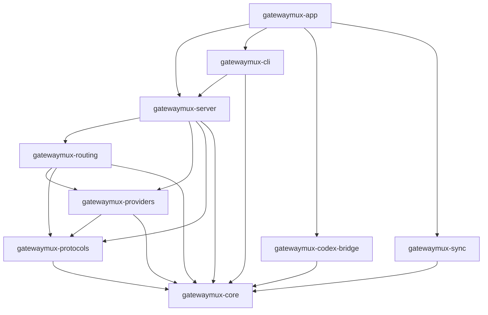

# Repository Layout

This document details the directory structure, subsystem responsibilities, and artifact categorization across `ArchdukeViel/gatewaymux`.

## Workspace Tree

```
gatewaymux/
├── AGENTS.md                  # AI agent constitution and authority ordering
├── README.md                  # Project overview and pre-implementation status
├── CONTRIBUTING.md            # Contributor guidelines, Conventional Commits, PR rules
├── SECURITY.md                # Vulnerability disclosure, secret protection policy
├── CHANGELOG.md               # Monotonically updated release changelog
├── LICENSE                    # MIT license (Copyright (c) 2026 ArchdukeViel)
├── Cargo.toml                 # Root Rust workspace manifest
├── Cargo.lock                 # Pinned Cargo dependency lockfile
├── package.json               # Root npm workspace manifest
├── package-lock.json          # Pinned npm dependency lockfile
├── rust-toolchain.toml        # Pinned Rust toolchain specification (1.98.1)
├── deny.toml                  # cargo-deny configuration for licenses/advisories
├── .editorconfig              # Editor indentation and line ending rules
├── .gitattributes             # Git LF/CRLF normalization and file attributes
├── .gitignore                 # Strict ignore rules for target, node_modules, temp
├── .generated-manifest.json   # Machine-readable registry of generated files
│
├── crates/                    # Multi-crate Rust workspace
│   ├── gatewaymux-core/       # Domain models, Canonical IR, security traits
│   ├── gatewaymux-routing/    # Combo fallback chains, quota buckets, selection
│   ├── gatewaymux-protocols/  # Wire protocol parsing, dialects, transport profiles
│   ├── gatewaymux-providers/  # Upstream adapters (NIM, Antigravity, Poolside, etc.)
│   ├── gatewaymux-server/     # HTTP data-plane and control-plane listeners
│   ├── gatewaymux-codex-bridge/# Windows-specific Codex subagent interceptor
│   ├── gatewaymux-sync/       # Cloud State Sync client and state coordinator
│   ├── gatewaymux-cli/        # Command-line interface and daemon commands
│   ├── gatewaymux-app/        # Unified native application entrypoint
│   └── xtask/                 # Developer automation and CI governance task runner
│
├── dashboard/                 # Control Plane web application (npm workspace)
├── sync-server/               # Reference Sync Server implementation (npm workspace)
│
├── compat/                    # Durable Compatibility Corpus fixtures
│   ├── codex/                 # Codex client transcripts
│   ├── providers/             # Upstream provider responses
│   ├── protocols/             # Client SDK request captures
│   ├── transports/            # SSE and framing test vectors
│   └── operations/            # Canonical IR goldens
│
├── profiles/                  # Built-in configuration and capability profiles
│   ├── providers/             # Provider-specific definitions
│   ├── models/                # Logical model and quality definitions
│   ├── schema-dialects/       # Tool schema compilation dialects
│   └── transports/            # Transport profile rules
│
├── tests/                     # Test suites
│   ├── integration/           # Cross-crate subsystem tests
│   ├── e2e/                   # End-to-end full server tests
│   ├── fault/                 # Chaos, partition, and error recovery tests
│   ├── security/              # Secret containment and boundary tests
│   └── fixtures/              # Reusable mock responses
│
├── config/                    # Configuration reference and validation
│   ├── examples/              # Reference TOML configurations
│   └── schemas/               # Configuration JSON schemas
│
├── docs/                      # Architectural and operational documentation
│   ├── architecture/adr/      # Architecture Decision Records
│   ├── engineering/           # Developer, workflow, and repo engineering guides
│   ├── providers/             # Provider integration documentation
│   ├── operations/            # Runtime operation guides
│   ├── dashboard/             # Dashboard architecture docs
│   ├── security/              # Threat models and security specifications
│   └── runbooks/              # Operational runbooks
│
├── packaging/                 # Distribution wrappers
│   ├── windows/               # MSI / WiX installer assets
│   └── npm/                   # npm distribution package (`gatewaymux`)
│
├── scripts/                   # Developer automation and bootstrapping scripts
│
├── .agents/                   # Agent operational directives
│   └── rules/                 # Scoped contributor rules
│
└── .github/                   # GitHub Actions and repository configuration
    ├── workflows/             # CI, security, and owner-approval workflows
    ├── ISSUE_TEMPLATE/        # Issue forms for bugs, providers, regressions
    ├── CODEOWNERS             # Repository-wide ownership (@ArchdukeViel)
    ├── PULL_REQUEST_TEMPLATE.md# Pull request template
    └── dependabot.yml         # Dependabot grouped update configuration
```

## Directional Dependencies


